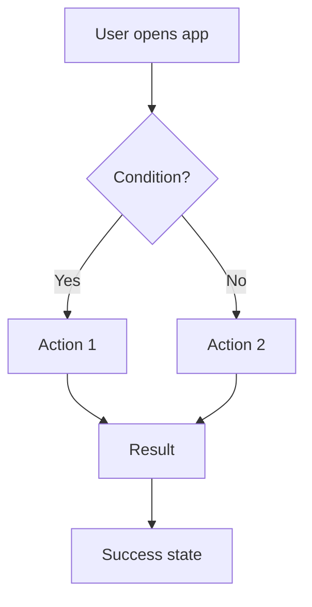
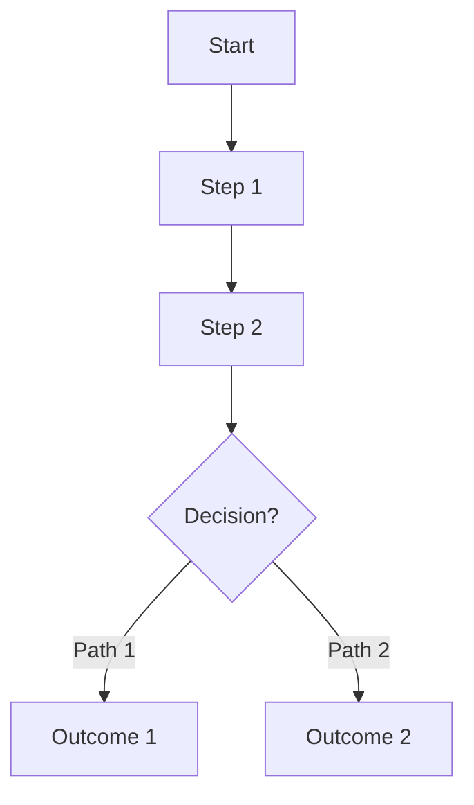

# [Feature Name] - Implementation Guide

> **Status**: 🔄 In Development | ✅ Design Complete | 🚀 Implemented  
> **Last Updated**: [Date]  
> **Version**: 1.0.0  
> **Priority**: 🔴 CRITICAL | 🟡 HIGH | 🟢 MEDIUM | ⚪ LOW

---

## 📑 Table of Contents

1. [Overview](#overview)
2. [Quick Reference & Validation Links](#quick-reference--validation-links)
3. [User Flows](#user-flows)
4. [Data Flow](#data-flow)
5. [Data Models](#data-models)
6. [Implementation Steps](#implementation-steps)
7. [Acceptance Criteria](#acceptance-criteria)

---

## 🎯 Overview

### Feature Summary
[Brief 2-3 sentence description of what this feature does]

**📚 Core Technology References:**
- [Technology 1 Documentation](https://example.com) - Brief description
- [Technology 2 API Reference](https://example.com) - What it covers
- [Related Standard/Spec](https://example.com) - Why it's relevant

---

## 🔍 Quick Reference & Validation Links

> **Purpose:** Add links to official documentation, specifications, and best practices that validate your implementation approach. This helps reviewers and future maintainers understand the technical foundation.

**Core Specifications & Standards:**
| Topic | Specification | Purpose |
|-------|--------------|---------|
| [Example: OAuth 2.0] | [RFC 6749](https://datatracker.ietf.org/doc/html/rfc6749) | Authorization framework |
| [Example: WebSocket] | [RFC 6455](https://datatracker.ietf.org/doc/html/rfc6455) | Real-time communication |
| [Add relevant specs] | [Link] | Why it matters |

**Framework/Library Documentation:**
| Resource | Link | Use Case |
|----------|------|----------|
| [Example: Nuxt 3] | [nuxt.com/docs](https://nuxt.com/docs) | Frontend framework |
| [Example: Pinia] | [pinia.vuejs.org](https://pinia.vuejs.org/) | State management |
| [Your main library] | [Docs link] | What you're using it for |

**Security & Best Practices:**
| Topic | Resource | Critical Info |
|-------|----------|--------------|
| [Example: OWASP] | [OWASP Guide](https://owasp.org/) | Security guidelines |
| [Your security concern] | [Link] | What to validate |

**Implementation Tools:**
| Tool | Link | Purpose |
|------|------|---------|
| [Example: Postman] | [postman.com](https://www.postman.com/) | API testing |
| [Your testing tool] | [Link] | How you'll test |

> **Instructions:** 
> 1. Add links to official docs for every major technology used
> 2. Include RFC/specification links for protocols (OAuth, WebSocket, etc.)
> 3. Add security best practice guides (OWASP, vendor security docs)
> 4. Link to API references for third-party services
> 5. Include validation tools (JWT.io, OAuth playground, etc.)

**User Story:**
> As a [user type], I want to [action] so that [benefit].

### Key Requirements
- Requirement 1
- Requirement 2
- Requirement 3

---

## 👤 User Flows

### Flow 1: [Primary User Flow Name]



**Steps:**
1. User performs action A
2. System checks condition B
3. If condition met:
   - System performs action C
   - User sees result E
4. If condition not met:
   - System performs action D
   - User sees result E

**Expected Outcome:** [What the user achieves]

---

### Flow 2: [Secondary User Flow Name]



**Steps:**
1. User action
2. System response
3. Final state

---

## 🔄 Data Flow

### Architecture Overview

```
┌─────────────────────────────────────────────────────┐
│                    FRONTEND                         │
├─────────────────────────────────────────────────────┤
│  UI Components  →  Pinia Store  →  Services        │
│       ↓                ↓               ↓            │
│  Local Storage (SQLite/Preferences/SecureStorage)   │
└─────────────────────────────────────────────────────┘
                       ↓ ↑ (API/WebSocket)
┌─────────────────────────────────────────────────────┐
│                    BACKEND                          │
├─────────────────────────────────────────────────────┤
│  API Handlers  →  Business Logic  →  Database      │
│       ↑                                             │
│  RabbitMQ/AI Service (if applicable)                │
└─────────────────────────────────────────────────────┘
```

### Detailed Data Flow

#### Scenario 1: [e.g., Create Operation - Offline]
```
1. User Input (Component)
       ↓
2. Pinia Store (create action)
       ↓
3. SQLite Service (local save)
       ↓
4. Sync Queue (mark needs_sync=1)
       ↓
5. UI Update (show success)
       ↓
6. [Background] SyncService processes queue when online
       ↓
7. API Call (POST /v1/resource)
       ↓
8. PostgreSQL (cloud save)
       ↓
9. Update local record (needs_sync=0)
```

#### Scenario 2: [e.g., Read Operation - Online]
```
1. User Request (Component)
       ↓
2. Pinia Store (fetch action)
       ↓
3. Check SQLite cache (if fresh, return)
       ↓
4. If stale → API Call (GET /v1/resource)
       ↓
5. Backend returns data
       ↓
6. Update SQLite cache
       ↓
7. Update Pinia state
       ↓
8. UI renders data
```

---

## 📊 Data Models

### Storage Strategy

| Data Type | Storage Method | Reason |
|-----------|---------------|--------|
| **Example: User Data** | SQLite + PostgreSQL | Large data, complex queries, offline access |
| **Example: Auth Tokens** | SecureStorage | Sensitive, encrypted storage |
| **Example: Settings** | Preferences | Simple key-value, small data |

---

### Database Schema

#### Table Name (Local SQLite + Cloud PostgreSQL)

```sql
CREATE TABLE table_name (
    id TEXT PRIMARY KEY,
    user_id TEXT NOT NULL,
    field1 TEXT NOT NULL,
    field2 INTEGER,
    field3 JSONB,
    needs_sync INTEGER DEFAULT 1,  -- For offline-first features
    created_at TIMESTAMP DEFAULT CURRENT_TIMESTAMP,
    updated_at TIMESTAMP,
    synced_at TIMESTAMP
);

CREATE INDEX idx_table_user ON table_name(user_id);
CREATE INDEX idx_table_created ON table_name(created_at DESC);
CREATE INDEX idx_table_sync ON table_name(needs_sync) WHERE needs_sync = 1;
```

---

### TypeScript Types

```typescript
// Core entity type
interface Entity {
  id: string;
  user_id: string;
  field1: string;
  field2: number;
  field3: Record<string, any>;
  needs_sync?: boolean;
  created_at: string;
  updated_at?: string;
  synced_at?: string;
}

// API request/response types
interface CreateEntityRequest {
  field1: string;
  field2: number;
  field3: Record<string, any>;
}

interface UpdateEntityRequest {
  id: string;
  field1?: string;
  field2?: number;
  field3?: Record<string, any>;
}

interface EntityListResponse {
  entities: Entity[];
  total: number;
}
```

---

## 🛠️ Implementation Steps

### Phase 1: Backend Setup

#### Step 1: Database Migration

**📖 Official Documentation:**
- [PostgreSQL Documentation](https://www.postgresql.org/docs/) - SQL syntax and best practices
- [Migration Tool Docs](https://github.com/golang-migrate/migrate) - If using migrate
- [Database Design Guide](https://example.com) - Schema design principles

```bash
# Create migration files
cd tranquara_core_service/migrations
touch 000XXX_create_table_name.up.sql
touch 000XXX_create_table_name.down.sql
```

**File: 000XXX_create_table_name.up.sql**
```sql
CREATE TABLE table_name (
    id UUID DEFAULT gen_random_uuid() PRIMARY KEY,
    user_id UUID NOT NULL,
    field1 TEXT NOT NULL,
    field2 INTEGER,
    created_at TIMESTAMP DEFAULT CURRENT_TIMESTAMP,
    updated_at TIMESTAMP
);

CREATE INDEX idx_table_user ON table_name(user_id);
```

**File: 000XXX_create_table_name.down.sql**
```sql
DROP TABLE IF EXISTS table_name;
```

**Run migration:**
```bash
cd tranquara_core_service
make migrate-up
```

**Expected Result:** ✅ Table created in PostgreSQL

---

#### Step 2: Go Backend Models

**📖 Related Documentation:**
- [Go Database/SQL Package](https://pkg.go.dev/database/sql) - Database operations
- [Context Package](https://pkg.go.dev/context) - Request context handling
- [Go Best Practices](https://github.com/golang-standards/project-layout) - Project structure

**File: `internal/data/entity.go`**
```go
package data

import (
    "context"
    "database/sql"
    "time"
)

type Entity struct {
    ID        string    `json:"id"`
    UserID    string    `json:"user_id"`
    Field1    string    `json:"field1"`
    Field2    int       `json:"field2"`
    CreatedAt time.Time `json:"created_at"`
    UpdatedAt time.Time `json:"updated_at"`
}

type EntityModel struct {
    DB *sql.DB
}

func (m EntityModel) Insert(entity *Entity) error {
    query := `
        INSERT INTO table_name (user_id, field1, field2)
        VALUES ($1, $2, $3)
        RETURNING id, created_at, updated_at`
    
    args := []interface{}{entity.UserID, entity.Field1, entity.Field2}
    
    return m.DB.QueryRow(query, args...).Scan(
        &entity.ID,
        &entity.CreatedAt,
        &entity.UpdatedAt,
    )
}

func (m EntityModel) Get(id string) (*Entity, error) {
    query := `
        SELECT id, user_id, field1, field2, created_at, updated_at
        FROM table_name
        WHERE id = $1`
    
    var entity Entity
    err := m.DB.QueryRow(query, id).Scan(
        &entity.ID,
        &entity.UserID,
        &entity.Field1,
        &entity.Field2,
        &entity.CreatedAt,
        &entity.UpdatedAt,
    )
    
    return &entity, err
}

func (m EntityModel) GetAll(userID string) ([]*Entity, error) {
    query := `
        SELECT id, user_id, field1, field2, created_at, updated_at
        FROM table_name
        WHERE user_id = $1
        ORDER BY created_at DESC`
    
    rows, err := m.DB.Query(query, userID)
    if err != nil {
        return nil, err
    }
    defer rows.Close()
    
    entities := []*Entity{}
    for rows.Next() {
        var entity Entity
        err := rows.Scan(
            &entity.ID,
            &entity.UserID,
            &entity.Field1,
            &entity.Field2,
            &entity.CreatedAt,
            &entity.UpdatedAt,
        )
        if err != nil {
            return nil, err
        }
        entities = append(entities, &entity)
    }
    
    return entities, nil
}

func (m EntityModel) Update(entity *Entity) error {
    query := `
        UPDATE table_name
        SET field1 = $1, field2 = $2, updated_at = NOW()
        WHERE id = $3
        RETURNING updated_at`
    
    args := []interface{}{entity.Field1, entity.Field2, entity.ID}
    
    return m.DB.QueryRow(query, args...).Scan(&entity.UpdatedAt)
}

func (m EntityModel) Delete(id string) error {
    query := `DELETE FROM table_name WHERE id = $1`
    
    result, err := m.DB.Exec(query, id)
    if err != nil {
        return err
    }
    
    rowsAffected, err := result.RowsAffected()
    if err != nil {
        return err
    }
    
    if rowsAffected == 0 {
        return ErrRecordNotFound
    }
    
    return nil
}
```

**Expected Result:** ✅ CRUD operations implemented

---

#### Step 3: API Handlers

**File: `cmd/api/entity_handlers.go`**
```go
package main

import (
    "net/http"
    "github.com/yourusername/tranquara_core_service/internal/data"
)

func (app *application) createEntityHandler(w http.ResponseWriter, r *http.Request) {
    var input struct {
        Field1 string `json:"field1"`
        Field2 int    `json:"field2"`
    }
    
    err := app.readJSON(w, r, &input)
    if err != nil {
        app.badRequestResponse(w, r, err)
        return
    }
    
    entity := &data.Entity{
        UserID: app.contextGetUser(r).ID,
        Field1: input.Field1,
        Field2: input.Field2,
    }
    
    err = app.models.Entities.Insert(entity)
    if err != nil {
        app.serverErrorResponse(w, r, err)
        return
    }
    
    err = app.writeJSON(w, http.StatusCreated, envelope{"entity": entity}, nil)
    if err != nil {
        app.serverErrorResponse(w, r, err)
    }
}

func (app *application) listEntitiesHandler(w http.ResponseWriter, r *http.Request) {
    userID := app.contextGetUser(r).ID
    
    entities, err := app.models.Entities.GetAll(userID)
    if err != nil {
        app.serverErrorResponse(w, r, err)
        return
    }
    
    err = app.writeJSON(w, http.StatusOK, envelope{"entities": entities}, nil)
    if err != nil {
        app.serverErrorResponse(w, r, err)
    }
}

func (app *application) updateEntityHandler(w http.ResponseWriter, r *http.Request) {
    id := r.URL.Query().Get("id")
    if id == "" {
        app.badRequestResponse(w, r, errors.New("missing id parameter"))
        return
    }
    
    entity, err := app.models.Entities.Get(id)
    if err != nil {
        app.notFoundResponse(w, r)
        return
    }
    
    var input struct {
        Field1 *string `json:"field1"`
        Field2 *int    `json:"field2"`
    }
    
    err = app.readJSON(w, r, &input)
    if err != nil {
        app.badRequestResponse(w, r, err)
        return
    }
    
    if input.Field1 != nil {
        entity.Field1 = *input.Field1
    }
    if input.Field2 != nil {
        entity.Field2 = *input.Field2
    }
    
    err = app.models.Entities.Update(entity)
    if err != nil {
        app.serverErrorResponse(w, r, err)
        return
    }
    
    err = app.writeJSON(w, http.StatusOK, envelope{"entity": entity}, nil)
    if err != nil {
        app.serverErrorResponse(w, r, err)
    }
}

func (app *application) deleteEntityHandler(w http.ResponseWriter, r *http.Request) {
    id := r.URL.Query().Get("id")
    if id == "" {
        app.badRequestResponse(w, r, errors.New("missing id parameter"))
        return
    }
    
    err := app.models.Entities.Delete(id)
    if err != nil {
        app.notFoundResponse(w, r)
        return
    }
    
    err = app.writeJSON(w, http.StatusOK, envelope{"message": "entity deleted"}, nil)
    if err != nil {
        app.serverErrorResponse(w, r, err)
    }
}
```

**Expected Result:** ✅ API handlers implemented

---

#### Step 4: Register Routes

**File: `cmd/api/routes.go`**
```go
// Add to routes function
router.HandlerFunc(http.MethodPost, "/v1/entity", app.requireAuthenticatedUser(app.createEntityHandler))
router.HandlerFunc(http.MethodGet, "/v1/entities", app.requireAuthenticatedUser(app.listEntitiesHandler))
router.HandlerFunc(http.MethodPut, "/v1/entity", app.requireAuthenticatedUser(app.updateEntityHandler))
router.HandlerFunc(http.MethodDelete, "/v1/entity", app.requireAuthenticatedUser(app.deleteEntityHandler))
```

**Test with curl:**
```bash
# Get auth token first
TOKEN="your_keycloak_token"

# Test create
curl -X POST http://localhost:4000/v1/entity \
  -H "Authorization: Bearer $TOKEN" \
  -H "Content-Type: application/json" \
  -d '{"field1":"test","field2":123}'

# Test list
curl http://localhost:4000/v1/entities \
  -H "Authorization: Bearer $TOKEN"
```

**Expected Result:** ✅ API endpoints working

---

### Phase 2: Frontend Implementation

#### Step 5: TypeScript Types

**File: `tranquara_frontend/types/entity.ts`**
```typescript
export interface Entity {
  id: string;
  user_id: string;
  field1: string;
  field2: number;
  needs_sync?: boolean;
  created_at: string;
  updated_at?: string;
  synced_at?: string;
}

export interface CreateEntityRequest {
  field1: string;
  field2: number;
}

export interface UpdateEntityRequest {
  id: string;
  field1?: string;
  field2?: number;
}

export interface EntityListResponse {
  entities: Entity[];
}
```

**Expected Result:** ✅ Types defined

---

#### Step 6: SDK Methods

**File: `tranquara_frontend/stores/entity/index.ts`**
```typescript
import { TranquaraSDK } from "../tranquara_sdk";
import type { Entity, CreateEntityRequest, UpdateEntityRequest, EntityListResponse } from "~/types/entity";

export class Entities extends TranquaraSDK {
  constructor() {
    super();
  }

  async getAll(): Promise<Entity[]> {
    const response = await this.fetch<EntityListResponse>("GET", "/v1/entities");
    return response.entities;
  }

  async getById(id: string): Promise<Entity> {
    const response = await this.fetch<{ entity: Entity }>("GET", `/v1/entity?id=${id}`);
    return response.entity;
  }

  async create(data: CreateEntityRequest): Promise<Entity> {
    const response = await this.fetch<{ entity: Entity }>("POST", "/v1/entity", data);
    return response.entity;
  }

  async update(data: UpdateEntityRequest): Promise<Entity> {
    const response = await this.fetch<{ entity: Entity }>("PUT", `/v1/entity?id=${data.id}`, data);
    return response.entity;
  }

  async delete(id: string): Promise<void> {
    await this.fetch("DELETE", `/v1/entity?id=${id}`);
  }
}
```

**Expected Result:** ✅ SDK methods implemented

---

#### Step 7: SQLite Service (For Offline Features)

**📖 Official Documentation:**
- [Capacitor SQLite Plugin](https://github.com/capacitor-community/sqlite) - Plugin API reference
- [SQLite Documentation](https://www.sqlite.org/docs.html) - SQL syntax
- [Offline-First Patterns](https://offlinefirst.org/) - Design principles

**File: `tranquara_frontend/services/sqlite_service.ts`**
```typescript
import { CapacitorSQLite, SQLiteConnection, SQLiteDBConnection } from '@capacitor-community/sqlite';

class SQLiteService {
  private static instance: SQLiteService;
  private sqlite: SQLiteConnection;
  private db: SQLiteDBConnection | null = null;
  private dbName = 'tranquara.db';

  private constructor() {
    this.sqlite = new SQLiteConnection(CapacitorSQLite);
  }

  static getInstance(): SQLiteService {
    if (!SQLiteService.instance) {
      SQLiteService.instance = new SQLiteService();
    }
    return SQLiteService.instance;
  }

  async initialize(): Promise<void> {
    try {
      this.db = await this.sqlite.createConnection(
        this.dbName,
        false,
        'no-encryption',
        1,
        false
      );
      
      await this.db.open();
      await this.runMigrations();
      
      console.log('SQLite initialized successfully');
    } catch (error) {
      console.error('SQLite initialization failed:', error);
      throw error;
    }
  }

  private async runMigrations(): Promise<void> {
    if (!this.db) throw new Error('Database not initialized');

    const createTableSQL = `
      CREATE TABLE IF NOT EXISTS table_name (
        id TEXT PRIMARY KEY,
        user_id TEXT NOT NULL,
        field1 TEXT NOT NULL,
        field2 INTEGER,
        needs_sync INTEGER DEFAULT 1,
        created_at TEXT DEFAULT CURRENT_TIMESTAMP,
        updated_at TEXT,
        synced_at TEXT
      );
      
      CREATE INDEX IF NOT EXISTS idx_table_user ON table_name(user_id);
      CREATE INDEX IF NOT EXISTS idx_table_sync ON table_name(needs_sync);
    `;

    await this.db.execute(createTableSQL);
  }

  async query<T>(sql: string, params: any[] = []): Promise<T[]> {
    if (!this.db) throw new Error('Database not initialized');
    
    const result = await this.db.query(sql, params);
    return result.values as T[];
  }

  async execute(sql: string, params: any[] = []): Promise<void> {
    if (!this.db) throw new Error('Database not initialized');
    
    await this.db.run(sql, params);
  }
}

export const sqliteService = SQLiteService.getInstance();
```

**Expected Result:** ✅ SQLite service ready

---

#### Step 8: Pinia Store (Offline-First)

**File: `tranquara_frontend/stores/stores/entity.ts`**
```typescript
import { defineStore } from 'pinia';
import { Entities } from '../entity';
import { sqliteService } from '~/services/sqlite_service';
import type { Entity, CreateEntityRequest, UpdateEntityRequest } from '~/types/entity';

const entitySDK = new Entities();

export const useEntityStore = defineStore('entity', {
  state: () => ({
    entities: [] as Entity[],
    loading: false,
    error: null as string | null,
  }),

  actions: {
    async fetchEntities() {
      this.loading = true;
      this.error = null;

      try {
        // Try local SQLite first (offline-first)
        const localEntities = await sqliteService.query<Entity>(
          'SELECT * FROM table_name ORDER BY created_at DESC'
        );

        this.entities = localEntities;

        // Then sync with backend (if online)
        try {
          const cloudEntities = await entitySDK.getAll();
          
          // Update local database
          for (const entity of cloudEntities) {
            await this.saveToLocal(entity, false);
          }
          
          this.entities = cloudEntities;
        } catch (apiError) {
          console.log('Using offline data');
        }
      } catch (error) {
        this.error = error instanceof Error ? error.message : 'Unknown error';
      } finally {
        this.loading = false;
      }
    },

    async createEntity(data: CreateEntityRequest) {
      try {
        const localId = crypto.randomUUID();
        const now = new Date().toISOString();

        const localEntity: Entity = {
          id: localId,
          user_id: 'current_user_id',
          ...data,
          needs_sync: true,
          created_at: now,
        };

        // Save to local SQLite immediately
        await this.saveToLocal(localEntity, true);
        this.entities.unshift(localEntity);

        // Try to sync to backend
        try {
          const cloudEntity = await entitySDK.create(data);
          await this.updateLocal(localId, cloudEntity.id, false);
          
          const index = this.entities.findIndex(e => e.id === localId);
          if (index !== -1) {
            this.entities[index] = { ...cloudEntity, needs_sync: false };
          }
        } catch (apiError) {
          console.log('Entity will sync when online');
        }
      } catch (error) {
        this.error = error instanceof Error ? error.message : 'Unknown error';
        throw error;
      }
    },

    async saveToLocal(entity: Entity, needsSync: boolean) {
      await sqliteService.execute(
        `INSERT OR REPLACE INTO table_name 
         (id, user_id, field1, field2, needs_sync, created_at, updated_at, synced_at)
         VALUES (?, ?, ?, ?, ?, ?, ?, ?)`,
        [
          entity.id,
          entity.user_id,
          entity.field1,
          entity.field2,
          needsSync ? 1 : 0,
          entity.created_at,
          entity.updated_at || null,
          entity.synced_at || null,
        ]
      );
    },

    async updateLocal(oldId: string, newId: string, needsSync: boolean) {
      await sqliteService.execute(
        'UPDATE table_name SET id = ?, needs_sync = ?, synced_at = ? WHERE id = ?',
        [newId, needsSync ? 1 : 0, new Date().toISOString(), oldId]
      );
    },
  },
});
```

**Expected Result:** ✅ Pinia store with offline-first logic

---

#### Step 9: Vue Component

**File: `tranquara_frontend/components/Entity/List.vue`**
```vue
<template>
  <div class="entity-list">
    <div v-if="entityStore.loading">Loading...</div>
    <div v-else-if="entityStore.error">{{ entityStore.error }}</div>
    <div v-else>
      <div 
        v-for="entity in entityStore.entities" 
        :key="entity.id"
        class="entity-card"
      >
        <h3>{{ entity.field1 }}</h3>
        <span v-if="entity.needs_sync">⏱️ Not synced</span>
        <p>Field2: {{ entity.field2 }}</p>
      </div>
      <button @click="createNew">+ Create New</button>
    </div>
  </div>
</template>

<script setup lang="ts">
import { onMounted } from 'vue';
import { useEntityStore } from '~/stores/stores/entity';

const entityStore = useEntityStore();

onMounted(async () => {
  await entityStore.fetchEntities();
});

const createNew = async () => {
  await entityStore.createEntity({
    field1: 'New entity',
    field2: 123
  });
};
</script>
```

**Expected Result:** ✅ UI working with offline support

---

#### Step 10: Initialize SQLite on App Start

**File: `tranquara_frontend/plugins/sqlite.client.ts`**
```typescript
import { sqliteService } from '~/services/sqlite_service';

export default defineNuxtPlugin(async () => {
  try {
    await sqliteService.initialize();
    console.log('SQLite initialized');
  } catch (error) {
    console.error('Failed to initialize SQLite:', error);
  }
});
```

**Expected Result:** ✅ SQLite auto-initializes

---

## ✅ Acceptance Criteria

### Must Have (v1.0)

#### Backend
- [ ] PostgreSQL table created with correct schema
- [ ] All CRUD API endpoints working (GET, POST, PUT, DELETE)
- [ ] Endpoints require authentication (Keycloak token)
- [ ] API returns proper HTTP status codes (200, 201, 400, 404, 500)
- [ ] Database indexes created for performance

#### Frontend - Online Mode
- [ ] User can fetch list of entities from API
- [ ] User can view individual entity details
- [ ] User can create new entity via API
- [ ] User can update existing entity via API
- [ ] User can delete entity via API
- [ ] Loading states shown during API calls
- [ ] Error messages displayed on API failures

#### Frontend - Offline Mode
- [ ] SQLite database initializes on app start
- [ ] User can create entity offline (saves to SQLite)
- [ ] User can edit entity offline (updates SQLite)
- [ ] User can delete entity offline (removes from SQLite)
- [ ] User can view entities offline (reads from SQLite)
- [ ] App shows "Not synced" badge for offline changes
- [ ] Data persists after app restart

#### Sync Functionality
- [ ] Offline changes sync automatically when online
- [ ] "Not synced" badge disappears after successful sync
- [ ] Sync happens in background (non-blocking)
- [ ] Failed sync attempts retry later
- [ ] No duplicate data after sync

#### UI/UX
- [ ] List view shows all entities
- [ ] Create/Edit form validates inputs
- [ ] Delete requires confirmation
- [ ] Network status visible to user
- [ ] Sync status visible to user
- [ ] Responsive design (mobile + desktop)

---

### Should Have (v1.1)

#### Enhanced Functionality
- [ ] Search/filter entities
- [ ] Sort entities (by date, field1, etc.)
- [ ] Pagination for large datasets
- [ ] Bulk operations (select multiple, delete all)

#### Advanced Sync
- [ ] Conflict resolution UI (if same entity edited offline + online)
- [ ] Manual "Force Sync" button
- [ ] Sync history/log viewer
- [ ] Bandwidth-aware sync (WiFi only option)

#### Performance
- [ ] Lazy loading for long lists
- [ ] Virtual scrolling for 1000+ items
- [ ] Optimistic UI updates (instant feedback)
- [ ] Background cache refresh

---

### Could Have (Future)

- [ ] Export data (JSON, CSV)
- [ ] Import data from file
- [ ] Share entity via link
- [ ] Real-time collaboration (WebSocket updates)
- [ ] Undo/redo functionality
- [ ] Version history for edits

---

## 📋 Testing Checklist

### Before Merge

**Backend Tests:**
```bash
cd tranquara_core_service
go test ./internal/data -v
go test ./cmd/api -v
```

**Frontend Tests:**
- [ ] Unit tests pass for stores
- [ ] Component tests pass
- [ ] E2E tests pass (Playwright/Cypress)

**Manual QA:**
- [ ] Test on Android device
- [ ] Test on iOS device (if available)
- [ ] Test offline → online transition
- [ ] Test online → offline transition
- [ ] Test app resume after background
- [ ] Test with slow network (throttling)

---

## 🔗 Related Documentation

- [Feature Overview](./00-OVERVIEW.md)
- [User Flows](./01-FLOWS.md)
- [Database Schema](../00-DATABASE/SCHEMA_OVERVIEW.md)
- [API Documentation](../../API-DOCS.md)

---

**Document Version:** 1.0.0  
**Last Updated:** [Date]  
**Status:** ✅ Ready for Implementation
```
POST /v1/entity
Authorization: Bearer {token}
Content-Type: application/json

Request:
{
  "field1": "value",
  "field2": 123
}

Response 201:
{
  "entity": {
    "id": "uuid",
    "field1": "value",
    "field2": 123,
    "created_at": "2025-11-28T10:00:00Z"
  }
}

Response 400:
{
  "error": "Validation error",
  "details": ["field1 is required"]
}
```

### WebSocket Protocol (if applicable)

```typescript
// Connection
const ws = new WebSocket('ws://server/endpoint');

// Message format
ws.send(JSON.stringify({
  type: 'action_type',
  payload: { ... }
}));

// Response format
ws.onmessage = (event) => {
  const data = JSON.parse(event.data);
  // { type: 'response_type', payload: { ... } }
};
```

---

## 🔄 Implementation Status

### ✅ Completed Features

**Frontend:**
- ✅ Component 1 implemented
- ✅ Store integration
- ✅ Type definitions

**Backend:**
- ✅ API endpoint 1
- ✅ Database migrations
- ✅ Model definitions

### ⚠️ In Progress

- ⚠️ Feature X (60% complete)
- ⚠️ Integration Y (30% complete)

### ❌ Not Started

- ❌ Feature Z
- ❌ Enhancement W

### 🐛 Known Issues

| Issue | Severity | Status | Description |
|-------|----------|--------|-------------|
| #1 | 🔴 CRITICAL | Open | Description |
| #2 | 🟡 MEDIUM | In Progress | Description |
| #3 | 🟢 LOW | Open | Description |

---

## 🗺️ Implementation Plan

### Phase 1: Foundation (Week 1)

**Priority:** 🔴 CRITICAL  
**Estimated Time:** 5 days

**Tasks:**
- [ ] Task 1: Description
- [ ] Task 2: Description
- [ ] Task 3: Description

**Deliverables:**
- Deliverable 1
- Deliverable 2

**Dependencies:**
- Dependency 1
- Dependency 2

---

### Phase 2: Core Features (Week 2)

**Priority:** 🟡 HIGH  
**Estimated Time:** 5 days

**Tasks:**
- [ ] Task 1: Description
- [ ] Task 2: Description

**Deliverables:**
- Deliverable 1
- Deliverable 2

---

### Phase 3: Enhancements (Week 3+)

**Priority:** 🟢 MEDIUM  
**Estimated Time:** 3-5 days

**Tasks:**
- [ ] Task 1: Description
- [ ] Task 2: Description

**Deliverables:**
- Deliverable 1
- Deliverable 2

---

### Implementation Timeline

| Phase | Duration | Priority | Dependencies | Status |
|-------|----------|----------|--------------|--------|
| Phase 1 | 1 week | 🔴 CRITICAL | None | Not Started |
| Phase 2 | 1 week | 🟡 HIGH | Phase 1 | Not Started |
| Phase 3 | 1 week | 🟢 MEDIUM | Phase 2 | Not Started |

**Total Estimated Time:** 3 weeks

---

## 🧪 Testing Strategy

### Unit Tests

**Frontend Tests:**
```typescript
// Test file: __tests__/component.test.ts
describe('Component', () => {
  test('should render correctly', () => {
    // Test implementation
  });
  
  test('should handle user interaction', () => {
    // Test implementation
  });
});
```

**Backend Tests:**
```go
// Test file: internal/feature/feature_test.go
func TestFeatureFunction(t *testing.T) {
    // Test implementation
}
```

### Integration Tests

**End-to-End Flow:**
```typescript
test('complete user flow', async ({ page }) => {
  // Step 1: Navigate
  await page.goto('/feature');
  
  // Step 2: Interact
  await page.click('[data-test="action-button"]');
  
  // Step 3: Verify
  await expect(page.locator('[data-test="result"]')).toBeVisible();
});
```

### Performance Tests

**Metrics to Track:**
- [ ] Load time: < X ms
- [ ] API response: < Y ms
- [ ] Database query: < Z ms

### Manual Testing Checklist

**Happy Path:**
- [ ] User can perform action A
- [ ] User can perform action B
- [ ] Data persists correctly

**Edge Cases:**
- [ ] Handles empty state
- [ ] Handles error state
- [ ] Handles offline mode (if applicable)

**Security:**
- [ ] Authentication required
- [ ] Authorization enforced
- [ ] Input validation works

---

## 📚 Related Documentation

### Feature Documentation
- [Feature Overview](./00-OVERVIEW.md)
- [User Flows](./01-FLOWS.md)
- [Technical Spec](./02-TECHNICAL-SPEC.md)

### System Documentation
- [Database Schema](../00-DATABASE/SCHEMA_OVERVIEW.md)
- [API Documentation](../API-DOCS.md)
- [Architecture Overview](../ARCHITECTURE.md)

### External Resources
- [Library Documentation](https://example.com)
- [API Reference](https://example.com)

---

## 📝 Notes & Decisions

### Design Decisions

**Decision 1: Choice Made**
- **Context:** What was the situation?
- **Decision:** What did we decide?
- **Rationale:** Why did we make this choice?
- **Alternatives Considered:** What else was considered?
- **Date:** YYYY-MM-DD

**Decision 2: Choice Made**
- **Context:** ...
- **Decision:** ...
- **Rationale:** ...

### Technical Debt

| Item | Impact | Effort | Priority | Notes |
|------|--------|--------|----------|-------|
| Item 1 | 🔴 HIGH | Medium | P1 | Description |
| Item 2 | 🟡 MEDIUM | Low | P2 | Description |

### Future Enhancements

- ⏸️ Enhancement 1: Description
- ⏸️ Enhancement 2: Description
- ⏸️ Enhancement 3: Description

---

## 🔗 Quick Links

**Development:**
- [Local Setup Guide](../../README.md)
- [Development Workflow](../../CONTRIBUTING.md)

**Deployment:**
- [Staging Environment](https://staging.example.com)
- [Production Environment](https://app.example.com)

**Monitoring:**
- [Logs Dashboard](https://logs.example.com)
- [Metrics Dashboard](https://metrics.example.com)

---

**Document Version:** 1.0.0  
**Last Updated:** YYYY-MM-DD  
**Author:** [Your Name]  
**Reviewers:** [Reviewer Names]  
**Status:** 🔄 Draft | ✅ Approved | 📝 Needs Review
