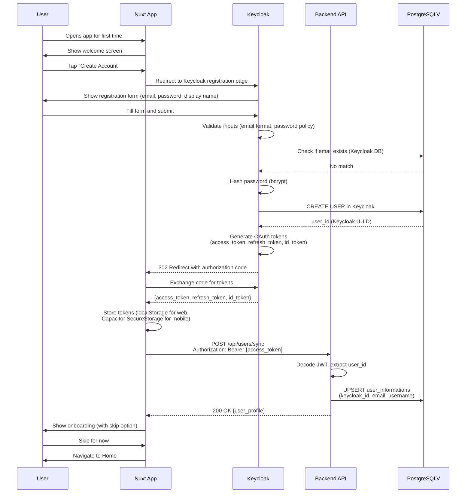
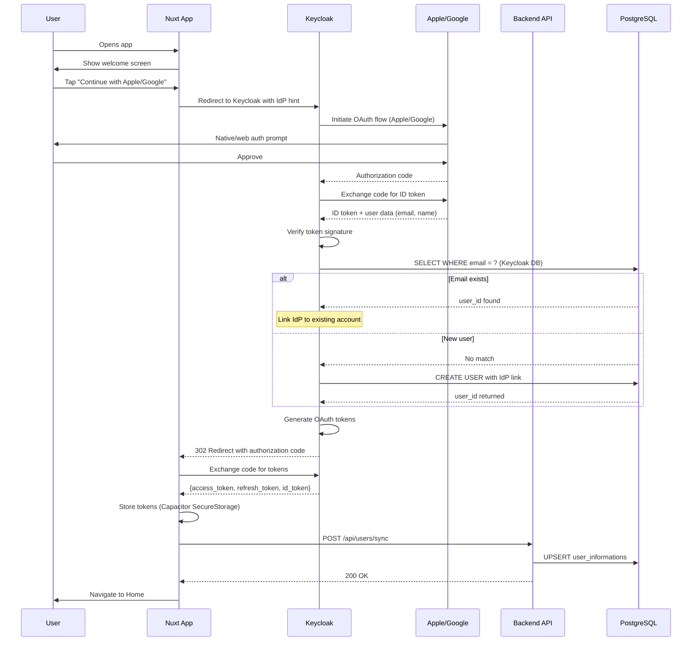
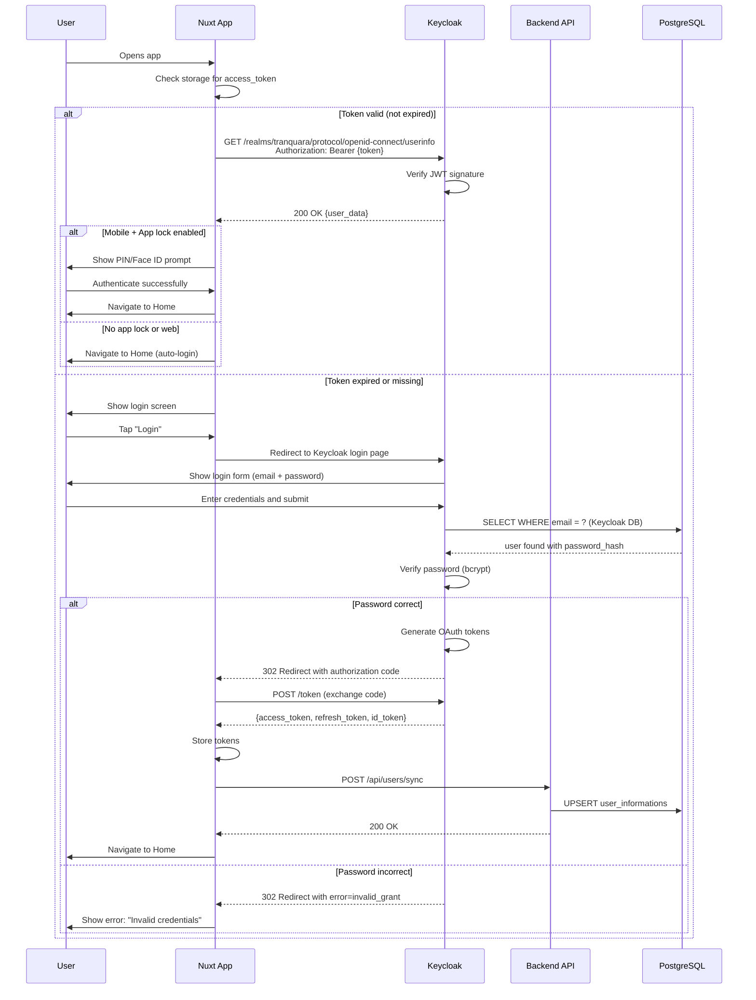
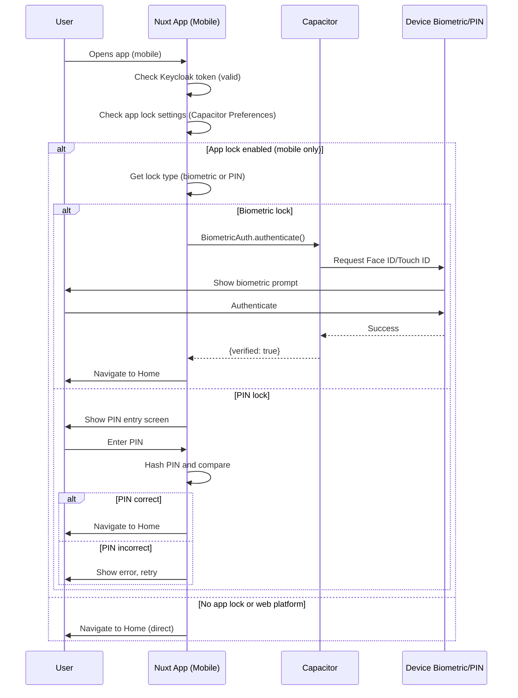
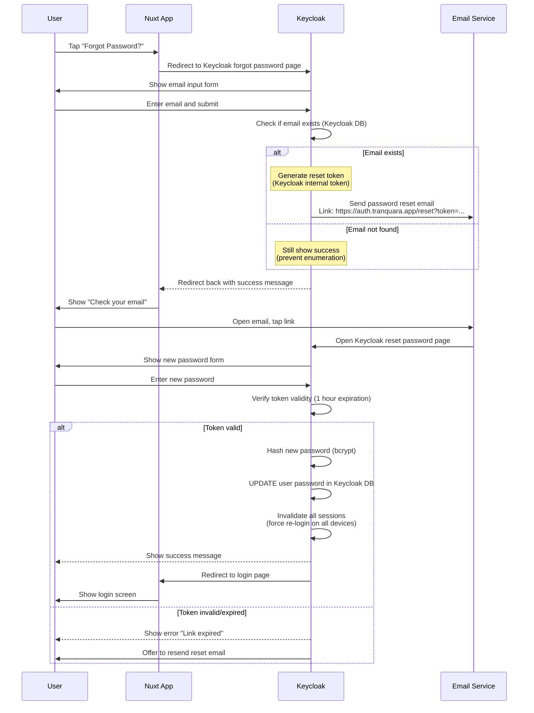

# 🔐 User Registration & Login Flow

## 📖 Overview

Tranquara uses **Keycloak** for centralized authentication and identity management with support for **email/password**, **social login** (Apple, Google), and **SSO**. The frontend is built with **Nuxt 3 + Vue 3** for web and **Capacitor** for native mobile capabilities. Users can optionally enable **app lock** (PIN/Face ID) on mobile in Settings for additional device-level security.

### Tech Stack

- **Authentication**: Keycloak (OpenID Connect / OAuth 2.0)
- **Web Framework**: Nuxt 3 + Vue 3 (currently use clientside render)
- **Mobile Runtime**: Capacitor (native bridge for iOS/Android)
- **State Management**: Pinia (Vue 3)
- **Backend**: Go + PostgreSQL (existing)
- **Session Management**: Keycloak tokens (JWT) + Refresh tokens

### Design Goals

1. **Centralized Identity**: Keycloak manages all authentication, user sessions, and OAuth providers
2. **Industry Standard**: OpenID Connect protocol for secure authentication
3. **Password Recovery**: Built-in Keycloak password reset via email
4. **No Forced Onboarding**: Users can skip profile details and complete them later
5. **Social Login Convenience**: Keycloak-managed Apple, Google identity providers
6. **Optional App Lock**: Biometric/PIN lock is a mobile-only convenience feature
7. **Display Name Flexibility**: Username is a changeable display name, email is the unique identifier
8. **Cross-Platform**: Single codebase for web and mobile using Nuxt 3 + Capacitor

---

## 🔄 Authentication Flows

### Flow 1: New User Registration (Email/Password)

### Flow 2: Social Login (Apple/Google)

### Flow 3: Returning User Login (Email/Password)

### Flow 4: Returning User with App Lock Enabled (Mobile Only)

### Flow 5: Password Reset

---

## 💻 Technical Implementation

### Keycloak Configuration

#### 1. Keycloak Realm Setup

- **Realm**: `tranquara`
- **SSL Required**: `external`
- **Registration Allowed**: `true`
- **Login with Email**: `true`
- **Duplicate Emails**: `false` (email is unique identifier)
- **Reset Password**: `true`
- **Brute Force Protection**: `true`

#### 2. Client Configuration (Nuxt App)

- **Client ID**: `tranquara-web`
- **Client Type**: Public client
- **Protocol**: `openid-connect`
- **Redirect URIs**: 
  - `https://tranquara.app/*`
  - `http://localhost:3000/*`
  - `capacitor://localhost/*`
- **Web Origins**: `+` (all redirect URIs)
- **Standard Flow**: Enabled (Authorization Code)
- **PKCE**: Required (S256 challenge method)

#### 3. Identity Providers (Social Login)

**Apple Sign-In**:
- Provider ID: `apple`
- Client ID: `com.tranquara.app`
- Team ID, Key ID configured
- Default scope: `name email`

**Google OAuth**:
- Provider ID: `google`
- Client ID, Client Secret configured
- Default scope: `openid profile email`

#### 4. Password Policy

- Minimum length: 8 characters
- Require uppercase: 1
- Require lowercase: 1
- Require digits: 1
- Not same as username
- Password history: 3 (prevent reuse)

---

### Frontend: Nuxt 3 + Vue 3 Implementation

#### Dependencies

- `@nuxtjs/auth-next` - Nuxt authentication module
- `@keycloak/keycloak-admin-client` - Keycloak client
- `@capacitor/core` - Capacitor core
- `@capacitor/ios`, `@capacitor/android` - Native platforms
- `@capacitor/preferences` - Local storage
- `@capacitor/biometric-auth` - Biometric authentication
- `pinia`, `@pinia/nuxt` - State management

#### Nuxt Configuration

**Authentication Strategy**: OAuth2 with Keycloak endpoints
- Authorization endpoint: `/realms/tranquara/protocol/openid-connect/auth`
- Token endpoint: `/realms/tranquara/protocol/openid-connect/token`
- User info endpoint: `/realms/tranquara/protocol/openid-connect/userinfo`
- Logout endpoint: `/realms/tranquara/protocol/openid-connect/logout`

**Token Settings**:
- Access token: 15 minutes
- Refresh token: 30 days
- Response type: `code` (Authorization Code)
- Grant type: `authorization_code`
- Code challenge: `S256` (PKCE)

#### Capacitor Configuration

**App Details**:
- App ID: `com.tranquara.app`
- App Name: `Tranquara`
- Web directory: `.output/public`

**Platform Settings**:
- Android scheme: `https`
- iOS scheme: `capacitor`

**Biometric Plugin**:
- Android strength: `strong`
- iOS type: `touchid-faceid`

---

### Backend Integration

#### Go Backend: Keycloak JWT Verification

**Middleware**: Verify Keycloak JWT on protected routes
- Parse `Authorization: Bearer {token}` header
- Verify JWT signature using Keycloak public key
- Extract claims: `sub` (keycloak_id), `email`, `preferred_username`
- Attach user context to request

**User Sync Endpoint**: `POST /api/users/sync`
- Extract user data from verified JWT
- UPSERT into `user_informations` table
- Match by `keycloak_id` (unique)
- Update email, username on each sync
- Return user profile

**Public Key Retrieval**:
- Fetch from: `https://auth.tranquara.app/realms/tranquara/protocol/openid-connect/certs`
- Cache public key for performance
- Refresh periodically or on verification failure

#### Database Schema Update

**Add Keycloak Fields**:
- `keycloak_id VARCHAR(255) UNIQUE NOT NULL` - Keycloak user UUID
- `oauth_provider VARCHAR(50)` - 'email', 'apple', 'google'

**Remove Old Fields**:
- `password_hash` - Managed by Keycloak, not stored in app DB

**Indexes**:
- `idx_user_keycloak_id` on `keycloak_id`
- `idx_user_email` on `email` (unique)
- `idx_user_oauth_provider` on `oauth_provider`

---

## 👤 User Experience

### Success Path

**First Time User (Registration)**:
1. Opens app (web or mobile)
2. Sees welcome screen with "Create Account" and "Login" buttons
3. Taps "Create Account"
4. Redirected to Keycloak registration page
5. Enters email, password, display name
6. OR taps "Continue with Apple/Google" (Keycloak handles OAuth)
7. Account created, redirected back to app with tokens
8. User synced to backend database
9. Sees optional onboarding with skip option
10. Enters home dashboard

**Returning User (Web - No App Lock)**:
1. Opens app
2. Auto-logged in (valid Keycloak token)
3. Home dashboard loads immediately

**Returning User (Mobile - With App Lock)**:
1. Opens app
2. Keycloak session valid, but app lock enabled
3. Face ID/PIN prompt appears
4. Authenticates successfully
5. Home dashboard loads

**Forgot Password**:
1. Taps "Forgot Password" on login screen
2. Redirected to Keycloak password reset page
3. Enters email
4. Receives email with reset link from Keycloak
5. Taps link (opens Keycloak reset page)
6. Enters new password
7. Password reset successful
8. Redirected to login

---

## ⚠️ Edge Cases & Handling

### Email Already Registered

- **Keycloak Response**: "User with email already exists"
- **User Action**: Use login instead, or try social login if same email

### Invalid Credentials (Login)

- **Keycloak Response**: Error in redirect (`error=invalid_grant`)
- **App Display**: "Invalid username or password"
- **User Action**: Retry login or use password reset

### Expired Access Token

- **Behavior**: Nuxt Auth automatically refreshes using refresh_token
- **If Refresh Fails**: Redirect to login
- **User Impact**: Transparent, no action needed if refresh succeeds

### Expired Refresh Token

- **Behavior**: User must re-login through Keycloak
- **Impact**: All sessions on this device invalidated
- **App Display**: "Session expired. Please login again."

### Social Login Email Linking

- **Behavior**: Keycloak automatically links accounts with same email
- **Result**: User can login either way (email/password OR social)
- **User Impact**: Seamless, no duplicate accounts

### App Uninstall/Reinstall (Mobile)

- **Lost Data**: Tokens deleted (Capacitor SecureStorage cleared), App lock settings deleted
- **Persisted Data**: User profile, journals (in PostgreSQL)
- **User Action**: Re-login through Keycloak
- **Result**: Data syncs back from server, can re-enable app lock in Settings

### Forgot PIN (App Lock)

- **Solution**: "Disable App Lock" button available on app lock screen
- **Impact**: User stays logged in (Keycloak session valid)
- **User Action**: Can re-enable app lock in Settings later

---

## 🔒 Security Considerations

### Keycloak Security

✅ **Industry-standard OpenID Connect / OAuth 2.0**  
✅ **bcrypt password hashing** managed by Keycloak  
✅ **Configurable password policies** (complexity, history)  
✅ **Built-in brute force protection**  
✅ **Session management and revocation**  
✅ **Email verification workflows**  
✅ **Multi-factor authentication** (optional future enhancement)

### Token Security

✅ **Access token**: 15 minute expiration (short-lived)  
✅ **Refresh token**: 30 day expiration (long-lived)  
✅ **Secure storage**:
- Web: localStorage (XSS protection via CSP)
- Mobile: Capacitor SecureStorage (encrypted)  
✅ **PKCE for mobile apps** (prevents authorization code interception)  
✅ **JWT signature verification** on backend

### OAuth Security (Social Login)

✅ **Keycloak manages OAuth flows** (no client secrets in app)  
✅ **ID tokens verified by Keycloak**  
✅ **Automatic account linking by email**  
✅ **Nonce/state parameters** prevent CSRF

### App Lock Security (Mobile Only)

✅ **Optional device-level convenience feature**  
✅ **Biometric via Capacitor** (native device secure enclave)  
✅ **PIN hashed with SHA-256** Web Crypto API  
✅ **Can be disabled** if forgotten (user stays logged in to Keycloak)

### Backend Security

✅ **JWT verification with Keycloak public key**  
✅ **User sync ensures database integrity**  
✅ **All API calls require valid Keycloak token**  
✅ **No passwords stored in application database**

---

## 📚 Related Documentation

- **[Onboarding Flow](./02-ONBOARDING-FLOW.md)** - Optional profile completion
- **[Data Models](./03-DATA-MODELS.md)** - Database schemas and offline caching
- **[User Settings](../06.%20User%20profile%20and%20Settings/)** - Complete profile anytime, enable app lock

---

## 🔄 Migration from Expo to Nuxt 3 + Capacitor

### Key Changes

**Authentication**: Custom JWT → Keycloak OpenID Connect  
**Frontend Framework**: React Native (Expo) → Vue 3 (Nuxt 3)  
**Mobile Runtime**: Expo → Capacitor  
**State Management**: React Context → Pinia  
**Secure Storage**: expo-secure-store → @capacitor/preferences + @capacitor/secure-storage  
**Biometric Auth**: expo-local-authentication → @capacitor/biometric-auth  
**Deep Links**: Expo Linking → Capacitor App URL  
**Session Management**: Custom → Keycloak session management

### Benefits

- **Centralized Identity**: Single source of truth for users (Keycloak)
- **SSO Capabilities**: Future enterprise/B2B features
- **Better Security**: Industry-standard OAuth 2.0 / OpenID Connect
- **Easier Social Login**: Keycloak manages OAuth providers
- **Cross-Platform**: Same codebase for web and mobile
- **Better DX**: Vue 3 Composition API, Nuxt 3 auto-imports
- **Production-Ready**: Keycloak is battle-tested for enterprise

---

**Last Updated**: November 24, 2025
