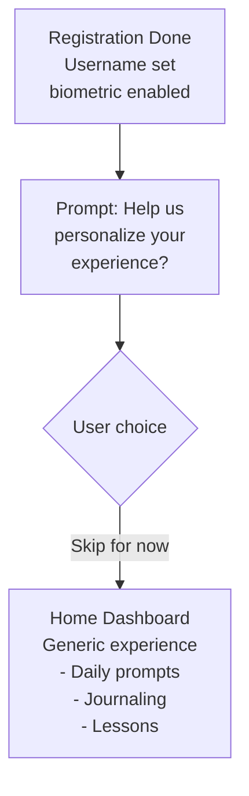
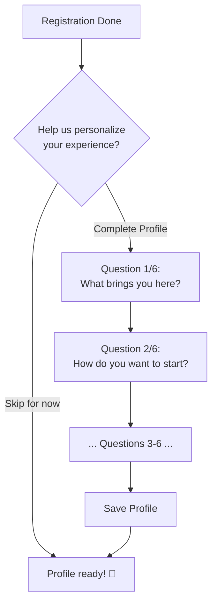
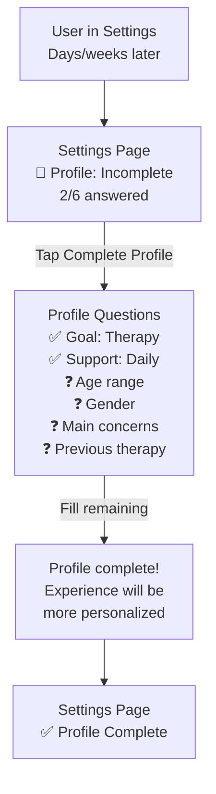

# 🌿 Onboarding Flow - TheraPrep

## Overview

TheraPrep's onboarding is **completely optional** and can be skipped during registration. Users can complete their profile questions anytime from the Settings page. This reduces friction and respects user autonomy while still enabling personalization when they're ready.

---

## 🎯 Design Goals

1. **Skip-First** - Allow users to start journaling immediately without barriers
2. **Deferred Completion** - Profile questions accessible anytime in Settings
3. **Progressive Disclosure** - Show value of personalization without forcing it
4. **No Friction** - Get to core features (journaling) in < 30 seconds
5. **Privacy Respecting** - Minimal required data, everything else is optional

---

## 🗺️ User Flows

### Flow A: Skip Onboarding (Fastest Path)



**Result:** User enters app immediately with default/generic content. No profile data stored yet.

---

### Flow B: Complete Onboarding (Optional)



**Result:** User's answers stored in `user_informations.kyc_answers` JSONB. AI uses this for personalization.

---

### Flow C: Complete Later in Settings



**Result:** Partial `kyc_answers` get updated with new fields. AI personalization improves.

---

## 📝 Onboarding Questions (All Optional)

### Question 1: What brings you here today?
**Purpose:** Defines user journey type

- 🧠 Understand myself better
- ✍️ Build a journaling habit  
- 🏥 Prepare for therapy
- 💚 Improve emotional wellness

**Stored as:** `kyc_answers.goal_reason`

---

### Question 2: How do you want to start?
**Purpose:** Defines daily support intensity

- 🌤️ Light daily reflections
- 📚 Learn with guided lessons
- 🔔 Check-ins and gentle reminders

**Stored as:** `kyc_answers.support_mode`

---

### Question 3: What's your age range?
**Purpose:** Tailor language tone and lesson complexity

- Under 18
- 18-24
- 25-34
- 35-44
- 45-54
- 55+

**Stored as:** `kyc_answers.age_range`

---

### Question 4: How do you identify?
**Purpose:** Respect pronouns and identity

- Male
- Female
- Non-binary
- Prefer not to say

**Stored as:** `kyc_answers.gender`

---

### Question 5: What are your main concerns? (Select up to 3)
**Purpose:** Guide lesson recommendations and AI tone

- Anxiety
- Depression
- Stress management
- Relationship issues
- Self-esteem
- Trauma
- Life transitions
- Other

**Stored as:** `kyc_answers.main_concerns` (array)

---

### Question 6: Have you attended therapy before?
**Purpose:** Adjust complexity of therapy prep content

- Yes, currently in therapy
- Yes, in the past
- No, but interested
- No, not interested

**Stored as:** `kyc_answers.therapy_experience`

---

## 💾 Data Storage

### Empty Profile (Skipped Onboarding)

**Stored in PostgreSQL `user_informations.kyc_answers`**: `{}`

**Impact:**
- AI uses generic prompts
- Dashboard shows default content
- Lessons not personalized
- Still fully functional

---

### Partial Profile (2/6 Questions Answered)

**Stored in PostgreSQL**: Contains `goal_reason` and `support_mode` fields

**Impact:**
- AI tailors prompts toward therapy preparation
- Lessons weighted toward guided content
- Other personalization still generic

---

### Complete Profile (All 6 Questions)

**Stored in PostgreSQL**: Contains all 6 fields (goal_reason, support_mode, age_range, gender, main_concerns array, therapy_experience)

**Impact:**
- Fully personalized AI prompts
- Age-appropriate language
- Lessons focused on selected concerns
- Therapy prep content tailored to experience level

---

## 🎨 UI/UX Specifications

### Registration → Onboarding Prompt

**Screen Layout:**

```mermaid
┌─────────────────────────────┐
│                             │
│        🌟                   │
│                             │
│  Help us personalize        │
│  your experience            │
│                             │
│  Answer 6 quick questions   │
│  to get tailored prompts    │
│  and lessons                │
│                             │
│  ┌───────────────────────┐  │
│  │  Complete Profile     │  │ ← Primary CTA
│  └───────────────────────┘  │
│                             │
│  Skip for now (complete     │ ← Text link
│  anytime in Settings)       │
│                             │
└─────────────────────────────┘
```

**Copy Guidelines:**
- ✅ "Help us personalize" (friendly invitation)
- ❌ "Tell us about yourself" (feels invasive)
- ✅ "Skip for now" (clear escape)
- ❌ "Maybe later" (vague)

---

### Settings: Profile Completion Entry

**Screen Layout:**

```mermaid
┌─────────────────────────────┐
│  Settings                   │
│                             │
│  Account                    │
│  ├─ Username: Sarah         │
│  └─ Device: iPhone 13       │
│                             │
│  Profile  🌱 Incomplete     │ ← Badge if < 6 answers
│  ├─ Complete Profile        │
│  │  (2/6 questions)         │
│                             │
│  Preferences                │
│  ├─ Theme                   │
│  └─ Notifications           │
└─────────────────────────────┘
```

**Badge States:**
- 🌱 **Incomplete** (0-5 answers)
- ✅ **Complete** (6/6 answers)

---

### Profile Questions Screen

**Screen Layout:**

```mermaid
┌─────────────────────────────┐
│  ← Back          [X] Close  │
│                             │
│  Question 3 of 6            │ ← Progress indicator
│  ●●●○○○                     │
│                             │
│  What's your age range?     │
│                             │
│  ○ Under 18                 │
│  ○ 18-24                    │
│  ● 25-34                    │ ← Selected
│  ○ 35-44                    │
│  ○ 45-54                    │
│  ○ 55+                      │
│                             │
│  ┌───────────────────────┐  │
│  │  Continue             │  │
│  └───────────────────────┘  │
│                             │
│  Skip this one              │ ← Each question skippable
└─────────────────────────────┘
```

**Interaction:**
- Tap answer → auto-advance to next question
- "Skip this one" → marks as skipped, moves to next
- "[X] Close" → saves progress, returns to Settings
- "← Back" → previous question (can change answer)

---

## 🔧 Technical Implementation

### Check Profile Completion Status

**Function Purpose**: Determine how many profile questions have been answered

**Logic**:
- Count answered fields out of 6 total questions
- Required fields: goal_reason, support_mode, age_range, gender, main_concerns, therapy_experience
- Return status: isComplete (boolean), answeredCount, totalQuestions, percentage

---

### Update Profile from Settings

**Function Purpose**: Save individual profile answers and sync

**Process**:
1. Update local cache (Capacitor Preferences)
2. Decrypt existing user profile
3. Update kyc_answers field
4. Encrypt and save back to Preferences
5. Add to sync queue
6. Sync to backend when online

---

### AI Personalization Based on Profile

**Function Purpose**: Generate appropriate journal prompts based on profile completeness

**Logic**:
- No profile data → Generic prompt: "How are you feeling today?"
- Partial profile → Basic personalization based on goal_reason
- Full profile → Deep personalization using main_concerns and other fields

---

## 📋 Implementation Strategy

### Phase 1: Registration (Complete)
- ✅ Allow skipping onboarding
- ✅ Empty `kyc_answers` by default
- ✅ Generic experience works fine

### Phase 2: Settings Entry
- [ ] Add "Profile" section in Settings
- [ ] Show completion badge (Incomplete/Complete)
- [ ] Display answered count (e.g., "2/6 questions")

### Phase 3: Profile Questions UI
- [ ] Build question flow screen
- [ ] Progress indicator (dots or 3/6 text)
- [ ] Skip button on each question
- [ ] Save progress even if interrupted

### Phase 4: AI Integration
- [ ] Check profile status before generating prompts
- [ ] Fallback to generic when data missing
- [ ] Gradual personalization as user fills more

---

##  Related Documentation

- **[Login Flow](./01-LOGIN-FLOW.md)** - Registration and authentication
- **[Data Models](./03-DATA-MODELS.md)** - `user_informations.kyc_answers` schema
- **[User Settings](../06.%20User%20profile%20and%20Settings/)** - Profile completion UI
- **[AI Guider](../02.%20Emotion%20Journal%20Feature/)** - Uses profile for personalization

---

**Last Updated**: November 21, 2025
