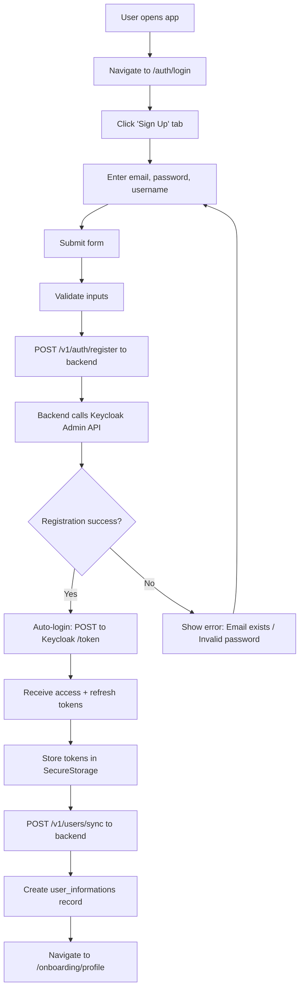
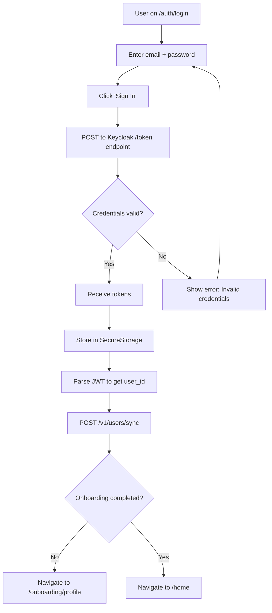
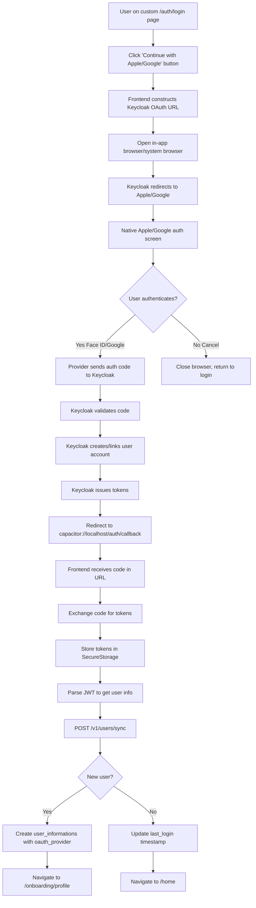
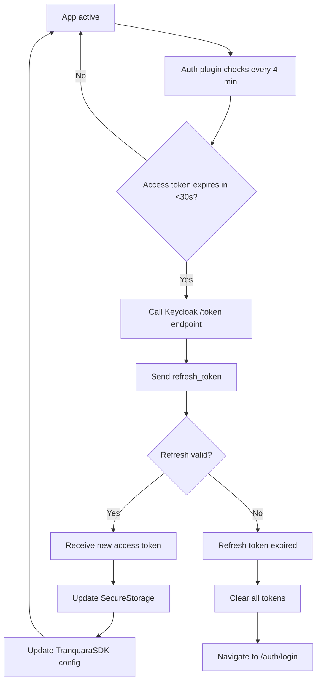

# User Registration & Authentication - Implementation Guide

> **Status**: ✅ Design Complete - Ready for Implementation  
> **Last Updated**: November 29, 2025  
> **Version**: 1.0.0  
> **Priority**: 🔴 CRITICAL

---

## 📑 Table of Contents

1. [Overview](#overview)
2. [Quick Reference & Validation Links](#quick-reference--validation-links)
3. [User Flows](#user-flows)
4. [Data Flow](#data-flow)
5. [Data Models](#data-models)
6. [Implementation Steps](#implementation-steps)
7. [Acceptance Criteria](#acceptance-criteria)

---

## 🔍 Quick Reference & Validation Links

**Core Specifications & Standards:**
| Topic | Specification | Purpose |
|-------|--------------|---------|
| OAuth 2.0 Framework | [RFC 6749](https://datatracker.ietf.org/doc/html/rfc6749) | Authorization framework foundation |
| Password Grant Flow | [RFC 6749 §4.3](https://datatracker.ietf.org/doc/html/rfc6749#section-4.3) | Email/password login (Direct Grant) |
| Authorization Code Flow | [RFC 6749 §4.1](https://datatracker.ietf.org/doc/html/rfc6749#section-4.1) | Social login OAuth flow |
| Token Refresh | [RFC 6749 §6](https://datatracker.ietf.org/doc/html/rfc6749#section-6) | Automatic token renewal |
| PKCE Security | [RFC 7636](https://datatracker.ietf.org/doc/html/rfc7636) | Mobile OAuth protection |
| Mobile OAuth | [RFC 8252](https://datatracker.ietf.org/doc/html/rfc8252) | Native app best practices |
| JWT Standard | [RFC 7519](https://datatracker.ietf.org/doc/html/rfc7519) | Token format specification |
| JWT Security | [RFC 8725](https://datatracker.ietf.org/doc/html/rfc8725) | Security considerations |
| OpenID Connect | [OIDC Spec](https://openid.net/specs/openid-connect-core-1_0.html) | Identity layer on OAuth 2.0 |

**Keycloak Official Docs:**
| Resource | Link | Use Case |
|----------|------|----------|
| Main Documentation | [keycloak.org/documentation](https://www.keycloak.org/documentation) | Complete reference |
| Server Admin Guide | [Server Admin](https://www.keycloak.org/docs/latest/server_admin/) | Realm/client setup |
| Securing Apps Guide | [Securing Apps](https://www.keycloak.org/docs/latest/securing_apps/) | Integration patterns |
| Admin REST API | [REST API Docs](https://www.keycloak.org/docs-api/latest/rest-api/) | Programmatic user management |
| Direct Access Grants | [Direct Grant](https://www.keycloak.org/docs/latest/server_admin/index.html#_direct-access-grants) | Custom login setup |
| Token Endpoint | [Token Exchange](https://www.keycloak.org/docs/latest/securing_apps/index.html#_token-exchange) | Token operations |
| Identity Brokering | [Social Login](https://www.keycloak.org/docs/latest/server_admin/index.html#_identity_broker) | Apple/Google integration |

**Capacitor Mobile Framework:**
| Plugin | Documentation | Purpose |
|--------|--------------|---------|
| Capacitor Core | [capacitorjs.com/docs](https://capacitorjs.com/docs) | Mobile framework |
| Preferences API | [Preferences](https://capacitorjs.com/docs/apis/preferences) | Local key-value storage |
| Browser API | [Browser](https://capacitorjs.com/docs/apis/browser) | OAuth in-app browser |
| Secure Storage | [GitHub Plugin](https://github.com/martinkasa/capacitor-secure-storage-plugin) | Encrypted token storage |
| Deep Links | [Deep Links Guide](https://capacitorjs.com/docs/guides/deep-links) | OAuth callback handling |

**Social Login Providers:**
| Provider | Setup Guide | Documentation |
|----------|-------------|---------------|
| Apple Sign-In | [Getting Started](https://developer.apple.com/sign-in-with-apple/get-started/) | [Full Docs](https://developer.apple.com/documentation/sign_in_with_apple) |
| Google OAuth | [Setup Guide](https://developers.google.com/identity/protocols/oauth2/native-app) | [Sign-In Docs](https://developers.google.com/identity/sign-in/ios) |

**Security & Best Practices:**
| Topic | Resource | Critical Info |
|-------|----------|--------------|
| Mobile Security | [OWASP Mobile](https://owasp.org/www-project-mobile-security/) | Mobile app security guidelines |
| Authentication | [OWASP Auth Cheat Sheet](https://cheatsheetseries.owasp.org/cheatsheets/Authentication_Cheat_Sheet.html) | Auth implementation patterns |
| JWT Best Practices | [OWASP JWT Guide](https://cheatsheetseries.owasp.org/cheatsheets/JSON_Web_Token_for_Java_Cheat_Sheet.html) | Secure JWT handling |
| Token Storage | [Auth0 Guide](https://auth0.com/docs/secure/security-guidance/data-security/token-storage) | Where to store tokens |
| iOS Keychain | [Apple Docs](https://developer.apple.com/documentation/security/keychain_services) | iOS secure storage |
| Android Keystore | [Android Guide](https://developer.android.com/training/articles/keystore) | Android secure storage |

**Implementation Tools:**
| Tool | Link | Purpose |
|------|------|---------|
| JWT Debugger | [jwt.io](https://jwt.io/) | Decode & validate JWTs |
| OAuth Playground | [oauth.tools](https://oauth.tools/) | Test OAuth flows |
| Postman Collection | [Keycloak Collection](https://www.postman.com/keycloak/workspace/keycloak/) | API testing |

---

## 🎯 Overview

### Feature Summary
Mobile-first authentication system with **custom login UI** for native app experience. Users can sign up/login with email/password or social providers (Apple, Google) through a branded, in-app interface. Keycloak handles authentication via Direct Grant Flow (email/password) and OAuth 2.0 (social login).

**📚 Core Technology References:**
- **Keycloak Documentation**: [https://www.keycloak.org/documentation](https://www.keycloak.org/documentation)
- **OAuth 2.0 Spec (RFC 6749)**: [https://datatracker.ietf.org/doc/html/rfc6749](https://datatracker.ietf.org/doc/html/rfc6749)
- **OpenID Connect (OIDC)**: [https://openid.net/connect/](https://openid.net/connect/)
- **Capacitor Documentation**: [https://capacitorjs.com/docs](https://capacitorjs.com/docs)

> **📱 Primary Implementation: Custom Login UI (Mobile-First)**
> 
> This guide implements **native login forms** in your app with Keycloak as the authentication backend:
> 
> **✅ What You Get:**
> - Custom email/password forms (no browser redirects)
> - Social login buttons that open native OAuth flows
> - Full UI/UX control for brand consistency
> - Seamless Capacitor mobile experience
> - Keycloak handles all authentication logic
> 
> **⚙️ How It Works:**
> - **Email/Password:** Direct Grant Flow (POST to Keycloak token endpoint)
>   - 📖 [Keycloak Direct Grant API](https://www.keycloak.org/docs/latest/securing_apps/index.html#_resource_owner_password_credentials_flow)
> - **Social Login:** Standard OAuth redirect (users briefly see Apple/Google auth)
>   - 📖 [Apple Sign In](https://developer.apple.com/sign-in-with-apple/)
>   - 📖 [Google OAuth 2.0](https://developers.google.com/identity/protocols/oauth2)
> - **Tokens:** Stored in Capacitor SecureStorage (encrypted)
>   - 📖 [Capacitor SecureStorage Plugin](https://github.com/martinkasa/capacitor-secure-storage-plugin)
> - **Backend Sync:** User profile synced to PostgreSQL after auth
>   - 📖 [JWT Token Format](https://jwt.io/introduction)
> 
> **📖 Alternative Approach:**
> For web-only apps or if you prefer Keycloak's hosted UI, see "Appendix: Keycloak Redirect Flow" at the end of this guide.

**User Story:**
> As a new user, I want to sign up using email or social login directly within the app, so I can start journaling immediately without disrupting my mobile experience.

### Key Requirements
- **Custom login/signup forms** with email/password validation
- **Social login buttons** for Apple Sign-In and Google OAuth
- **Direct Grant Flow** for email/password authentication ([Keycloak Resource Owner Password Grant](https://www.keycloak.org/docs/latest/securing_apps/index.html#_resource_owner_password_credentials_flow))
- **Secure token storage** (access token 5-min, refresh token 30-day) ([JWT Best Practices](https://datatracker.ietf.org/doc/html/rfc8725))
- **Auto-refresh mechanism** (background token renewal every 4 minutes)
- **Backend user registration** via Keycloak Admin API ([Admin REST API](https://www.keycloak.org/docs-api/latest/rest-api/index.html))
- **Optional KYC onboarding** flow after first login
- **Profile sync** to PostgreSQL via Go backend

---

## 👤 User Flows

### Flow 1: Email/Password Registration (Custom Form)



**Steps:**
1. User opens app → Lands on `/auth/login` page
2. User clicks **"Don't have an account? Sign up"** link
3. Form switches to Sign Up mode (shows username field)
4. User enters:
   - Email (validated format)
   - Password (min 8 chars, validation rules)
   - Username (unique)
5. User clicks **"Sign Up"** button
6. Frontend validates inputs locally
7. Frontend calls backend: `POST /v1/auth/register { email, password, username }`
8. **Backend creates user in Keycloak** via Admin API:
   - Creates user account
   - Sets password (non-temporary)
   - Assigns default roles
9. If success → Frontend auto-logs in user:
   - Calls Keycloak: `POST /realms/tranquara_auth/protocol/openid-connect/token`
   - Grant type: `password`
   - Returns access_token + refresh_token
10. Tokens stored in **Capacitor SecureStorage** (encrypted)
11. Frontend syncs user: `POST /v1/users/sync { email, username, oauth_provider: 'email' }`
12. Navigate to `/onboarding/profile` for KYC questions

**Expected Outcome:** New user registered, authenticated, ready for onboarding

---

### Flow 2: Email/Password Login (Custom Form)



**Steps:**
1. User enters email + password in custom form
2. User clicks **"Sign In"** button
3. Frontend calls Keycloak token endpoint directly:
   ```typescript
   POST http://localhost:4200/realms/tranquara_auth/protocol/openid-connect/token
   Body: {
     grant_type: 'password',
     client_id: 'tranquara_auth_client',
     username: 'user@email.com',
     password: '********'
   }
   ```
4. Keycloak validates credentials
5. If valid → Returns:
   ```json
   {
     "access_token": "eyJhbG...",
     "refresh_token": "eyJhbG...",
     "expires_in": 300,
     "refresh_expires_in": 2592000
   }
   ```
6. Frontend stores tokens in SecureStorage
7. Parse JWT to extract `sub` (user_id), `email`, `preferred_username`
8. Call backend: `POST /v1/users/sync` to update last_login
9. Check if `onboarding_completed` flag exists in storage
10. Navigate accordingly

**Expected Outcome:** Existing user logged in, tokens secured, seamless navigation

---

### Flow 3: Social Login (Apple/Google) - Custom UI



**Steps:**
1. User on **your custom login page** clicks "Continue with Apple" or "Continue with Google" button
2. Frontend constructs Keycloak OAuth authorization URL:
   ```typescript
   const authUrl = `http://localhost:4200/realms/tranquara_auth/protocol/openid-connect/auth?` +
     `client_id=tranquara_auth_client&` +
     `redirect_uri=capacitor://localhost/auth/callback&` +
     `response_type=code&` +
     `scope=openid email profile&` +
     `kc_idp_hint=apple`;  // or 'google'
   ```
3. Open URL in **Capacitor Browser** (or system browser on web):
   ```typescript
   import { Browser } from '@capacitor/browser';
   await Browser.open({ url: authUrl });
   ```
4. Keycloak **immediately redirects** to Apple/Google (user sees Keycloak page for ~100ms)
5. **Native authentication screen** appears:
   - **Apple:** Face ID / Touch ID prompt
   - **Google:** Google account picker
6. User authenticates → Provider sends authorization code to Keycloak
7. Keycloak validates code with Apple/Google
8. Keycloak creates user account (if first login) or links to existing account
9. Keycloak issues access_token + refresh_token
10. Keycloak redirects to: `capacitor://localhost/auth/callback?code=ABC123`
11. Your app's **`/auth/callback` page** receives the code
12. Frontend exchanges code for tokens:
    ```typescript
    POST http://localhost:4200/realms/tranquara_auth/protocol/openid-connect/token
    Body: {
      grant_type: 'authorization_code',
      client_id: 'tranquara_auth_client',
      code: 'ABC123',
      redirect_uri: 'capacitor://localhost/auth/callback'
    }
    ```
13. Store tokens in SecureStorage (encrypted)
14. Parse JWT to extract user info:
    ```typescript
    {
      sub: "550e8400-e29b-41d4-a716-446655440000",
      email: "user@privaterelay.appleid.com",
      preferred_username: "user123",
      oauth_provider: "apple"
    }
    ```
15. Sync to backend: `POST /v1/users/sync { email, username, oauth_provider: 'apple' }`
16. If new user → Navigate to `/onboarding/profile`
17. If returning user → Navigate to `/home`

**Expected Outcome:** Social login initiated from custom UI, brief OAuth redirect, seamless return to app

---

### Flow 4: Token Refresh (Background)



**Steps:**
1. Nuxt plugin runs background interval (every 4 minutes)
2. Check access token expiry time
3. If <30 seconds remaining → Trigger refresh
4. Call Keycloak `/realms/tranquara_auth/protocol/openid-connect/token`
5. Send `refresh_token` + `grant_type=refresh_token`
6. If valid → Receive new access token
7. Update SecureStorage with new token
8. Update SDK authorization header
9. Continue app operation (transparent to user)
10. If refresh expired (>30 days) → Clear storage, redirect to login

**Expected Outcome:** User never sees "session expired" if app used within 30 days

---

## 🔄 Data Flow

### Architecture Overview

```
┌─────────────────────────────────────────────────────┐
│                    FRONTEND (Mobile App)            │
├─────────────────────────────────────────────────────┤
│  Custom Login UI  →  AuthStore  →  Direct API Calls│
│       ↓                  ↓                ↓          │
│  Capacitor SecureStorage (encrypted tokens)         │
└─────────────────────────────────────────────────────┘
         ↓ ↑ (Direct Grant)        ↓ ↑ (OAuth 2.0)
┌─────────────────────────────────────────────────────┐
│              KEYCLOAK (Auth Server)                 │
├─────────────────────────────────────────────────────┤
│  Token Endpoint → Admin API → Social Providers     │
│  (Direct Grant)   (User Reg)   (Apple/Google)      │
└─────────────────────────────────────────────────────┘
                       ↓ ↑ (REST API + JWT)
┌─────────────────────────────────────────────────────┐
│           BACKEND (Go Core Service)                 │
├─────────────────────────────────────────────────────┤
│  Registration Handler → JWT Middleware → PostgreSQL│
│  (Keycloak Admin API)   (Token Validation)          │
│                             ↓                        │
│                   user_informations table            │
└─────────────────────────────────────────────────────┘
```

**Key Components:**
- **Custom Login UI**: Email/password forms in your Vue components (no Keycloak pages)
  - 📖 [Nuxt 3 Pages](https://nuxt.com/docs/guide/directory-structure/pages)
  - 📖 [Pinia State Management](https://pinia.vuejs.org/)
- **Direct Grant Flow**: Frontend → Keycloak token endpoint (email/password)
  - 📖 [OAuth 2.0 Password Grant](https://datatracker.ietf.org/doc/html/rfc6749#section-4.3)
- **Admin API**: Backend creates users in Keycloak programmatically
  - 📖 [Keycloak Admin REST API](https://www.keycloak.org/docs-api/latest/rest-api/index.html)
- **SecureStorage**: Encrypted keychain/keystore for tokens
  - 📖 [iOS Keychain Services](https://developer.apple.com/documentation/security/keychain_services)
  - 📖 [Android Keystore](https://developer.android.com/training/articles/keystore)
- **JWT Middleware**: Backend validates Keycloak-issued tokens
  - 📖 [JWT Validation](https://www.keycloak.org/docs/latest/securing_apps/index.html#_token_validation)

---

### Detailed Data Flow

#### Scenario 1: First-Time Registration (Custom Form)

📖 **Related Documentation:**
- [Keycloak Admin API - Create User](https://www.keycloak.org/docs-api/latest/rest-api/index.html#_users_resource)
- [Direct Grant Token Endpoint](https://www.keycloak.org/docs/latest/securing_apps/index.html#_resource_owner_password_credentials_flow)

```
1. User fills registration form in /auth/login
   Input: { email, password, username }
       ↓
2. Frontend calls backend: POST /v1/auth/register
   {
     "email": "user@example.com",
     "password": "SecurePass123!",
     "username": "user123"
   }
       ↓
3. Backend validates inputs (email format, password strength)
       ↓
4. Backend gets Keycloak Admin token:
   POST /realms/master/protocol/openid-connect/token
   Body: { grant_type: client_credentials, client_id: admin-cli }
       ↓
5. Backend creates user via Keycloak Admin API:
   POST /admin/realms/tranquara_auth/users
   {
     "username": "user123",
     "email": "user@example.com",
     "enabled": true,
     "credentials": [{ 
       "type": "password", 
       "value": "SecurePass123!",
       "temporary": false 
     }]
   }
       ↓
6. Keycloak creates user (HTTP 201)
       ↓
7. Backend responds: { "success": true, "user_id": "uuid" }
       ↓
8. Frontend auto-logs in user (Direct Grant):
   POST /realms/tranquara_auth/protocol/openid-connect/token
   {
     "grant_type": "password",
     "client_id": "tranquara_auth_client",
     "username": "user@example.com",
     "password": "SecurePass123!"
   }
       ↓
9. Keycloak returns tokens:
   {
     "access_token": "eyJhbG...",
     "refresh_token": "eyJhbG...",
     "expires_in": 300,
     "refresh_expires_in": 2592000
   }
       ↓
10. Frontend stores in SecureStorage:
    - access_token
    - refresh_token
    - expires_at (now + 300s)
    - refresh_expires_at (now + 2592000s)
       ↓
11. Frontend parses JWT to get user_id (sub claim)
       ↓
12. Frontend syncs to PostgreSQL: POST /v1/users/sync
    {
      "email": "user@example.com",
      "username": "user123",
      "oauth_provider": "email"
    }
       ↓
13. Backend INSERT INTO user_informations:
    (user_id, email, username, oauth_provider)
       ↓
14. Frontend navigates to /onboarding/profile
```

**Expected Result:** ✅ New user registered, logged in, ready for onboarding

---

#### Scenario 2: Login with Email/Password (Custom Form)

📖 **Token Endpoint Reference:**
- [POST to Token Endpoint](https://www.keycloak.org/docs/latest/securing_apps/index.html#_token-exchange)
- [OAuth 2.0 Password Grant](https://datatracker.ietf.org/doc/html/rfc6749#section-4.3)

```
1. User enters credentials in custom login form
   Input: { email: "user@example.com", password: "SecurePass123!" }
       ↓
2. Frontend calls Keycloak token endpoint directly:
   POST http://localhost:4200/realms/tranquara_auth/protocol/openid-connect/token
   Headers: { Content-Type: application/x-www-form-urlencoded }
   Body: {
     grant_type=password&
     client_id=tranquara_auth_client&
     username=user@example.com&
     password=SecurePass123!&
     scope=openid email profile
   }
       ↓
3. Keycloak validates username/password against its database
       ↓
4. If valid → Keycloak issues tokens (same as scenario 1 step 9)
       ↓
5. Frontend stores tokens in SecureStorage
       ↓
6. Frontend parses JWT:
   {
     "sub": "550e8400-e29b-41d4-a716-446655440000",
     "email": "user@example.com",
     "preferred_username": "user123",
     "exp": 1732888500
   }
       ↓
7. Frontend syncs user: POST /v1/users/sync
   (Backend updates updated_at timestamp)
       ↓
8. Check local storage for onboarding_completed flag
       ↓
9. Navigate to /home or /onboarding/profile
```

**Expected Result:** ✅ User logged in, tokens secured, seamless navigation

---

#### Scenario 3: Social Login (Apple) - From Custom UI

📖 **OAuth Flow References:**
- [OAuth 2.0 Authorization Code Flow](https://datatracker.ietf.org/doc/html/rfc6749#section-4.1)
- [Keycloak Identity Brokering](https://www.keycloak.org/docs/latest/server_admin/index.html#_identity_broker)
- [Apple Sign In Documentation](https://developer.apple.com/documentation/sign_in_with_apple)

```
1. User on custom login page clicks "Continue with Apple" button
       ↓
2. Frontend constructs Keycloak OAuth authorization URL:
   const authUrl = `http://localhost:4200/realms/tranquara_auth/protocol/openid-connect/auth?` +
     `client_id=tranquara_auth_client&` +
     `redirect_uri=capacitor://localhost/auth/callback&` +
     `response_type=code&` +
     `scope=openid email profile&` +
     `kc_idp_hint=apple`;
       ↓
3. Frontend opens in Capacitor Browser:
   import { Browser } from '@capacitor/browser';
   await Browser.open({ url: authUrl });
       ↓
4. Browser redirects to Apple Sign-In page (Native iOS):
   https://appleid.apple.com/auth/authorize?...
       ↓
5. User sees Face ID / Touch ID prompt
       ↓
6. User authenticates → Apple returns authorization code:
   http://localhost:4200/realms/tranquara_auth/broker/apple/endpoint?code=ABC123
       ↓
7. Keycloak exchanges code with Apple:
   POST https://appleid.apple.com/auth/token
   Body: { grant_type: 'authorization_code', code: 'ABC123', ... }
       ↓
8. Apple returns user info:
   {
     "sub": "001234.abc...",
     "email": "user@privaterelay.appleid.com",
     "email_verified": true
   }
       ↓
9. Keycloak checks if user exists (by email or federated ID)
       ↓
10. If new user → Keycloak creates account:
    {
      "username": "apple_001234abc",
      "email": "user@privaterelay.appleid.com",
      "federatedIdentities": [{
        "identityProvider": "apple",
        "userId": "001234.abc..."
      }]
    }
       ↓
11. Keycloak issues access_token + refresh_token
       ↓
12. Keycloak redirects to:
    capacitor://localhost/auth/callback?code=XYZ789
       ↓
13. Your app's /auth/callback page receives code
       ↓
14. Frontend exchanges code for tokens:
    POST http://localhost:4200/realms/tranquara_auth/protocol/openid-connect/token
    {
      "grant_type": "authorization_code",
      "client_id": "tranquara_auth_client",
      "code": "XYZ789",
      "redirect_uri": "capacitor://localhost/auth/callback"
    }
       ↓
15. Keycloak returns tokens:
    {
      "access_token": "eyJhbG...",
      "refresh_token": "eyJhbG...",
      "expires_in": 300,
      "refresh_expires_in": 2592000
    }
       ↓
16. Frontend stores in SecureStorage (encrypted)
       ↓
17. Frontend parses JWT:
    {
      "sub": "550e8400-e29b-41d4-a716-446655440000",
      "email": "user@privaterelay.appleid.com",
      "preferred_username": "apple_001234abc",
      "federated_claims": {
        "identity_provider": "apple"
      }
    }
       ↓
18. Frontend syncs to backend: POST /v1/users/sync
    {
      "email": "user@privaterelay.appleid.com",
      "username": "apple_001234abc",
      "oauth_provider": "apple"
    }
       ↓
19. Backend INSERT INTO user_informations:
    (user_id, email, username, oauth_provider='apple')
       ↓
20. Close Browser window, return to app
       ↓
21. If new user → Navigate to /onboarding/profile
    If existing user → Navigate to /home
```

**Expected Result:** ✅ Social login from custom UI, brief OAuth redirect, tokens secured

**User Experience:**
- User taps "Continue with Apple" on **your branded login page**
- Browser opens for ~2-3 seconds (Apple auth)
- User sees Face ID prompt (native)
- Browser closes automatically
- User returns to **your app** (onboarding or home)
- **Total time:** ~5 seconds for first-time Apple Sign-In

---

#### Scenario 4: Token Refresh (Background)

📖 **Token Refresh Documentation:**
- [Refresh Token Grant](https://datatracker.ietf.org/doc/html/rfc6749#section-6)
- [Token Refresh Best Practices](https://auth0.com/docs/secure/tokens/refresh-tokens/refresh-token-rotation)

```
1. App resume event fires (user returns to app)
       ↓
2. Auth plugin checks access_token.expires_at
       ↓
3. If <30s remaining → Call Keycloak /token
       ↓
4. Request body: {grant_type: 'refresh_token', refresh_token: '...'}
       ↓
5. Keycloak validates refresh_token
       ↓
6. Keycloak returns new access_token (extends 5 min)
       ↓
7. Update SecureStorage with new access_token
       ↓
8. Update TranquaraSDK.config.access_token
       ↓
9. All API calls now use new token
       ↓
10. User unaware of refresh (transparent)
```

---

## 📊 Data Models

### Storage Strategy

📖 **Storage Best Practices:**
- [Mobile App Security](https://owasp.org/www-project-mobile-security/)
- [Secure Data Storage](https://cheatsheetseries.owasp.org/cheatsheets/Mobile_Application_Security_Cheat_Sheet.html)

| Data Type | Storage Method | Reason |
|-----------|---------------|--------|
| **Access Token** | Capacitor SecureStorage | Sensitive, 5-min TTL, encrypted keychain/keystore |
| **Refresh Token** | Capacitor SecureStorage | Highly sensitive, 30-day TTL, must be encrypted |
| **User Profile** | Capacitor Preferences | Cache user info (name, email), small data |
| **Onboarding Flags** | Capacitor Preferences | `onboarding_completed`, `onboarding_skipped` |

---

### Database Schema

#### user_informations (PostgreSQL)

```sql
CREATE TABLE user_informations (
    user_id UUID PRIMARY KEY,  -- From Keycloak JWT sub claim
    email VARCHAR(255) UNIQUE NOT NULL,
    username VARCHAR(100),  -- Display name (changeable)
    oauth_provider VARCHAR(50),  -- 'email', 'google', 'apple'
    kyc_answers JSONB,  -- Onboarding responses
    name TEXT,
    age_range VARCHAR(50),  -- '18-24', '25-34', etc.
    gender VARCHAR(50),
    settings JSONB DEFAULT '{}',
    created_at TIMESTAMP DEFAULT CURRENT_TIMESTAMP,
    updated_at TIMESTAMP DEFAULT CURRENT_TIMESTAMP
);

CREATE INDEX idx_user_informations_email ON user_informations(email);
CREATE INDEX idx_user_informations_oauth_provider ON user_informations(oauth_provider);
```

**Migration File:** `000001_create_user_informations_table.up.sql`

**Down Migration:**
```sql
DROP TABLE IF EXISTS user_informations;
```

---

### TypeScript Types

```typescript
// Keycloak token storage
interface TokenStorage {
  access_token: string;
  refresh_token: string;
  expires_at: number;  // Unix timestamp
  refresh_expires_at: number;
}

// User profile
interface User {
  id: string;  // UUID from Keycloak
  email: string;
  username: string;
  name?: string;
  age_range?: string;
  gender?: string;
  oauth_provider?: 'email' | 'google' | 'apple';
  kyc_answers?: Record<string, any>;
  settings?: Record<string, any>;
  created_at: string;
  updated_at?: string;
}

// API request/response
interface SyncUserRequest {
  email: string;
  username: string;
  oauth_provider?: string;
}

interface UpdateProfileRequest {
  name?: string;
  age_range?: string;
  gender?: string;
  kyc_answers?: Record<string, any>;
}

interface UserResponse {
  user: User;
}
```

---

## 🛠️ Implementation Steps

### Phase 1: Database & Keycloak Setup

#### Step 1: Create Database Migration
```bash
cd tranquara_core_service/migrations
touch 000001_create_user_informations_table.up.sql
touch 000001_create_user_informations_table.down.sql
```

**File: 000001_create_user_informations_table.up.sql**
```sql
CREATE TABLE user_informations (
    user_id UUID PRIMARY KEY,
    email VARCHAR(255) UNIQUE NOT NULL,
    username VARCHAR(100),
    oauth_provider VARCHAR(50),
    kyc_answers JSONB,
    name TEXT,
    age_range VARCHAR(50),
    gender VARCHAR(50),
    settings JSONB DEFAULT '{}',
    created_at TIMESTAMP DEFAULT CURRENT_TIMESTAMP,
    updated_at TIMESTAMP DEFAULT CURRENT_TIMESTAMP
);

CREATE INDEX idx_user_informations_email ON user_informations(email);
CREATE INDEX idx_user_informations_oauth_provider ON user_informations(oauth_provider);
```

**Run migration:**
```bash
cd tranquara_core_service
make migrate-up
```

**Expected Result:** ✅ Table created in PostgreSQL

---

#### Step 2: Configure Keycloak Realm (For Custom Login)

**📖 Official Documentation:**
- [Keycloak Server Administration](https://www.keycloak.org/docs/latest/server_admin/)
- [Client Configuration](https://www.keycloak.org/docs/latest/server_admin/index.html#_clients)
- [Direct Access Grants](https://www.keycloak.org/docs/latest/server_admin/index.html#_direct-access-grants)

**Start Keycloak:**
```bash
cd tranquara_core_service
docker-compose up -d keycloak
```

**Access Admin Console:** http://localhost:4200  
**Default credentials:** admin / admin

---

**A. Create Realm**
1. Click "Add realm" → Name: `tranquara_auth`
2. Save

---

**B. Create Client (Public Client for Mobile)**
1. Navigate to **Clients** → Click **Create**
2. Client ID: `tranquara_auth_client`
3. Client Protocol: `openid-connect`
4. Save

**Client Settings:**
- **Access Type:** `public` (no client secret required for mobile apps)
  - 📖 [Public vs Confidential Clients](https://www.keycloak.org/docs/latest/server_admin/index.html#_access-type)
- **Standard Flow Enabled:** `ON` (for social login redirects)
  - 📖 [Authorization Code Flow](https://datatracker.ietf.org/doc/html/rfc6749#section-4.1)
- **Direct Access Grants Enabled:** `ON` ⚠️ **CRITICAL for custom login**
  - 📖 [Resource Owner Password Credentials Grant](https://www.keycloak.org/docs/latest/securing_apps/index.html#_resource_owner_password_credentials_flow)
- **Implicit Flow Enabled:** `OFF`
- **Service Accounts Enabled:** `OFF`

**Valid Redirect URIs** (for social login callbacks):
```
http://localhost:3000/*
capacitor://localhost/*
capacitor://localhost/auth/callback
```
📖 [Capacitor Deep Links](https://capacitorjs.com/docs/guides/deep-links)

**Web Origins:** 
```
*
```
(Or specify: `http://localhost:3000`, `capacitor://localhost`)

**Advanced Settings:**
- Proof Key for Code Exchange Code Challenge Method: `S256` (PKCE for security)
  - 📖 [PKCE (RFC 7636)](https://datatracker.ietf.org/doc/html/rfc7636)
  - 📖 [OAuth 2.0 for Mobile Apps](https://datatracker.ietf.org/doc/html/rfc8252)

3. Click **Save**

---

**C. Configure Token Lifespans**

📖 [Keycloak Token Settings](https://www.keycloak.org/docs/latest/server_admin/index.html#_timeouts)

1. Navigate to **Realm Settings** → **Tokens** tab
2. Configure:
   - **Access Token Lifespan:** `5 minutes` (short-lived for security)
   - **Refresh Token Lifespan:** `30 days` (allows offline access)
   - **SSO Session Idle:** `30 days`
   - **SSO Session Max:** `30 days`
3. Save

---

**D. Create Admin Service Account (For Backend User Registration)**

📖 [Keycloak Service Accounts](https://www.keycloak.org/docs/latest/server_admin/index.html#_service_accounts)

This is required so your backend can create users programmatically.

1. Navigate to **Clients** → Click **Create**
2. Client ID: `tranquara_admin`
3. Client Protocol: `openid-connect`
4. Save

**Client Settings:**
- **Access Type:** `confidential`
- **Service Accounts Enabled:** `ON`
- **Direct Access Grants Enabled:** `OFF`
- Save

5. Go to **Credentials** tab → Copy **Secret** (save this!)

6. Go to **Service Account Roles** tab:
   - Client Roles → `realm-management` → Available Roles
   - Select: `manage-users`, `view-users`, `create-user`
   - Click **Add selected**

**Save credentials in backend `.env`:**
```bash
KEYCLOAK_ADMIN_CLIENT_ID=tranquara_admin
KEYCLOAK_ADMIN_CLIENT_SECRET=<copied_secret>
KEYCLOAK_URL=http://localhost:4200
KEYCLOAK_REALM=tranquara_auth
```

**Expected Result:** ✅ Keycloak configured for custom login + backend user registration

---

#### Step 3: Add Social Identity Providers

📖 **Official Provider Documentation:**
- [Keycloak Identity Brokering](https://www.keycloak.org/docs/latest/server_admin/index.html#_identity_broker)
- [Apple Sign In Setup](https://developer.apple.com/sign-in-with-apple/get-started/)
- [Google OAuth Setup](https://developers.google.com/identity/protocols/oauth2/native-app)

**Apple:**
1. Identity Providers → Add provider → Apple
2. Configure with Apple Developer credentials:
   - Client ID (Services ID)
   - Team ID
   - Key ID
   - Private Key (.p8 file)
3. Redirect URI: `http://localhost:4200/realms/tranquara_auth/broker/apple/endpoint`
4. Save

**Google:**
1. Identity Providers → Add provider → Google
2. Get credentials from Google Cloud Console
3. Configure:
   - Client ID
   - Client Secret
4. Redirect URI: `http://localhost:4200/realms/tranquara_auth/broker/google/endpoint`
5. Save

**Expected Result:** ✅ Social login buttons appear in Keycloak

---

### Phase 2: Frontend Storage Services

#### Step 4: Install Capacitor Plugins

📖 **Capacitor Plugin Documentation:**
- [Capacitor Preferences](https://capacitorjs.com/docs/apis/preferences)
- [Capacitor Secure Storage](https://github.com/martinkasa/capacitor-secure-storage-plugin)

```bash
cd tranquara_frontend
npm install @capacitor/preferences capacitor-secure-storage-plugin
npx cap sync
```

**Expected Result:** ✅ Plugins installed and synced to native projects

---

#### Step 5: Create Storage Utilities

**File: `tranquara_frontend/utils/storage.ts`**
```typescript
import { Preferences } from '@capacitor/preferences';

export const storage = {
  async set(key: string, value: any): Promise<void> {
    await Preferences.set({
      key,
      value: JSON.stringify(value),
    });
  },

  async get<T>(key: string): Promise<T | null> {
    const { value } = await Preferences.get({ key });
    return value ? JSON.parse(value) : null;
  },

  async remove(key: string): Promise<void> {
    await Preferences.remove({ key });
  },

  async clear(): Promise<void> {
    await Preferences.clear();
  },
};
```

**File: `tranquara_frontend/utils/secure-storage.ts`**
```typescript
import { SecureStoragePlugin } from 'capacitor-secure-storage-plugin';

export const secureStorage = {
  async setToken(key: string, value: string): Promise<void> {
    await SecureStoragePlugin.set({ key, value });
  },

  async getToken(key: string): Promise<string | null> {
    try {
      const { value } = await SecureStoragePlugin.get({ key });
      return value;
    } catch {
      return null;
    }
  },

  async removeToken(key: string): Promise<void> {
    await SecureStoragePlugin.remove({ key });
  },

  async clearAll(): Promise<void> {
    await SecureStoragePlugin.clear();
  },
};
```

**Expected Result:** ✅ Storage utilities ready

---

#### Step 6: Enhance KeycloakService

**File: `tranquara_frontend/stores/auth/keycloak_service.ts`**

Add these methods to existing class:

```typescript
import { secureStorage } from '~/utils/secure-storage';
import { storage } from '~/utils/storage';

// Add to KeycloakService class:

public async storeTokens(): Promise<void> {
  const token = this.getToken();
  const refreshToken = KeycloakService._kc.refreshToken;
  
  if (token) {
    await secureStorage.setToken('access_token', token);
  }
  if (refreshToken) {
    await secureStorage.setToken('refresh_token', refreshToken);
  }
  
  // Store expiry times
  const tokenParsed = this.getTokenParsed();
  if (tokenParsed) {
    await storage.set('token_expires_at', tokenParsed.exp);
  }
}

public async loadStoredTokens(): Promise<boolean> {
  const token = await secureStorage.getToken('access_token');
  const refreshToken = await secureStorage.getToken('refresh_token');
  
  if (token && refreshToken) {
    KeycloakService._kc.token = token;
    KeycloakService._kc.refreshToken = refreshToken;
    return true;
  }
  return false;
}

public async getUserInfo(): Promise<any> {
  return KeycloakService._kc.loadUserInfo();
}

public async doLogoutWithCleanup(): Promise<void> {
  await secureStorage.clearAll();
  await storage.clear();
  KeycloakService._kc.logout();
}

public startTokenRefresh(): void {
  // Refresh every 4 minutes (before 5-min expiry)
  setInterval(async () => {
    try {
      await this.refreshToken();
      await this.storeTokens();
    } catch (error) {
      console.error('Token refresh failed:', error);
    }
  }, 240000); // 4 minutes
}

public async initWithProvider(provider: 'google' | 'apple'): Promise<void> {
  const loginOptions: Keycloak.KeycloakLoginOptions = {
    idpHint: provider,
  };
  await KeycloakService._kc.login(loginOptions);
}
```

**Expected Result:** ✅ KeycloakService enhanced with storage

---

#### Step 7: Create Auth Store

**File: `tranquara_frontend/stores/auth/index.ts`**
```typescript
import { defineStore } from 'pinia';
import { KeycloakService } from './keycloak_service';
import { TranquaraSDK } from '../tranquara_sdk';
import { storage } from '~/utils/storage';

interface User {
  id: string;
  email: string;
  username: string;
  name?: string;
}

export const useAuthStore = defineStore('auth', {
  state: () => ({
    user: null as User | null,
    isAuthenticated: false,
    loading: false,
    error: null as string | null,
  }),

  actions: {
    async initialize() {
      this.loading = true;
      try {
        const keycloak = KeycloakService.getInstance();
        
        // Try to load stored tokens
        const hasTokens = await keycloak.loadStoredTokens();
        
        if (hasTokens) {
          // Validate token
          const userInfo = await keycloak.getUserInfo();
          this.user = {
            id: keycloak.getUserUUid() || '',
            email: userInfo.email,
            username: userInfo.preferred_username,
            name: userInfo.name,
          };
          this.isAuthenticated = true;
          
          // Start auto-refresh
          keycloak.startTokenRefresh();
          
          // Sync with backend
          await this.syncUserProfile();
        }
      } catch (error) {
        console.error('Auth initialization failed:', error);
        this.isAuthenticated = false;
      } finally {
        this.loading = false;
      }
    },

    async login() {
      const keycloak = KeycloakService.getInstance();
      await keycloak.initKeycloak(async () => {
        await keycloak.storeTokens();
        await this.initialize();
      });
    },

    async loginWithSocial(provider: 'google' | 'apple') {
      const keycloak = KeycloakService.getInstance();
      await keycloak.initWithProvider(provider);
      await keycloak.storeTokens();
      await this.initialize();
    },

    async logout() {
      const keycloak = KeycloakService.getInstance();
      await keycloak.doLogoutWithCleanup();
      this.user = null;
      this.isAuthenticated = false;
    },

    async syncUserProfile() {
      try {
        const sdk = TranquaraSDK.getInstance();
        const response = await sdk.fetch<{ user: User }>('POST', '/users/sync', {
          email: this.user?.email,
          username: this.user?.username,
        });
        
        // Cache profile
        await storage.set('user_profile', response.user);
      } catch (error) {
        console.error('Profile sync failed:', error);
      }
    },

    async updateProfile(data: Partial<User>) {
      try {
        const sdk = TranquaraSDK.getInstance();
        await sdk.fetch('PUT', '/users/profile', data);
        
        // Update local state
        if (this.user) {
          this.user = { ...this.user, ...data };
        }
      } catch (error) {
        console.error('Profile update failed:', error);
        throw error;
      }
    },
  },
});
```

**Expected Result:** ✅ Auth store with Keycloak integration

---

### Phase 3: Backend API

#### Step 8: Create User Handlers

**File: `tranquara_core_service/cmd/api/handlers_users.go`**
```go
package main

import (
	"encoding/json"
	"net/http"
	"time"
)

type UserSyncInput struct {
	Email    string `json:"email"`
	Username string `json:"username"`
	Provider string `json:"oauth_provider"`
}

type UserProfileInput struct {
	Name       *string                `json:"name"`
	AgeRange   *string                `json:"age_range"`
	Gender     *string                `json:"gender"`
	KycAnswers *map[string]interface{} `json:"kyc_answers"`
}

func (app *application) syncUserHandler(w http.ResponseWriter, r *http.Request) {
	var input UserSyncInput
	
	err := json.NewDecoder(r.Body).Decode(&input)
	if err != nil {
		app.badRequestResponse(w, r, err)
		return
	}

	// Get user_id from JWT token
	userUUID, err := app.GetUserUUIDFromContext(r.Context())
	if err != nil {
		app.serverErrorResponse(w, r, err)
		return
	}

	// Check if user exists
	query := `SELECT user_id FROM user_informations WHERE user_id = $1`
	var existingID string
	err = app.DB.QueryRow(query, userUUID).Scan(&existingID)
	
	if err == sql.ErrNoRows {
		// Create new user
		insertQuery := `
			INSERT INTO user_informations (user_id, email, username, oauth_provider)
			VALUES ($1, $2, $3, $4)
			RETURNING created_at`
		
		var createdAt time.Time
		err = app.DB.QueryRow(insertQuery, userUUID, input.Email, input.Username, input.Provider).Scan(&createdAt)
		if err != nil {
			app.serverErrorResponse(w, r, err)
			return
		}
	} else {
		// Update last_login
		updateQuery := `UPDATE user_informations SET updated_at = NOW() WHERE user_id = $1`
		_, err = app.DB.Exec(updateQuery, userUUID)
		if err != nil {
			app.serverErrorResponse(w, r, err)
			return
		}
	}

	response := map[string]interface{}{
		"user_id":  userUUID.String(),
		"email":    input.Email,
		"username": input.Username,
	}

	err = app.writeJSON(w, http.StatusOK, envelope{"user": response}, nil)
	if err != nil {
		app.serverErrorResponse(w, r, err)
	}
}

func (app *application) updateUserProfileHandler(w http.ResponseWriter, r *http.Request) {
	userUUID, err := app.GetUserUUIDFromContext(r.Context())
	if err != nil {
		app.serverErrorResponse(w, r, err)
		return
	}

	var input UserProfileInput
	err = json.NewDecoder(r.Body).Decode(&input)
	if err != nil {
		app.badRequestResponse(w, r, err)
		return
	}

	query := `
		UPDATE user_informations 
		SET name = COALESCE($1, name),
		    age_range = COALESCE($2, age_range),
		    gender = COALESCE($3, gender),
		    kyc_answers = COALESCE($4, kyc_answers),
		    updated_at = NOW()
		WHERE user_id = $5`
	
	_, err = app.DB.Exec(query, input.Name, input.AgeRange, input.Gender, input.KycAnswers, userUUID)
	if err != nil {
		app.serverErrorResponse(w, r, err)
		return
	}

	app.writeJSON(w, http.StatusOK, envelope{"message": "Profile updated"}, nil)
}
```

**Expected Result:** ✅ Backend handlers implemented

---

#### Step 8B: Add Registration Handler (Keycloak Admin API)

📖 **Keycloak Admin API:**
- [Admin REST API Reference](https://www.keycloak.org/docs-api/latest/rest-api/index.html)
- [User Management API](https://www.keycloak.org/docs-api/latest/rest-api/index.html#_users_resource)
- [Service Account Authentication](https://www.keycloak.org/docs/latest/server_admin/index.html#_service_accounts)

**File: `tranquara_core_service/cmd/api/handlers_auth.go`** (new file)

```go
package main

import (
	"bytes"
	"encoding/json"
	"fmt"
	"io"
	"net/http"
	"os"
)

type RegisterInput struct {
	Email    string `json:"email"`
	Password string `json:"password"`
	Username string `json:"username"`
}

type KeycloakAdminTokenResponse struct {
	AccessToken string `json:"access_token"`
}

// Get admin token from Keycloak
func (app *application) getKeycloakAdminToken() (string, error) {
	tokenURL := fmt.Sprintf("%s/realms/master/protocol/openid-connect/token",
		os.Getenv("KEYCLOAK_URL"))
	
	data := map[string]string{
		"grant_type":    "client_credentials",
		"client_id":     os.Getenv("KEYCLOAK_ADMIN_CLIENT_ID"),
		"client_secret": os.Getenv("KEYCLOAK_ADMIN_CLIENT_SECRET"),
	}
	
	jsonData, _ := json.Marshal(data)
	resp, err := http.Post(tokenURL, "application/json", bytes.NewBuffer(jsonData))
	if err != nil {
		return "", err
	}
	defer resp.Body.Close()
	
	var tokenResp KeycloakAdminTokenResponse
	json.NewDecoder(resp.Body).Decode(&tokenResp)
	
	return tokenResp.AccessToken, nil
}

func (app *application) registerUserHandler(w http.ResponseWriter, r *http.Request) {
	var input RegisterInput
	
	err := json.NewDecoder(r.Body).Decode(&input)
	if err != nil {
		app.badRequestResponse(w, r, err)
		return
	}

	// Validate inputs
	if input.Email == "" || input.Password == "" || input.Username == "" {
		app.badRequestResponse(w, r, fmt.Errorf("missing required fields"))
		return
	}

	// Get Keycloak admin token
	adminToken, err := app.getKeycloakAdminToken()
	if err != nil {
		app.serverErrorResponse(w, r, err)
		return
	}

	// Create user in Keycloak
	keycloakURL := fmt.Sprintf("%s/admin/realms/%s/users",
		os.Getenv("KEYCLOAK_URL"),
		os.Getenv("KEYCLOAK_REALM"))
	
	userPayload := map[string]interface{}{
		"username": input.Username,
		"email":    input.Email,
		"enabled":  true,
		"credentials": []map[string]interface{}{
			{
				"type":      "password",
				"value":     input.Password,
				"temporary": false,
			},
		},
	}
	
	jsonPayload, _ := json.Marshal(userPayload)
	
	req, err := http.NewRequest("POST", keycloakURL, bytes.NewBuffer(jsonPayload))
	if err != nil {
		app.serverErrorResponse(w, r, err)
		return
	}
	
	req.Header.Set("Content-Type", "application/json")
	req.Header.Set("Authorization", "Bearer "+adminToken)
	
	client := &http.Client{}
	resp, err := client.Do(req)
	if err != nil {
		app.serverErrorResponse(w, r, err)
		return
	}
	defer resp.Body.Close()
	
	if resp.StatusCode != http.StatusCreated {
		body, _ := io.ReadAll(resp.Body)
		app.serverErrorResponse(w, r, fmt.Errorf("keycloak error: %s", string(body)))
		return
	}
	
	// Get user ID from Location header
	location := resp.Header.Get("Location")
	// Location format: http://localhost:4200/admin/realms/tranquara_auth/users/{user-id}
	// Extract user_id if needed
	
	response := map[string]interface{}{
		"success":  true,
		"email":    input.Email,
		"username": input.Username,
		"message":  "User registered successfully. Please login.",
	}
	
	app.writeJSON(w, http.StatusCreated, envelope{"data": response}, nil)
}
```

**Expected Result:** ✅ Registration endpoint ready

---

#### Step 9: Register Routes

**File: `tranquara_core_service/cmd/api/routes.go`**
```go
// Public routes (no auth required)
router.HandlerFunc(http.MethodPost, "/v1/auth/register", app.registerUserHandler)

// Protected routes (require JWT token)
router.HandlerFunc(http.MethodPost, "/v1/users/sync", app.requireAuthenticatedUser(app.syncUserHandler))
router.HandlerFunc(http.MethodPut, "/v1/users/profile", app.requireAuthenticatedUser(app.updateUserProfileHandler))
```

**Test registration:**
```bash
# Register new user
curl -X POST http://localhost:4000/v1/auth/register \
  -H "Content-Type: application/json" \
  -d '{
    "email": "test@example.com",
    "password": "SecurePass123!",
    "username": "testuser"
  }'

# Expected response:
# {
#   "data": {
#     "success": true,
#     "email": "test@example.com",
#     "username": "testuser",
#     "message": "User registered successfully. Please login."
#   }
# }
```

**Test sync:**
```bash
# First, get token from Keycloak
TOKEN=$(curl -X POST http://localhost:4200/realms/tranquara_auth/protocol/openid-connect/token \
  -H "Content-Type: application/x-www-form-urlencoded" \
  -d "grant_type=password&client_id=tranquara_auth_client&username=test@example.com&password=SecurePass123!" \
  | jq -r '.access_token')

# Then sync user
curl -X POST http://localhost:4000/v1/users/sync \
  -H "Authorization: Bearer $TOKEN" \
  -H "Content-Type: application/json" \
  -d '{"email":"test@example.com","username":"testuser","oauth_provider":"email"}'
```

**Expected Result:** ✅ Registration + sync endpoints working

---

### Phase 4: Custom Login UI Implementation

#### Step 10: Create Auth Service with Custom Login Methods

📖 **Implementation References:**
- [Keycloak Token Endpoint](https://www.keycloak.org/docs/latest/securing_apps/index.html#_token-exchange)
- [JWT Parsing in JavaScript](https://jwt.io/#libraries-io)
- [Secure Token Storage Best Practices](https://cheatsheetseries.owasp.org/cheatsheets/JSON_Web_Token_for_Java_Cheat_Sheet.html)

**File: `tranquara_frontend/services/auth_service.ts`** (new file)

This service handles custom email/password authentication using Keycloak's Direct Grant Flow.

```typescript
import { secureStorage } from '~/utils/secure-storage';
import { TranquaraSDK } from '~/stores/tranquara_sdk';

interface TokenStorage {
  access_token: string;
  refresh_token: string;
  expires_at: number;
  refresh_expires_at: number;
}

interface UserInfo {
  sub: string;  // user_id (UUID)
  email: string;
  preferred_username: string;
  name?: string;
}

class AuthService {
  private static instance: AuthService;
  private tokenParsed: UserInfo | null = null;
  private refreshInterval: NodeJS.Timeout | null = null;

  private config = {
    keycloakUrl: 'http://localhost:4200',
    realm: 'tranquara_auth',
    clientId: 'tranquara_auth_client',
  };

  private constructor() {}

  static getInstance(): AuthService {
    if (!AuthService.instance) {
      AuthService.instance = new AuthService();
    }
    return AuthService.instance;
  }

  /**
   * Register new user (calls backend)
   */
  async register(email: string, password: string, username: string): Promise<void> {
    const sdk = TranquaraSDK.getInstance();
    
    // Backend creates user in Keycloak via Admin API
    const response = await sdk.fetch('POST', '/v1/auth/register', {
      email,
      password,
      username,
    });

    if (!response.data.success) {
      throw new Error(response.data.message || 'Registration failed');
    }
  }

  /**
   * Login with email/password (Direct Grant Flow)
   * 📖 https://www.keycloak.org/docs/latest/securing_apps/index.html#_resource_owner_password_credentials_flow
   */
  async loginWithPassword(email: string, password: string): Promise<TokenStorage> {
    const tokenUrl = `${this.config.keycloakUrl}/realms/${this.config.realm}/protocol/openid-connect/token`;
    
    const response = await fetch(tokenUrl, {
      method: 'POST',
      headers: {
        'Content-Type': 'application/x-www-form-urlencoded',
      },
      body: new URLSearchParams({
        grant_type: 'password',
        client_id: this.config.clientId,
        username: email,
        password: password,
        scope: 'openid email profile',
      }),
    });

    if (!response.ok) {
      const error = await response.json();
      throw new Error(error.error_description || 'Invalid email or password');
    }

    const data = await response.json();
    
    const tokens: TokenStorage = {
      access_token: data.access_token,
      refresh_token: data.refresh_token,
      expires_at: Date.now() + (data.expires_in * 1000),
      refresh_expires_at: Date.now() + (data.refresh_expires_in * 1000),
    };

    // Store tokens securely
    await this.storeTokens(tokens);
    
    // Parse token to get user info
    this.tokenParsed = this.parseJwt(data.access_token);

    // Start auto-refresh
    this.startTokenRefresh();

    return tokens;
  }

  /**
   * Refresh access token using refresh token
   */
  async refreshToken(): Promise<string> {
    const refreshToken = await secureStorage.getToken('refresh_token');
    
    if (!refreshToken) {
      throw new Error('No refresh token found');
    }

    const tokenUrl = `${this.config.keycloakUrl}/realms/${this.config.realm}/protocol/openid-connect/token`;
    
    const response = await fetch(tokenUrl, {
      method: 'POST',
      headers: {
        'Content-Type': 'application/x-www-form-urlencoded',
      },
      body: new URLSearchParams({
        grant_type: 'refresh_token',
        client_id: this.config.clientId,
        refresh_token: refreshToken,
      }),
    });

    if (!response.ok) {
      // Refresh token expired - user must login again
      await this.logout();
      throw new Error('Session expired. Please login again.');
    }

    const data = await response.json();
    
    const tokens: TokenStorage = {
      access_token: data.access_token,
      refresh_token: data.refresh_token,
      expires_at: Date.now() + (data.expires_in * 1000),
      refresh_expires_at: Date.now() + (data.refresh_expires_in * 1000),
    };

    await this.storeTokens(tokens);
    this.tokenParsed = this.parseJwt(data.access_token);

    return data.access_token;
  }

  /**
   * Start automatic token refresh (every 4 minutes)
   */
  startTokenRefresh(): void {
    if (this.refreshInterval) {
      clearInterval(this.refreshInterval);
    }

    this.refreshInterval = setInterval(async () => {
      try {
        const expiresAt = await secureStorage.getToken('expires_at');
        if (expiresAt) {
          const timeLeft = parseInt(expiresAt) - Date.now();
          // Refresh if less than 30 seconds remaining
          if (timeLeft < 30000) {
            await this.refreshToken();
            console.log('Token refreshed automatically');
          }
        }
      } catch (error) {
        console.error('Auto-refresh failed:', error);
      }
    }, 4 * 60 * 1000); // Every 4 minutes
  }

  /**
   * Logout and clear all tokens
   */
  async logout(): Promise<void> {
    if (this.refreshInterval) {
      clearInterval(this.refreshInterval);
      this.refreshInterval = null;
    }

    await secureStorage.removeToken('access_token');
    await secureStorage.removeToken('refresh_token');
    await secureStorage.removeToken('expires_at');
    await secureStorage.removeToken('refresh_expires_at');

    this.tokenParsed = null;
  }

  /**
   * Get current access token
   */
  async getAccessToken(): Promise<string | null> {
    return await secureStorage.getToken('access_token');
  }

  /**
   * Get user info from parsed JWT
   */
  getUserInfo(): UserInfo | null {
    return this.tokenParsed;
  }

  /**
   * Check if user is authenticated
   */
  async isAuthenticated(): Promise<boolean> {
    const accessToken = await this.getAccessToken();
    if (!accessToken) return false;

    const expiresAt = await secureStorage.getToken('expires_at');
    if (!expiresAt) return false;

    return parseInt(expiresAt) > Date.now();
  }

  /**
   * Social login with Apple/Google (opens OAuth flow)
   * 📖 https://datatracker.ietf.org/doc/html/rfc6749#section-4.1 (Authorization Code Flow)
   */
  async loginWithSocial(provider: 'apple' | 'google'): Promise<void> {
    const authUrl = `${this.config.keycloakUrl}/realms/${this.config.realm}/protocol/openid-connect/auth?` +
      `client_id=${this.config.clientId}&` +
      `redirect_uri=${encodeURIComponent('capacitor://localhost/auth/callback')}&` +
      `response_type=code&` +
      `scope=openid email profile&` +
      `kc_idp_hint=${provider}`;  // Tells Keycloak which provider to use

    // Open in Capacitor Browser (will auto-redirect)
    const { Browser } = await import('@capacitor/browser');
    await Browser.open({ 
      url: authUrl,
      windowName: '_self'
    });

    // Note: The OAuth callback will be handled by /auth/callback page
    // which will call exchangeCodeForTokens()
  }

  /**
   * Exchange OAuth authorization code for tokens
   * (Called from /auth/callback page after social login redirect)
   */
  async exchangeCodeForTokens(code: string): Promise<TokenStorage> {
    const tokenUrl = `${this.config.keycloakUrl}/realms/${this.config.realm}/protocol/openid-connect/token`;
    
    const response = await fetch(tokenUrl, {
      method: 'POST',
      headers: {
        'Content-Type': 'application/x-www-form-urlencoded',
      },
      body: new URLSearchParams({
        grant_type: 'authorization_code',
        client_id: this.config.clientId,
        code: code,
        redirect_uri: 'capacitor://localhost/auth/callback',
      }),
    });

    if (!response.ok) {
      const error = await response.json();
      throw new Error(error.error_description || 'Token exchange failed');
    }

    const data = await response.json();
    
    const tokens: TokenStorage = {
      access_token: data.access_token,
      refresh_token: data.refresh_token,
      expires_at: Date.now() + (data.expires_in * 1000),
      refresh_expires_at: Date.now() + (data.refresh_expires_in * 1000),
    };

    // Store tokens
    await this.storeTokens(tokens);
    
    // Parse token
    this.tokenParsed = this.parseJwt(data.access_token);

    // Start auto-refresh
    this.startTokenRefresh();

    return tokens;
  }

  // --- Private Methods ---

  private async storeTokens(tokens: TokenStorage): Promise<void> {
    await secureStorage.setToken('access_token', tokens.access_token);
    await secureStorage.setToken('refresh_token', tokens.refresh_token);
    await secureStorage.setToken('expires_at', tokens.expires_at.toString());
    await secureStorage.setToken('refresh_expires_at', tokens.refresh_expires_at.toString());
  }

  private parseJwt(token: string): UserInfo | null {
    try {
      const base64Url = token.split('.')[1];
      const base64 = base64Url.replace(/-/g, '+').replace(/_/g, '/');
      const jsonPayload = decodeURIComponent(
        atob(base64)
          .split('')
          .map((c) => '%' + ('00' + c.charCodeAt(0).toString(16)).slice(-2))
          .join('')
      );
      return JSON.parse(jsonPayload);
    } catch (error) {
      console.error('Failed to parse JWT:', error);
      return null;
    }
  }
}

export const authService = AuthService.getInstance();
```

**Expected Result:** ✅ Auth service with custom login ready

---

#### Step 11: Update Auth Store for Custom Login

**File: `tranquara_frontend/stores/stores/auth.ts`**

```typescript
import { defineStore } from 'pinia';
import { authService } from '~/services/auth_service';
import { TranquaraSDK } from '~/stores/tranquara_sdk';
import { storage } from '~/utils/storage';

interface User {
  id: string;
  email: string;
  username: string;
  name?: string;
  oauth_provider?: 'email' | 'google' | 'apple';
}

export const useAuthStore = defineStore('auth', {
  state: () => ({
    user: null as User | null,
    isAuthenticated: false,
    loading: false,
    error: null as string | null,
  }),

  actions: {
    /**
     * Initialize auth state (check stored tokens)
     */
    async initialize() {
      this.loading = true;
      try {
        const isAuth = await authService.isAuthenticated();
        
        if (isAuth) {
          const userInfo = authService.getUserInfo();
          if (userInfo) {
            this.user = {
              id: userInfo.sub,
              email: userInfo.email,
              username: userInfo.preferred_username,
            };
            this.isAuthenticated = true;
            
            // Update SDK with token
            const sdk = TranquaraSDK.getInstance();
            sdk.config.access_token = await authService.getAccessToken();
            
            // Sync with backend
            await this.syncUser();
          }
        }
      } catch (error) {
        console.error('Auth initialization failed:', error);
        this.isAuthenticated = false;
      } finally {
        this.loading = false;
      }
    },

    /**
     * Register with email/password
     */
    async register(email: string, password: string, username: string) {
      this.loading = true;
      this.error = null;

      try {
        // Backend creates user in Keycloak
        await authService.register(email, password, username);
        
        // Auto-login after registration
        await this.loginWithEmailPassword(email, password);
      } catch (error) {
        this.error = error instanceof Error ? error.message : 'Registration failed';
        throw error;
      } finally {
        this.loading = false;
      }
    },

    /**
     * Login with email/password (Custom form)
     */
    async loginWithEmailPassword(email: string, password: string) {
      this.loading = true;
      this.error = null;

      try {
        const tokens = await authService.loginWithPassword(email, password);
        
        const userInfo = authService.getUserInfo();
        if (userInfo) {
          this.user = {
            id: userInfo.sub,
            email: userInfo.email,
            username: userInfo.preferred_username,
            oauth_provider: 'email',
          };
          this.isAuthenticated = true;
          
          // Update SDK
          const sdk = TranquaraSDK.getInstance();
          sdk.config.access_token = tokens.access_token;
          sdk.config.current_username = userInfo.preferred_username;
          
          // Sync to backend
          await this.syncUser();
        }
      } catch (error) {
        this.error = error instanceof Error ? error.message : 'Login failed';
        throw error;
      } finally {
        this.loading = false;
      }
    },

    /**
     * Login with Apple/Google (opens OAuth flow)
     */
    async loginWithSocial(provider: 'apple' | 'google') {
      this.loading = true;
      this.error = null;

      try {
        // Opens browser with OAuth flow
        // Callback handled in /auth/callback page
        await authService.loginWithSocial(provider);
      } catch (error) {
        this.error = error instanceof Error ? error.message : 'Social login failed';
        this.loading = false;
        throw error;
      }
      // Note: loading state will be cleared in handleOAuthCallback()
    },

    /**
     * Handle OAuth callback (called from /auth/callback page)
     */
    async handleOAuthCallback(code: string, provider: 'apple' | 'google') {
      try {
        const tokens = await authService.exchangeCodeForTokens(code);
        
        const userInfo = authService.getUserInfo();
        if (userInfo) {
          this.user = {
            id: userInfo.sub,
            email: userInfo.email,
            username: userInfo.preferred_username,
            oauth_provider: provider,
          };
          this.isAuthenticated = true;
          
          // Update SDK
          const sdk = TranquaraSDK.getInstance();
          sdk.config.access_token = tokens.access_token;
          
          // Sync to backend
          await this.syncUser();
        }
      } catch (error) {
        this.error = error instanceof Error ? error.message : 'OAuth callback failed';
        throw error;
      } finally {
        this.loading = false;
      }
    },

    /**
     * Logout
     */
    async logout() {
      await authService.logout();
      this.user = null;
      this.isAuthenticated = false;
      
      // Clear SDK token
      const sdk = TranquaraSDK.getInstance();
      sdk.config.access_token = null;
      
      // Navigate to login
      navigateTo('/auth/login');
    },

    /**
     * Sync user profile with backend
     */
    async syncUser() {
      try {
        const sdk = TranquaraSDK.getInstance();
        await sdk.fetch('POST', '/v1/users/sync', {
          email: this.user?.email,
          username: this.user?.username,
          oauth_provider: this.user?.oauth_provider,
        });
        
        // Cache profile locally
        await storage.set('user_profile', this.user);
      } catch (error) {
        console.error('Profile sync failed:', error);
      }
    },
  },
});
```

**Expected Result:** ✅ Auth store with email + social login ready

---

#### Step 12: Create Custom Login Page

#### Step 11: Create Custom Login Page (Email/Password)

**File: `tranquara_frontend/pages/auth/login.vue`**

**Two Options:**

**Option A: Custom Login Form (Better Mobile UX)**
```vue
<template>
  <div class="min-h-screen flex flex-col items-center justify-center p-6 bg-gray-50">
    <div class="w-full max-w-md space-y-6">
      <div class="text-center">
        <h1 class="text-3xl font-bold">TheraPrep</h1>
        <p class="mt-2 text-gray-600">Your mental wellness companion</p>
      </div>

      <UCard>
        <template #header>
          <h2 class="text-xl font-semibold">
            {{ isSignUp ? 'Create Account' : 'Welcome Back' }}
          </h2>
        </template>

        <!-- Email/Password Form -->
        <UForm :state="form" @submit="handleSubmit" class="space-y-4">
          <UFormGroup v-if="isSignUp" label="Username" name="username" required>
            <UInput 
              v-model="form.username" 
              placeholder="Choose a username"
              autocomplete="username"
            />
          </UFormGroup>

          <UFormGroup label="Email" name="email" required>
            <UInput 
              v-model="form.email" 
              type="email" 
              placeholder="your@email.com"
              autocomplete="email"
            />
          </UFormGroup>

          <UFormGroup label="Password" name="password" required>
            <UInput 
              v-model="form.password" 
              type="password" 
              placeholder="••••••••"
              autocomplete="current-password"
            />
          </UFormGroup>

          <UButton 
            type="submit" 
            block 
            size="lg" 
            :loading="loading"
          >
            {{ isSignUp ? 'Sign Up' : 'Sign In' }}
          </UButton>

          <UAlert v-if="error" color="red" variant="soft">
            {{ error }}
          </UAlert>
        </UForm>

        <div class="mt-4">
          <div class="relative">
            <div class="absolute inset-0 flex items-center">
              <div class="w-full border-t border-gray-300"></div>
            </div>
            <div class="relative flex justify-center text-sm">
              <span class="px-2 bg-white text-gray-500">Or continue with</span>
            </div>
          </div>

          <div class="mt-4 space-y-3">
            <UButton
              block
              size="lg"
              color="black"
              icon="i-simple-icons-apple"
              @click="handleSocialLogin('apple')"
              :loading="loading"
            >
              Continue with Apple
            </UButton>

            <UButton
              block
              size="lg"
              color="white"
              icon="i-simple-icons-google"
              @click="handleSocialLogin('google')"
              :loading="loading"
            >
              Continue with Google
            </UButton>
          </div>
        </div>

        <div class="mt-6 text-center">
          <button 
            @click="isSignUp = !isSignUp" 
            class="text-sm text-primary-600 hover:underline"
          >
            {{ isSignUp ? 'Already have an account? Sign in' : "Don't have an account? Sign up" }}
          </button>
        </div>
      </UCard>
    </div>
  </div>
</template>

<script setup lang="ts">
import { useAuthStore } from '~/stores/stores/auth';
import { storage } from '~/utils/storage';

const authStore = useAuthStore();
const loading = ref(false);
const error = ref('');
const isSignUp = ref(false);

const form = reactive({
  email: '',
  password: '',
  username: '',
});

const handleSubmit = async () => {
  loading.value = true;
  error.value = '';

  try {
    if (isSignUp.value) {
      // Register new user (backend + auto-login)
      await authStore.register(form.email, form.password, form.username);
    } else {
      // Login existing user
      await authStore.loginWithEmailPassword(form.email, form.password);
    }

    // Navigate to onboarding or home
    const hasCompletedOnboarding = await storage.get('onboarding_completed');
    if (hasCompletedOnboarding) {
      navigateTo('/');
    } else {
      navigateTo('/onboarding/profile');
    }
  } catch (err) {
    error.value = err instanceof Error ? err.message : 'Authentication failed';
  } finally {
    loading.value = false;
  }
};

const handleSocialLogin = async (provider: 'apple' | 'google') => {
  loading.value = true;
  error.value = '';
  
  try {
    // Opens OAuth flow in browser
    // Will redirect to /auth/callback with code
    await authStore.loginWithSocial(provider);
    // Note: User will be redirected away, loading state managed in callback
  } catch (err) {
    error.value = err instanceof Error ? err.message : 'Social login failed';
    loading.value = false;
  }
};
</script>
```

**Expected Result:** ✅ Custom login page with email + social login

---

#### Step 13: Create OAuth Callback Handler

**File: `tranquara_frontend/pages/auth/callback.vue`**

This page handles the OAuth redirect from Apple/Google login.

```vue
<template>
  <div class="min-h-screen flex items-center justify-center">
    <div class="text-center">
      <UIcon name="i-heroicons-arrow-path" class="animate-spin text-4xl" />
      <p class="mt-4 text-gray-600">{{ message }}</p>
    </div>
  </div>
</template>

<script setup lang="ts">
import { useAuthStore } from '~/stores/stores/auth';
import { storage } from '~/utils/storage';

const authStore = useAuthStore();
const route = useRoute();
const message = ref('Completing authentication...');

onMounted(async () => {
  try {
    // Get authorization code from URL
    const code = route.query.code as string;
    const provider = (route.query.state as string) || 'apple'; // You can pass provider via state param
    
    if (!code) {
      throw new Error('No authorization code received');
    }

    message.value = 'Verifying your account...';

    // Exchange code for tokens
    await authStore.handleOAuthCallback(code, provider as 'apple' | 'google');

    message.value = 'Success! Redirecting...';

    // Check if onboarding completed
    const hasCompletedOnboarding = await storage.get('onboarding_completed');
    
    // Navigate based on onboarding status
    if (hasCompletedOnboarding) {
      navigateTo('/');
    } else {
      navigateTo('/onboarding/profile');
    }
  } catch (error) {
    console.error('OAuth callback error:', error);
    message.value = 'Authentication failed. Redirecting to login...';
    
    setTimeout(() => {
      navigateTo('/auth/login');
    }, 2000);
  }
});
</script>
```

**Expected Result:** ✅ OAuth callback handler for social login

---

#### Step 14: Add Capacitor Browser Plugin

📖 **Capacitor Browser Documentation:**
- [Capacitor Browser Plugin](https://capacitorjs.com/docs/apis/browser)
- [Opening URLs in Capacitor](https://capacitorjs.com/docs/guides/opening-native-apps)

Install the Browser plugin for opening OAuth flows:

```bash
cd tranquara_frontend
npm install @capacitor/browser
npx cap sync
```

**Expected Result:** ✅ Browser plugin installed for social login redirects

---

**Option B (DEPRECATED): Keycloak Redirect Flow**

_Note: This approach is not recommended for mobile apps. Included for reference only._

```vue
<template>
  <div class="min-h-screen flex flex-col items-center justify-center p-6 bg-gray-50">
    <div class="w-full max-w-md space-y-6">
      <div class="text-center">
        <h1 class="text-3xl font-bold">TheraPrep</h1>
        <p class="mt-2 text-gray-600">Your mental wellness companion</p>
      </div>

      <UCard>
        <template #header>
          <h2 class="text-xl font-semibold">Welcome Back</h2>
        </template>

        <div class="space-y-4">
          <!-- Redirect to Keycloak's login page -->
          <UButton
            block
            size="lg"
            color="primary"
            icon="i-heroicons-envelope"
            @click="handleKeycloakLogin"
            :loading="loading"
          >
            Continue with Email
          </UButton>

          <div class="relative">
            <div class="absolute inset-0 flex items-center">
              <div class="w-full border-t border-gray-300"></div>
            </div>
            <div class="relative flex justify-center text-sm">
              <span class="px-2 bg-white text-gray-500">Or continue with</span>
            </div>
          </div>

          <UButton
            block
            size="lg"
            color="black"
            icon="i-simple-icons-apple"
            @click="handleSocialLogin('apple')"
            :loading="loading"
          >
            Continue with Apple
          </UButton>

          <UButton
            block
            size="lg"
            color="white"
            icon="i-simple-icons-google"
            @click="handleSocialLogin('google')"
            :loading="loading"
          >
            Continue with Google
          </UButton>
        </div>
      </UCard>
    </div>
  </div>
</template>

<script setup lang="ts">
import { useAuthStore } from '~/stores/auth';
import keycloakService from '~/stores/auth/keycloak_service';

const authStore = useAuthStore();
const loading = ref(false);

const handleKeycloakLogin = async () => {
  // Redirects to Keycloak's hosted login page
  keycloakService.doLogin();
};

const handleSocialLogin = async (provider: 'apple' | 'google') => {
  loading.value = true;
  try {
    await authStore.loginWithSocial(provider);
  } finally {
    loading.value = false;
  }
};
</script>
```

**Which to choose?**
- **Option A (Custom Form)**: Better mobile UX, full control, requires Direct Grant enabled
- **Option B (Keycloak Redirect)**: More secure (default OAuth flow), uses Keycloak's UI

**Expected Result:** ✅ Login page with custom or redirect flow

---

#### Step 12: Create Auth Callback

**File: `tranquara_frontend/pages/auth/callback.vue`**
```vue
<template>
  <div class="min-h-screen flex items-center justify-center">
    <div class="text-center">
      <UIcon name="i-heroicons-arrow-path" class="animate-spin text-4xl" />
      <p class="mt-4 text-gray-600">Completing authentication...</p>
    </div>
  </div>
</template>

<script setup lang="ts">
import { useAuthStore } from '~/stores/auth';
import { storage } from '~/utils/storage';

const authStore = useAuthStore();

onMounted(async () => {
  await authStore.initialize();
  
  if (authStore.isAuthenticated) {
    const hasCompletedOnboarding = await storage.get('onboarding_completed');
    
    if (hasCompletedOnboarding) {
      navigateTo('/');
    } else {
      navigateTo('/onboarding/welcome');
    }
  } else {
    navigateTo('/auth/login');
  }
});
</script>
```

**Expected Result:** ✅ OAuth callback handler

---

#### Step 13: Create Onboarding Pages

**File: `tranquara_frontend/pages/onboarding/profile.vue`**
```vue
<template>
  <div class="min-h-screen p-6">
    <div class="max-w-md mx-auto">
      <h2 class="text-2xl font-bold mb-6">Tell Us About Yourself</h2>

      <UForm :state="form" @submit="handleSubmit" class="space-y-6">
        <UFormGroup label="Name" name="name">
          <UInput v-model="form.name" placeholder="Your name" />
        </UFormGroup>

        <UFormGroup label="Age Range" name="age_range">
          <USelect
            v-model="form.age_range"
            :options="['18-24', '25-34', '35-44', '45-54', '55+']"
          />
        </UFormGroup>

        <UFormGroup label="Gender" name="gender">
          <USelect
            v-model="form.gender"
            :options="['Male', 'Female', 'Other', 'Prefer not to say']"
          />
        </UFormGroup>

        <UButton type="submit" block size="lg" :loading="loading">
          Complete Setup
        </UButton>
        <UButton block variant="ghost" @click="handleSkip">
          Skip for Now
        </UButton>
      </UForm>
    </div>
  </div>
</template>

<script setup lang="ts">
import { useAuthStore } from '~/stores/auth';
import { storage } from '~/utils/storage';

const authStore = useAuthStore();
const loading = ref(false);

const form = reactive({
  name: '',
  age_range: '',
  gender: '',
  kyc_answers: {
    onboarding_completed_at: '',
  },
});

const handleSubmit = async () => {
  loading.value = true;
  try {
    form.kyc_answers.onboarding_completed_at = new Date().toISOString();
    await authStore.updateProfile(form);
    await storage.set('onboarding_completed', true);
    navigateTo('/');
  } finally {
    loading.value = false;
  }
};

const handleSkip = async () => {
  await storage.set('onboarding_skipped', true);
  navigateTo('/');
};
</script>
```

**Expected Result:** ✅ Onboarding flow complete

---

### Phase 5: Auto-Token Refresh

#### Step 14: Add Auth Plugin

**File: `tranquara_frontend/plugins/auth.client.ts`**
```typescript
export default defineNuxtPlugin(async () => {
  const authStore = useAuthStore();
  const router = useRouter();

  // Initialize auth on app start
  await authStore.initialize();

  // Route guards
  router.beforeEach((to, from, next) => {
    const publicPages = ['/auth/login', '/auth/callback'];
    const authRequired = !publicPages.includes(to.path);

    if (authRequired && !authStore.isAuthenticated) {
      return next('/auth/login');
    }

    next();
  });
});
```

**Expected Result:** ✅ Auto-authentication + route guards

---

## ✅ Acceptance Criteria

### Must Have (v1.0)

#### Custom Login UI
- [ ] User can register via custom form (email/password/username)
- [ ] Backend calls Keycloak Admin API to create user
- [ ] User can login via custom form (email/password)
- [ ] Frontend calls Keycloak token endpoint directly (Direct Grant)
- [ ] No browser redirects for email/password auth
- [ ] Form validation (email format, password strength)
- [ ] Error messages from Keycloak displayed properly
- [ ] "Sign Up" / "Sign In" toggle works smoothly

#### Social Login
- [ ] User can login with Apple Sign-In (native iOS flow)
- [ ] User can login with Google OAuth (native flow)
- [ ] Social login opens in-app browser briefly
- [ ] Keycloak handles OAuth exchange
- [ ] Tokens returned to app correctly
- [ ] `oauth_provider` field set to 'apple' or 'google'

#### Token Management
- [ ] Access token stored in Capacitor SecureStorage (encrypted)
- [ ] Refresh token stored in Capacitor SecureStorage
- [ ] Tokens persist across app restarts
- [ ] Access token auto-refreshes every 4 minutes (background)
- [ ] Refresh token valid for 30 days
- [ ] Expired refresh token redirects to login
- [ ] Token included in all API requests (`Authorization: Bearer`)
- [ ] Token refresh transparent to user (no UI disruption)

#### Backend Registration
- [ ] `POST /v1/auth/register` endpoint works
- [ ] Backend gets Keycloak admin token
- [ ] Backend creates user in Keycloak via Admin API
- [ ] Password set as non-temporary
- [ ] User created with enabled status
- [ ] Registration errors returned properly (e.g., email exists)

#### Profile Sync
- [ ] After login, frontend calls `POST /v1/users/sync`
- [ ] Backend creates `user_informations` record
- [ ] `oauth_provider` field populated ('email', 'google', 'apple')
- [ ] Email and username stored in database
- [ ] User UUID from JWT matches database `user_id`
- [ ] Last login timestamp updated

#### Onboarding
- [ ] New users see onboarding flow after first login
- [ ] Can skip onboarding (stored in Preferences)
- [ ] Can complete KYC questions
- [ ] Profile saved via `PUT /v1/users/profile`
- [ ] `onboarding_completed` flag persists locally
- [ ] Returning users bypass onboarding

#### Logout
- [ ] Logout clears SecureStorage tokens
- [ ] Logout clears user state
- [ ] Logout redirects to `/auth/login`
- [ ] Cannot access protected routes after logout
- [ ] Re-login required for API access
- [ ] Auto-refresh stops after logout

#### UI/UX
- [ ] Custom login form responsive (mobile + web)
- [ ] Loading states during registration
- [ ] Loading states during login
- [ ] Error messages displayed clearly
- [ ] Social login buttons styled correctly (Apple black, Google white)
- [ ] Onboarding form validates inputs
- [ ] No flash of Keycloak pages (all UI is yours)

---

### Should Have (v1.1)

- [ ] Email verification flow
- [ ] Password reset flow
- [ ] Account linking (merge email + social accounts)
- [ ] Biometric authentication (Face ID/Touch ID)
- [ ] "Remember me" functionality
- [ ] Session timeout warning

---

### Could Have (Future)

- [ ] Two-factor authentication (2FA)
- [ ] SMS verification
- [ ] Magic link login (passwordless)
- [ ] Account deletion flow
- [ ] Export user data (GDPR compliance)

---

## 📋 Testing Checklist

### Before Merge

**Backend Tests:**
```bash
cd tranquara_core_service
go test ./cmd/api -v
```

**Manual QA:**
- [ ] Test email/password registration
- [ ] Test email/password login
- [ ] Test Apple Sign-In (iOS device required)
- [ ] Test Google OAuth
- [ ] Test token refresh (wait 5+ minutes)
- [ ] Test app restart (tokens persist)
- [ ] Test logout (data cleared)
- [ ] Test onboarding skip
- [ ] Test onboarding completion
- [ ] Test offline behavior (graceful degradation)
- [ ] Test on Android device
- [ ] Test on iOS device

---

## 🔗 Related Documentation

**Internal Documentation:**
- [Feature Overview](./00-OVERVIEW.md)
- [User Flows](./01-USER-FLOWS.md)
- [Keycloak Setup](./02-KEYCLOAK-SETUP.md)
- [Database Schema](../00-DATABASE/SCHEMA_OVERVIEW.md)

**External Technical References:**

**Authentication & Security:**
- [OAuth 2.0 (RFC 6749)](https://datatracker.ietf.org/doc/html/rfc6749) - OAuth 2.0 Authorization Framework
- [OpenID Connect Core](https://openid.net/specs/openid-connect-core-1_0.html) - OIDC specification
- [JWT (RFC 7519)](https://datatracker.ietf.org/doc/html/rfc7519) - JSON Web Token standard
- [PKCE (RFC 7636)](https://datatracker.ietf.org/doc/html/rfc7636) - Proof Key for Code Exchange
- [OAuth 2.0 for Native Apps (RFC 8252)](https://datatracker.ietf.org/doc/html/rfc8252) - Mobile OAuth best practices
- [JWT Best Practices (RFC 8725)](https://datatracker.ietf.org/doc/html/rfc8725) - JWT security considerations

**Keycloak:**
- [Keycloak Documentation](https://www.keycloak.org/documentation) - Official docs
- [Server Administration Guide](https://www.keycloak.org/docs/latest/server_admin/) - Realm and client setup
- [Securing Applications](https://www.keycloak.org/docs/latest/securing_apps/) - Integration patterns
- [Admin REST API](https://www.keycloak.org/docs-api/latest/rest-api/index.html) - Programmatic user management
- [Direct Access Grants](https://www.keycloak.org/docs/latest/server_admin/index.html#_direct-access-grants) - Resource Owner Password flow
- [Token Endpoint](https://www.keycloak.org/docs/latest/securing_apps/index.html#_token-exchange) - Token operations

**Capacitor:**
- [Capacitor Documentation](https://capacitorjs.com/docs) - Core framework
- [Preferences API](https://capacitorjs.com/docs/apis/preferences) - Key-value storage
- [Browser API](https://capacitorjs.com/docs/apis/browser) - In-app browser for OAuth
- [Deep Links Guide](https://capacitorjs.com/docs/guides/deep-links) - OAuth callback handling
- [Secure Storage Plugin](https://github.com/martinkasa/capacitor-secure-storage-plugin) - Encrypted token storage

**iOS & Android:**
- [iOS Keychain Services](https://developer.apple.com/documentation/security/keychain_services) - Secure iOS storage
- [Android Keystore](https://developer.android.com/training/articles/keystore) - Secure Android storage
- [Sign in with Apple](https://developer.apple.com/sign-in-with-apple/) - Apple authentication
- [Google Sign-In](https://developers.google.com/identity/sign-in/ios) - Google OAuth for mobile

**Frontend:**
- [Nuxt 3 Documentation](https://nuxt.com/docs) - Nuxt framework
- [Pinia](https://pinia.vuejs.org/) - Vue state management
- [Vue 3](https://vuejs.org/guide/introduction.html) - Vue framework
- [Nuxt UI](https://ui.nuxt.com/) - UI component library

**Backend:**
- [Go PostgreSQL Driver (pq)](https://github.com/lib/pq) - Database connectivity
- [Go HTTP Package](https://pkg.go.dev/net/http) - HTTP server and client
- [PostgreSQL Documentation](https://www.postgresql.org/docs/) - Database

**Security Best Practices:**
- [OWASP Mobile Security](https://owasp.org/www-project-mobile-security/) - Mobile security guidelines
- [OWASP Authentication Cheat Sheet](https://cheatsheetseries.owasp.org/cheatsheets/Authentication_Cheat_Sheet.html)
- [OWASP JWT Cheat Sheet](https://cheatsheetseries.owasp.org/cheatsheets/JSON_Web_Token_for_Java_Cheat_Sheet.html)
- [Token Storage Best Practices](https://auth0.com/docs/secure/security-guidance/data-security/token-storage)

---

**Document Version:** 1.0.0  
**Last Updated:** November 29, 2025  
**Status:** ✅ Ready for Implementation
