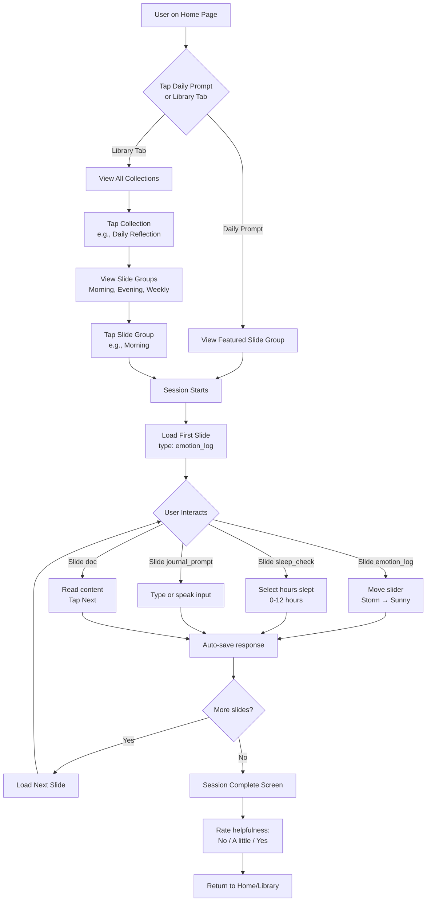
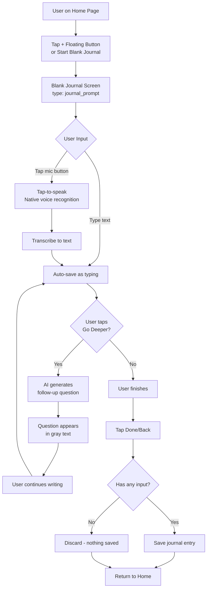
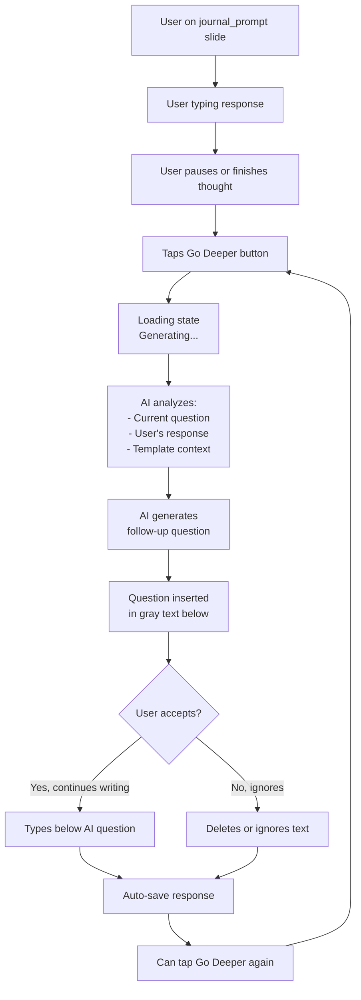
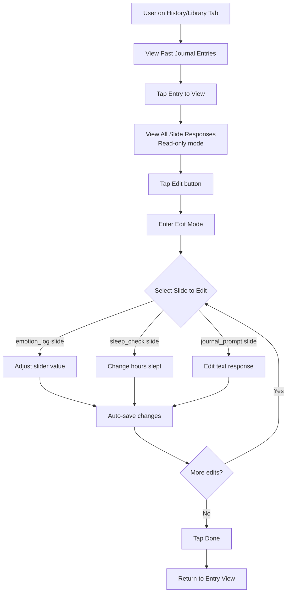
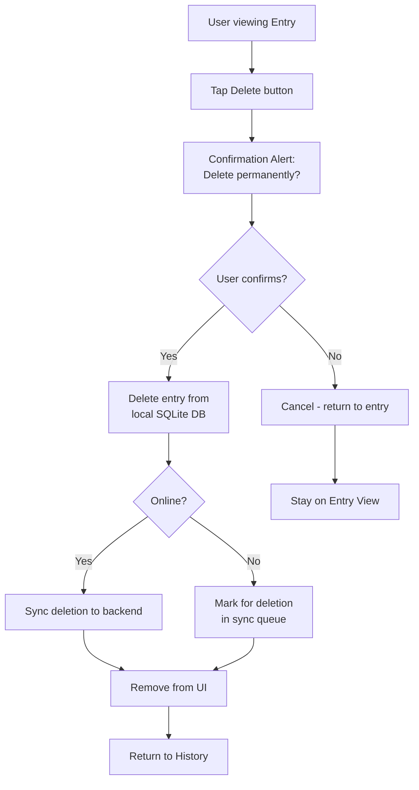
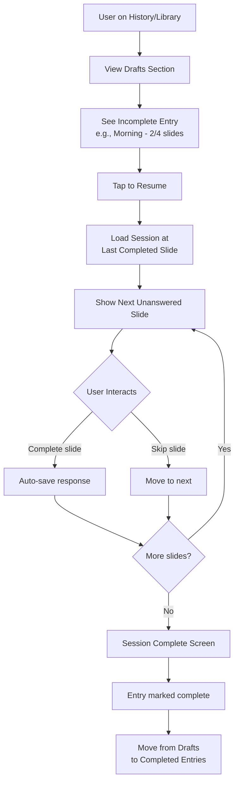
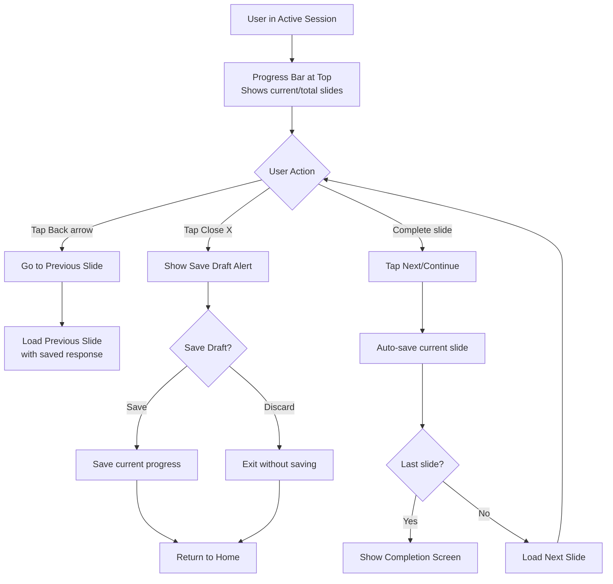
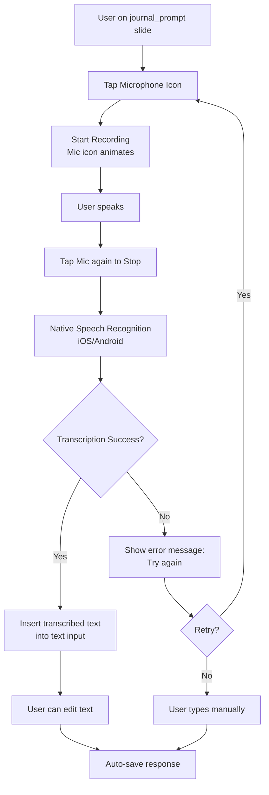
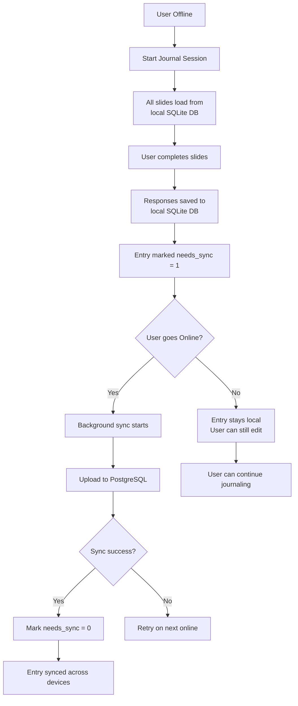

# 🗺️ Journaling Flows

## Overview

This document outlines all user journeys within the journaling feature, from selecting a collection to completing a session and managing past entries.

---

## Flow A: Template-Based Journaling (From Collection)

**Result**: Journal entry created with all slide responses saved. Streak counter increments if daily goal met.

---

## Flow B: Free-Form Journaling (Blank Journal)

**Result**: Single journal entry created with user's free-form text. No structured slides - just open writing.

---

## Flow C: AI "Go Deeper" Assistance (Within Journal Prompt)

**AI Behavior**:
- Keeps topic relevant to slide group theme
- Allows brief emotional tangents if relevant
- Asks open-ended questions (e.g., "What triggered that feeling?")
- Never suggests actions or diagnoses
- Questions feel like user asking themselves

---

## Flow D: Edit Past Entry

**Result**: Journal entry updated with new responses. `updated_at` timestamp refreshed.

---

## Flow E: Delete Entry

**Result**: Entry permanently deleted from local and cloud storage (when synced).

---

## Flow F: Resume Incomplete Session (Draft)

**Result**: Draft entry completed and moved to regular journal history.

---

## Flow G: Session Navigation & Progress

**Key Navigation Rules**:
- Back button: Returns to previous slide (preserves responses)
- Close X: Shows "Save Draft?" alert
- Progress bar: Visual indicator of session progress (e.g., "Slide 3 of 6")
- Auto-save: Every slide response saved immediately

---

## Flow H: Speech Input (Tap-to-Speak)

**Technical Notes**:
- Uses native device speech recognition (no third-party API)
- Tap-to-speak pattern (not real-time/continuous)
- Processes on-device when possible (privacy)
- Fallback to manual typing if speech recognition fails

---

## Flow I: Offline Journaling & Sync

**Offline Capabilities**:
- All collections, slide groups, and slides cached locally
- User can read, write, edit, delete entries offline
- Sync queue tracks pending changes
- Auto-sync when connection restored
- No data loss - local-first architecture

---

## Related Documentation

- **[00-OVERVIEW.md](./00-OVERVIEW.md)** - Feature purpose and design decisions
- **[02-AI-ASSISTANT-SPEC.md](./02-AI-ASSISTANT-SPEC.md)** - AI behavior and safety guidelines
- **[03-SLIDE-TYPES.md](./03-SLIDE-TYPES.md)** - Detailed slide type specifications
- **[04-DATA-MODELS.md](./04-DATA-MODELS.md)** - Database schemas and relationships
- **[User Authentication](../01.%20User%20register/)** - Required for journaling sessions

---

**Last Updated**: November 21, 2025
