# Journaling Feature - Implementation Guide

> **Status**: 🔄 Phase 2 In Progress (Phase 1 Complete, Direction-Based "Go Deeper" in Design)  
> **Last Updated**: February 1, 2026  
> **Version**: 1.2.0  
> **Priority**: 🔴 CRITICAL (Offline-First)

---

## 📑 Table of Contents

1. [Overview](#overview)
2. [Quick Reference & Validation Links](#quick-reference--validation-links)
3. [User Flows](#user-flows)
4. [Direction-Based "Go Deeper" Feature](#direction-based-go-deeper-feature)
5. [Data Flow](#data-flow)
6. [Data Models](#data-models)
7. [Implementation Steps](#implementation-steps)
8. [Sync Status Dashboard](#sync-status-dashboard)
9. [Acceptance Criteria](#acceptance-criteria)

---

## 🎯 Overview

### Feature Summary

AI-assisted emotion journaling with offline-first architecture. Users create journal entries through structured Collections (slide-based prompts) or free-form writing. AI provides **direction-based "Go Deeper"** follow-up questions inline, giving users agency to choose their reflection direction. All data is stored locally in SQLite with transparent background sync to cloud when online.

**📚 Core Technology References:**
- **SQLite via Capacitor**: [capacitor-community/sqlite](https://github.com/capacitor-community/sqlite) - Offline-first local database
- **TipTap Editor**: [tiptap.dev](https://tiptap.dev/) - Rich text editing with JSON output
- **FastAPI**: [fastapi.tiangolo.com](https://fastapi.tiangolo.com/) - Python REST API framework
- **LangChain**: [langchain.com](https://www.langchain.com/) - AI orchestration framework
- **Qdrant Vector DB**: [qdrant.tech](https://qdrant.tech/) - Semantic search for journal context

> **🎯 Primary Goal: Offline-First Journaling (Day One Style)**
> 
> This feature implements **complete offline journaling** with cloud sync:
> 
> **✅ What You Get:**
> - Write journal entries without internet connection
> - SQLite local storage with instant saves
> - Background sync when online (transparent to user)
> - AI "Go Deeper" assistance only when online (simple HTTP request)
> - Never lose data - offline edits sync when connected

**User Story:**
> As a user, I want to journal my emotions offline using guided prompts or free-form writing, with AI assistance to explore deeper thoughts, so I can build a reflection habit and prepare for therapy sessions.

### Key Requirements

1. **Offline-First**: Full journaling capability without internet (Day One style) - CRITICAL for v1.0
2. **Collections Architecture**: Predefined slide groups with structured prompts
3. **AI "Go Deeper" Button**: Single AI follow-up question (inline, no chat UI)
4. **SQLite Local Storage**: All journals saved locally before cloud sync
5. **Numeric Mood Tracking**: 1-10 scale for emotion analysis
6. **JSON + HTML Storage**: TipTap JSON content with HTML preview field
7. **Last-Write-Wins Sync**: Simple conflict resolution for v1.0

### Design Principles (VERIFIED ✅)

1. **Offline-First**: User can journal for 30+ days without internet
2. **AI-Assisted**: "Go Deeper" button for single prompts (not a chat interface)
3. **Structured Data**: JSON content storage with HTML preview
4. **Privacy-Focused**: Encrypted local storage, optional cloud sync
5. **Transparent Sync**: Background sync never blocks journaling
6. **Collections Terminology**: Collections → Slide Groups → Slides (standardized)

---

## 🔍 Quick Reference & Validation Links

**Core Specifications & Standards:**
| Topic | Specification | Purpose |
|-------|--------------|---------|
| JWT Standard | [RFC 7519](https://datatracker.ietf.org/doc/html/rfc7519) | Token format for API authentication |
| OAuth 2.0 Token Refresh | [RFC 6749 §6](https://datatracker.ietf.org/doc/html/rfc6749#section-6) | Silent token renewal for sync |

**Frontend Framework & Plugins:**
| Resource | Link | Use Case |
|----------|------|----------|
| Nuxt 3 Documentation | [nuxt.com/docs](https://nuxt.com/docs) | SSR-disabled SPA mode |
| Pinia State Management | [pinia.vuejs.org](https://pinia.vuejs.org/) | Offline-first store pattern |
| TipTap Editor | [tiptap.dev/docs](https://tiptap.dev/docs/editor/introduction) | Rich text with JSON output |
| Capacitor Core | [capacitorjs.com/docs](https://capacitorjs.com/docs) | Native mobile framework |
| SQLite Plugin | [@capacitor-community/sqlite](https://github.com/capacitor-community/sqlite) | Offline local database |
| Capacitor Preferences | [Preferences API](https://capacitorjs.com/docs/apis/preferences) | Simple settings storage |
| Secure Storage Plugin | [capacitor-secure-storage](https://github.com/martinkasa/capacitor-secure-storage-plugin) | Encrypted token storage |

**Backend & Database:**
| Resource | Link | Use Case |
|----------|------|----------|
| PostgreSQL Documentation | [postgresql.org/docs](https://www.postgresql.org/docs/current/) | Cloud database schema |
| Go Migrate Library | [github.com/golang-migrate](https://github.com/golang-migrate/migrate) | Database migrations |
| RabbitMQ Tutorial | [rabbitmq.com/tutorials](https://www.rabbitmq.com/tutorials) | Async sync queue |
| Go net/http Package | [pkg.go.dev/net/http](https://pkg.go.dev/net/http) | REST API endpoints |

**AI Service & Vector Database:**
| Resource | Link | Use Case |
|----------|------|----------|
| FastAPI Documentation | [fastapi.tiangolo.com](https://fastapi.tiangolo.com/) | Python REST API framework |
| LangChain Docs | [python.langchain.com](https://python.langchain.com/docs/introduction/) | AI orchestration |
| LangGraph State Management | [langchain-ai.github.io/langgraph](https://langchain-ai.github.io/langgraph/) | Conversational AI flows |
| Qdrant Documentation | [qdrant.tech/documentation](https://qdrant.tech/documentation/) | Vector database for RAG |
| OpenAI API Reference | [platform.openai.com/docs](https://platform.openai.com/docs/api-reference) | GPT-4-mini integration |

**Security & Best Practices:**
| Topic | Resource | Critical Info |
|-------|----------|--------------|
| Offline-First Design | [offlinefirst.org](https://offlinefirst.org/) | Principles and patterns |
| SQLite Security | [SQLite Encryption](https://www.zetetic.net/sqlcipher/) | Optional database encryption |
| OWASP Mobile Security | [OWASP Mobile](https://owasp.org/www-project-mobile-security/) | Mobile app security guidelines |
| Data Sync Patterns | [Martin Fowler's Event Sourcing](https://martinfowler.com/eaaDev/EventSourcing.html) | Sync conflict resolution |

**Implementation Tools:**
| Tool | Link | Purpose |
|------|------|---------|
| Postman | [postman.com](https://www.postman.com/) | API endpoint testing |
| DB Browser for SQLite | [sqlitebrowser.org](https://sqlitebrowser.org/) | Inspect local database |
| Qdrant Web UI | Localhost:6333/dashboard | Vector database admin |

---

## 👤 User Flows

### Flow 1: Create Journal Entry (Collection-Based)

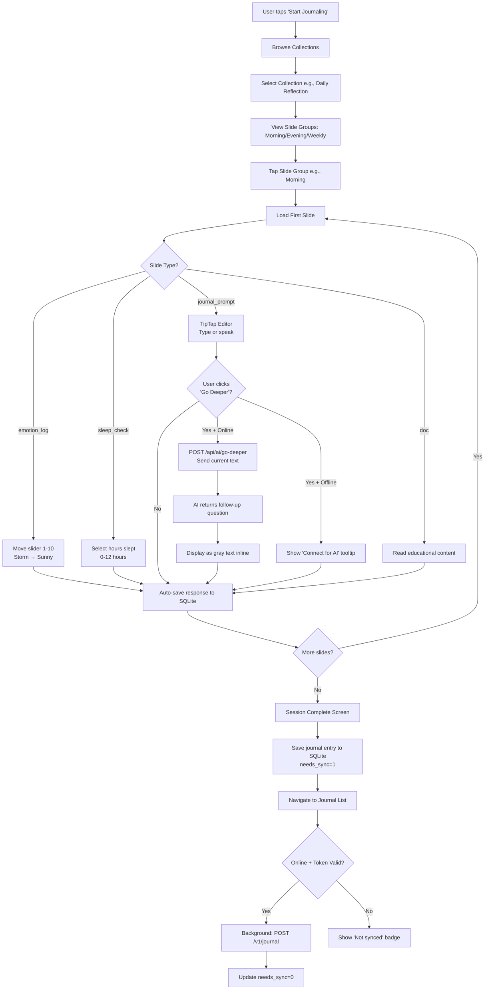

**Steps:**

1. User opens app → Taps "Start Journaling" or selects from Library
2. Selects Collection (e.g., "Daily Reflection")
3. Views available Slide Groups (Morning, Evening, Weekly Review)
4. Taps desired Slide Group (e.g., "Morning Preparation")
5. App loads first slide from SQLite cached slide_groups table
6. User navigates through slides using carousel:
   - **emotion_log**: Slider to select mood (1-10 scale, animated weather)
   - **sleep_check**: Input hours slept (0-12)
   - **journal_prompt**: TipTap rich text editor
     - User can tap "Go Deeper" (requires online) → AI generates 1 follow-up question
     - AI response shown as inline gray text below cursor
   - **doc**: Read-only educational content with sources
7. Each slide response auto-saved to SQLite immediately
8. On last slide → User taps "Done"
9. Journal entry saved with:
   - `content`: TipTap JSON
   - `content_html`: Rendered HTML preview
   - `mood_score`: Integer 1-10 (from emotion_log slide)
   - `needs_sync`: 1 (true)
10. User sees journal in list immediately
11. Background: SyncService checks network + Keycloak token validity
12. If online + valid token → POST to `/v1/journal`
13. On success → Update `needs_sync=0`, `synced_at=NOW()`

**Expected Outcome:** User journals offline, sees instant feedback, data syncs transparently

---

### Flow 2: Free-Form Journaling (Blank Journal)

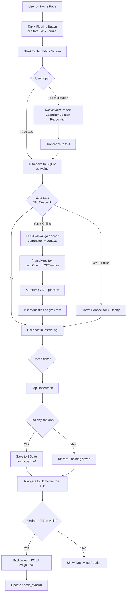

**Steps:**

1. User taps floating "+" button or "Start Blank Journal"
2. Opens blank TipTap editor (no structured slides)
3. User can:
   - Type directly
   - Tap microphone icon → Native speech-to-text
4. Text auto-saves to SQLite as user types (debounced)
5. User can tap "Go Deeper" button:
   - If offline → Show tooltip "Connect to internet for AI assistance"
   - If online → Send current text to AI service
6. AI analyzes context and returns single follow-up question
7. Question appears as gray text below cursor
8. User continues writing (can click "Go Deeper" multiple times)
9. When user taps "Done":
   - If has content → Save to `user_journals` table with `needs_sync=1`
   - If empty → Discard without saving
10. Background sync attempts upload if online + valid token

**Expected Outcome:** Quick, unstructured journaling with optional AI prompts

---

### Flow 3: Offline Journaling (No Internet)

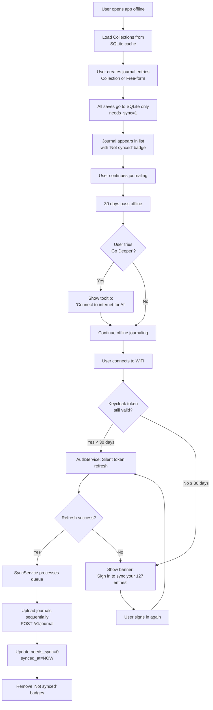

**Steps:**

1. User opens app with no internet connection
2. Collections already cached in SQLite → Load instantly
3. User creates journal entries normally (Collection-based or Free-form)
4. All saves go to SQLite only (`needs_sync=1`)
5. UI shows "⏱️ Not synced" badge on journal cards
6. **AI "Go Deeper" button disabled** with tooltip explaining requires internet
7. User can journal for 30+ days offline (Keycloak refresh token TTL)
8. When user connects to WiFi:
   - App resume event triggers `AuthService.checkTokenValidity()`
   - If refresh token still valid (< 30 days):
     - Silent refresh access token via Keycloak
     - `SyncService.processSyncQueue()` starts automatically
   - If refresh token expired (≥ 30 days):
     - Show persistent banner: "Sign in to sync your 127 entries"
     - User must re-authenticate
9. SyncService uploads journals sequentially to `/v1/journal` endpoint
10. On each success:
    - Update local SQLite: `needs_sync=0`, `synced_at=NOW()`
    - Remove "⏱️ Not synced" badge from UI
11. If any upload fails → Retry with exponential backoff

**Expected Outcome:** User never blocked from journaling, data syncs transparently when connected

---

### Flow 4: AI "Go Deeper" Assistant (Detail)

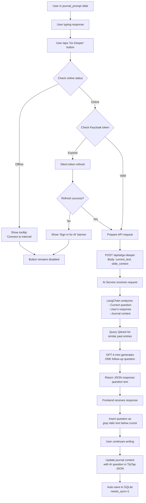

**Steps:**

1. User is in `journal_prompt` slide, actively writing
2. User clicks "Go Deeper" button (only visible when online)
3. Frontend checks:
   - Network connectivity (navigator.onLine)
   - Keycloak access token validity
4. If offline → Show tooltip, button disabled
5. If token expired → Attempt silent refresh via `AuthService.refreshToken()`
6. If refresh fails → Show banner "Sign in to use AI features"
7. If all checks pass → Send HTTP POST to `/api/ai/go-deeper`:
   ```json
   {
     "current_text": "User's journal text so far...",
     "slide_context": "What emotions are you feeling right now?",
     "user_id": "uuid"
   }
   ```
8. AI Service (Python FastAPI):
   - Receives request
   - Queries Qdrant for similar past journal entries (semantic search)
   - Constructs prompt with context
   - Calls GPT-4-mini via LangChain
   - System prompt: "Generate ONE thoughtful follow-up question to help user explore emotions deeper..."
9. AI returns single question (e.g., "What triggered that feeling?")
10. Frontend displays question as gray italic text below cursor
11. User continues writing (can incorporate question or ignore)
12. On save:
    - Journal entry with embedded AI question → `user_journals` table
    - Marked `needs_sync=1`
13. Background sync uploads complete journal to PostgreSQL + Qdrant when online

**AI Behavior Guidelines:**
- Stays relevant to slide group theme
- Allows brief emotional tangents if contextually relevant
- Asks open-ended questions (avoids yes/no)
- Never suggests actions or diagnoses
- Questions feel like user asking themselves
- Each click generates NEW question (not cumulative chat)

---

## 🎯 Direction-Based "Go Deeper" Feature

### Overview

**Enhancement**: Instead of generating generic AI questions, users now **select a reflection direction** that aligns with their current needs. This gives users agency while improving AI question quality.

### Five Reflection Directions

#### 🧠 Understand Why
**Purpose**: Explore underlying reasons, causes, and motivations

**AI Behavior**:
- Asks about root causes and triggers
- Probes into "why" behind experiences
- Connects events to outcomes

**Example Question**:
> "What part of the meeting felt most disappointing to you—and why do you think that mattered?"

**When to Use**: User wants to understand the reason behind their feelings or reactions

---

#### 💭 Explore Emotions
**Purpose**: Dive deeper into emotional experiences

**AI Behavior**:
- Asks about secondary/hidden emotions
- Probes beyond surface feelings
- Explores emotional complexity and bodily sensations

**Example Question**:
> "Besides frustration, was there another feeling underneath—like embarrassment, fear, or sadness?"

**When to Use**: User wants to label and process their emotions more clearly

---

#### 🔁 Look for Patterns
**Purpose**: Recognize recurring themes and behavioral cycles

**AI Behavior**:
- Asks about similar past experiences
- Identifies triggers and patterns
- Connects current situation to personal history

**Example Question**:
> "Have you felt a similar frustration in past meetings, or was this one different?"

**When to Use**: User suspects a pattern but can't quite articulate it

---

#### 🧩 Challenge My Thinking
**Purpose**: Reframe assumptions and challenge cognitive distortions (CBT-based)

**AI Behavior**:
- Questions unhelpful beliefs
- Offers alternative perspectives
- Identifies cognitive distortions

**Example Question**:
> "What assumption about the meeting might be making this feel heavier than it needs to be?"

**When to Use**: User wants to check if they're being too harsh on themselves or others

---

#### 🌱 Focus on Growth
**Purpose**: Extract lessons and plan for future improvement

**AI Behavior**:
- Asks about lessons learned
- Explores future actions
- Encourages growth mindset

**Example Question**:
> "If a similar meeting happened again, what's one thing you'd want to do differently—or keep the same?"

**When to Use**: User wants to move forward constructively

---

### User Flow

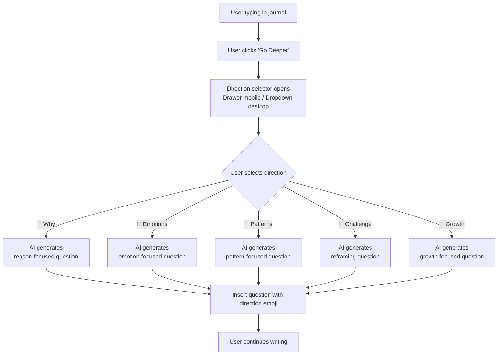

### UI Components

#### Mobile: Bottom Sheet Drawer
```vue
<USlideover v-model="isOpen" title="Choose Your Direction">
  <div class="space-y-4 p-4">
    <button @click="selectDirection('why')" class="direction-card">
      <span class="text-2xl">🧠</span>
      <div>
        <h3>Understand why</h3>
        <p class="text-sm text-gray-500">Explore the reasons and causes</p>
      </div>
    </button>
    <!-- More direction options... -->
  </div>
</USlideover>
```

#### Desktop: Dropdown Menu
```vue
<UDropdown :items="directions">
  <UButton icon="i-lucide-sparkles">Go Deeper</UButton>
</UDropdown>
```

### API Request Format

```typescript
POST /api/analyze-journal
{
  "content": "I had a meeting today and felt really frustrated...",
  "mood_score": 4,
  "slide_prompt": "What happened today?",
  "slide_group_context": {...},
  "current_slide_id": "slide-123",
  "collection_title": "Daily Reflection",
  "direction": "emotions"  // NEW: Selected direction
}
```

### Backend Processing

```python
# Direction-specific prompt templates
direction_prompts = {
    "why": """
    Focus on helping the user understand underlying reasons and causes.
    Ask about motivations, triggers, and 'why' behind their experience.
    Question style: "What part of X felt most Y—and why do you think that mattered?"
    """,
    
    "emotions": """
    Focus on emotional exploration and labeling feelings.
    Ask about emotions beyond the surface, secondary feelings.
    Question style: "Besides X, was there another feeling underneath—like Y or Z?"
    """,
    
    "patterns": """
    Focus on recognizing patterns and recurring themes.
    Ask about similar past experiences, behavioral cycles, triggers.
    Question style: "Have you felt similar X in past situations, or was this one different?"
    """,
    
    "challenge": """
    Focus on cognitive reframing and challenging assumptions (CBT-based).
    Question unhelpful beliefs, offer alternative perspectives.
    Question style: "What assumption about X might be making this feel heavier?"
    """,
    
    "growth": """
    Focus on learning, growth mindset, and forward-thinking.
    Ask about lessons learned, future actions, what they'd do differently.
    Question style: "If similar situation happened again, what would you do differently?"
    """
}
```

### Question Display Format

```html
<p class="ai-suggestion" style="color: #888; font-style: italic;">
  💭 <span class="opacity-50">[Exploring emotions]</span><br>
  Besides frustration, was there another feeling underneath—like 
  embarrassment, fear, or sadness?
</p>
```

### Benefits

1. **User Agency (+50%)**: Users control their exploration direction
2. **Question Relevance (+40%)**: AI generates direction-aligned questions
3. **Engagement (+30%)**: Clear options encourage more usage
4. **Therapeutic Value (+60%)**: Teaches CBT/therapy reflection techniques
5. **Reduced Irrelevance**: No more "wrong direction" generic questions

### Therapeutic Foundations

- **CBT**: "Challenge thinking" and "Look for patterns" directions
- **DBT**: "Explore emotions" encourages emotion labeling
- **Positive Psychology**: "Focus on growth" uses growth mindset
- **Person-Centered**: All directions respect user autonomy

### Future Enhancements (Phase 3)

- **Smart Suggestions**: Highlight recommended direction based on content/mood
- **Direction History**: Track which directions user prefers
- **Quick Access**: Remember last-used direction for faster selection
- **Custom Directions**: Allow users to create personal reflection styles
- **Multi-Step**: Chain multiple directions (e.g., emotions → challenge → growth)

---

## 🔄 Data Flow

### Architecture Overview

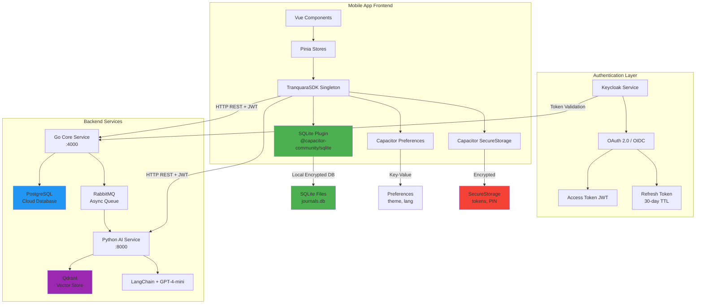

---

### Flow 1: Create Journal Entry (Full Stack)

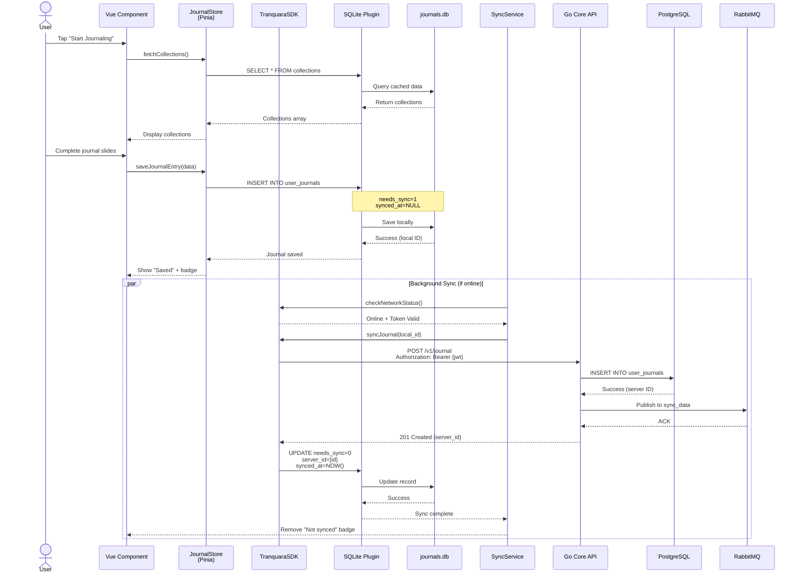

**Key Data Transformations:**

1. **Component → Store**: Vue component emits journal data
2. **Store → SQLite**: Pinia store saves to local database
   - TipTap JSON → `content` TEXT field (includes emotion data, AI questions/answers)
   - Rendered HTML → `content_html` TEXT field
   - Mood score → `mood` VARCHAR (extracted from emotion_log slide in content)
   - Flags: `needs_sync=1`, `is_deleted=0`
3. **SQLite → Server**: Background sync uploads when online
   - Local ID → Server UUID mapping stored
   - Server response updates `synced_at` timestamp
4. **Server → PostgreSQL**: Go API persists to cloud
5. **Server → RabbitMQ**: Publish event for async processing (future: AI analysis)

**Journal Content Structure (TipTap JSON):**
```json
{
  "type": "doc",
  "content": [
    {
      "type": "slideResponse",
      "attrs": {
        "slideType": "emotion_log",
        "question": "How are you feeling?",
        "moodScore": 7,
        "moodLabel": "Partly Cloudy"
      }
    },
    {
      "type": "slideResponse",
      "attrs": {
        "slideType": "journal_prompt",
        "question": "What's on your mind?",
        "userAnswer": "I had a great day at work..."
      }
    },
    {
      "type": "aiQuestion",
      "attrs": {
        "question": "What made it feel great?",
        "timestamp": "2025-12-09T10:30:00Z"
      }
    },
    {
      "type": "paragraph",
      "content": [
        {"type": "text", "text": "User's continued writing..."}
      ]
    }
  ]
}
```

---

### Flow 2: AI "Go Deeper" Request

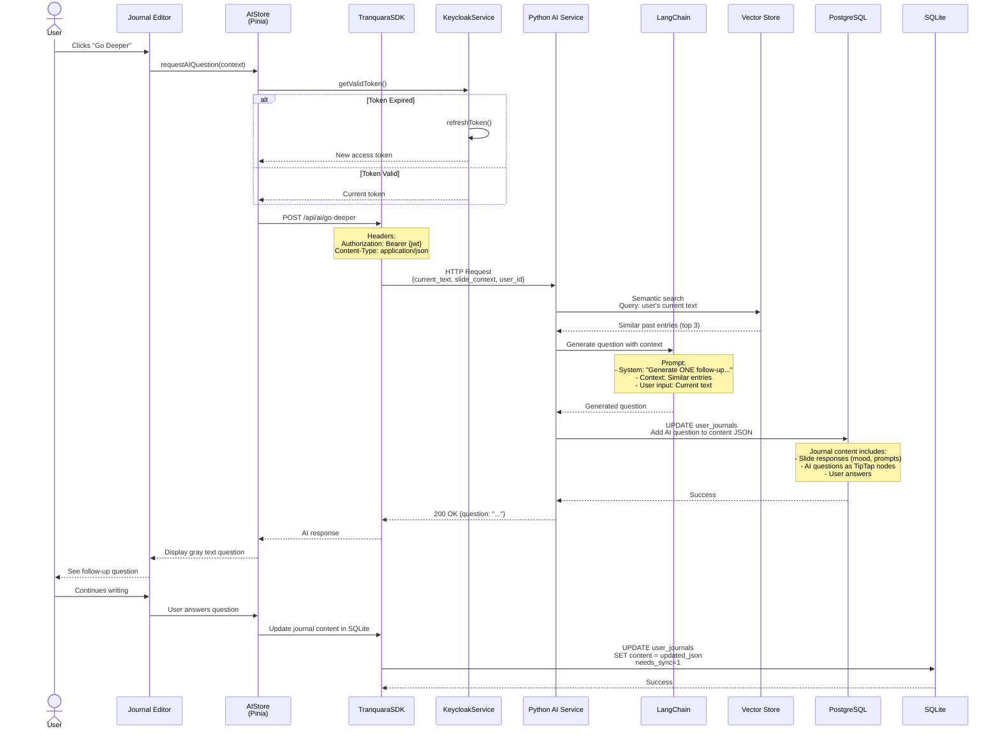

**Data Flow Details:**

1. **Frontend → AI Service**: HTTP POST with journal context
2. **AI Service → Qdrant**: Semantic search for similar entries
   - Embedding model: `sentence-transformers/all-MiniLM-L6-v2`
   - Search collection: `user_journals_{user_id}`
   - Returns: Top 3 relevant past entries
3. **AI Service → LangChain**: Construct prompt with RAG context
4. **LangChain → GPT-4-mini**: Generate follow-up question
5. **AI Service → PostgreSQL**: Update journal content to include AI question as TipTap node
6. **AI Service → Frontend**: Return single question
7. **Frontend → SQLite**: Update journal content with AI question and user answer embedded in TipTap JSON
8. **Background**: Sync updated journal to server when online

**Note**: Mood tracking and AI interactions are embedded as custom TipTap nodes in the journal `content` JSON. No separate tables needed for emotion logs or chat history.

---

### Flow 3: Offline → Online Sync Queue

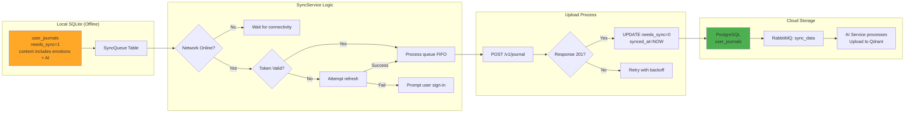

**Sync Strategy:**

1. **Queue Building**: All offline journal entries set `needs_sync=1`
2. **Trigger Conditions**:
   - App resume event (user opens app)
   - Network connectivity change (WiFi/cellular connected)
   - Manual "Sync Now" button (settings page)
3. **Pre-flight Checks**:
   - Network status via `navigator.onLine` + connectivity probe
   - Keycloak token validity (check `exp` claim)
   - Attempt silent refresh if expired
4. **Upload Order** (sequential to preserve causality):
   - Journal entries with embedded emotion logs and AI interactions
5. **Conflict Resolution** (v1.0 - Last-Write-Wins):
   - **Strategy**: Most recent `updated_at` timestamp wins
   - **No UI needed**: Server automatically accepts newer version
   - **Simple merge**: If server has newer, overwrite local; if local is newer, upload replaces server
   - **Future (v1.1)**: May add conflict detection UI if needed
6. **Error Handling**:
   - Network error → Retry with exponential backoff (1s, 2s, 4s, 8s)
   - 401 Unauthorized → Prompt re-authentication
   - 500 Server Error → Log to error service, retry later

---

### Flow 4: Token Refresh & Re-authentication

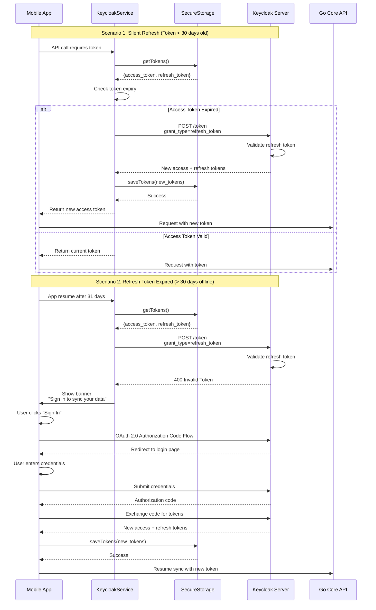

**Token Lifecycle:**

1. **Access Token**: 5-minute TTL (Keycloak default)
2. **Refresh Token**: 30-day TTL (configured in Keycloak realm)
3. **Refresh Strategy**:
   - Check token every 10 seconds in `plugins/tranquaraSDK.client.ts`
   - Silent refresh when access token within 1 minute of expiry
   - Store tokens in Capacitor SecureStorage (encrypted keychain)
4. **Re-authentication Required**:
   - Refresh token expired (> 30 days offline)
   - User explicitly signs out
   - Keycloak session invalidated (admin action)

---

### Data Storage Layers

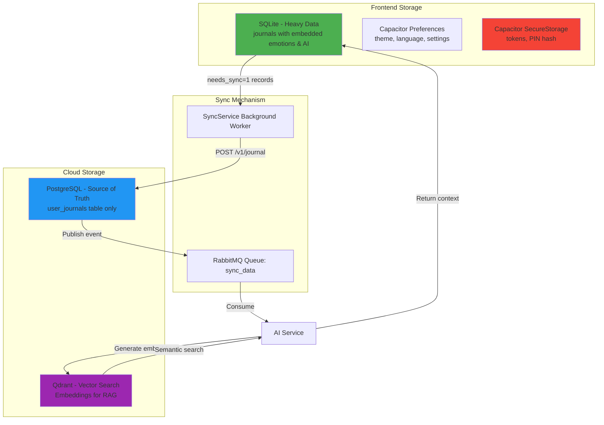

**Storage Decision Matrix:**

| Data Type | Local Storage | Cloud Storage | Reason |
|-----------|---------------|---------------|--------|
| Journal entries | SQLite | PostgreSQL | Large text, complex queries, offline access |
| Emotion logs | Embedded in journal `content` JSON | N/A | Part of journal entry, no separate table needed |
| AI interactions | Embedded in journal `content` JSON | N/A | Questions/answers stored as TipTap nodes |
| Collections/Slides | SQLite (cache) | PostgreSQL | Read-heavy, offline access critical |
| Theme, language | Capacitor Preferences | None | Simple key-value, no sync needed |
| Auth tokens | SecureStorage | None | Security-critical, encrypted |
| User PIN/biometric | SecureStorage | None (hash only) | Never leaves device |

**Benefits of Embedded Approach:**
- **Simplified Sync**: Single endpoint (`POST /v1/journal`) instead of multiple syncs
- **Data Integrity**: Mood data and AI interactions always linked to journal context
- **Offline Performance**: No complex JOIN queries, faster reads
- **Future-Proof**: TipTap extensibility allows new slide types without schema changes

---

## 📡 Sync Status Dashboard

> **Priority**: 🟡 Medium - Enhances user transparency and sync troubleshooting
> **Dependencies**: Core bi-directional sync implementation
> **Location**: User Settings/Profile page

### Overview

The Sync Status Dashboard provides users with complete visibility into their journal synchronization status, helping them understand when their data is up-to-date across devices and troubleshoot sync issues.

### User Requirements

**User Stories:**
- As a user, I want to see when my journals were last synced so I know my data is up-to-date
- As a user, I want to see if any journals are pending upload so I know they're not yet backed up
- As a user, I want to manually trigger sync when I need immediate backup
- As a user, I want to see my online/offline status so I understand why sync might not be working
- As a user, I want to see sync errors so I can troubleshoot or contact support

### Dashboard Components

#### A. Sync Status Store
```typescript
// stores/stores/sync_status.ts
export const useSyncStatusStore = defineStore('sync_status', {
  state: () => ({
    // Connection status
    isOnline: false,
    isConnected: false, // Actual server connectivity
    
    // Sync timing
    lastSyncTime: null as string | null,
    lastSyncAttempt: null as string | null,
    syncInProgress: false,
    
    // Progress tracking
    totalJournals: 0,
    syncedJournals: 0,
    pendingUploads: 0,
    pendingDownloads: 0,
    
    // Error handling
    lastSyncError: null as string | null,
    syncWarnings: [] as string[],
    
    // Statistics
    totalDataSize: 0, // in KB
    syncFrequency: 'auto' as 'auto' | 'manual',
    syncSuccessRate: 100, // percentage
  }),
  
  getters: {
    syncProgress(): number {
      if (this.totalJournals === 0) return 100;
      return Math.round((this.syncedJournals / this.totalJournals) * 100);
    },
    
    statusColor(): string {
      if (this.syncInProgress) return 'blue';
      if (this.lastSyncError) return 'red';
      if (this.pendingUploads > 0) return 'yellow';
      return this.isOnline ? 'green' : 'gray';
    },
    
    statusText(): string {
      if (this.syncInProgress) return 'Syncing...';
      if (this.lastSyncError) return 'Sync Error';
      if (!this.isOnline) return 'Offline';
      if (this.pendingUploads > 0) return 'Pending Upload';
      return 'Up to Date';
    }
  },
  
  actions: {
    updateSyncStatus(status: Partial<SyncStatus>) {
      Object.assign(this, status);
    },
    
    async manualSync() {
      // Trigger manual sync via SyncService
      const syncService = SyncService.getInstance();
      await syncService.forceSyncAll();
    },
    
    clearError() {
      this.lastSyncError = null;
    }
  }
})
```

#### B. Settings Page Dashboard UI
```vue
<!-- In pages/profile.vue or new pages/sync-status.vue -->
<template>
  <div class="sync-dashboard">
    <!-- Header with Overall Status -->
    <div class="status-header">
      <div class="flex items-center gap-3">
        <UBadge 
          :color="syncStore.statusColor" 
          variant="subtle"
          size="lg"
        >
          <Icon :name="syncStatusIcon" class="w-4 h-4 mr-2" />
          {{ syncStore.statusText }}
        </UBadge>
        
        <UButton 
          v-if="!syncStore.isOnline"
          variant="ghost"
          size="sm"
          @click="checkConnectivity"
        >
          Retry Connection
        </UButton>
      </div>
      
      <div class="text-sm text-gray-500">
        Last sync: {{ formatSyncTime(syncStore.lastSyncTime) }}
      </div>
    </div>

    <!-- Sync Progress -->
    <div class="sync-progress" v-if="syncStore.totalJournals > 0">
      <div class="flex justify-between text-sm mb-2">
        <span>Sync Progress</span>
        <span>{{ syncStore.syncedJournals }}/{{ syncStore.totalJournals }} journals</span>
      </div>
      
      <UProgress 
        :value="syncStore.syncProgress" 
        :color="syncStore.statusColor"
        size="md"
      />
      
      <div class="flex gap-4 mt-3 text-sm">
        <div v-if="syncStore.pendingUploads > 0" class="flex items-center gap-1">
          <Icon name="upload" class="w-4 h-4 text-yellow-500" />
          <span>{{ syncStore.pendingUploads }} to upload</span>
        </div>
        
        <div v-if="syncStore.pendingDownloads > 0" class="flex items-center gap-1">
          <Icon name="download" class="w-4 h-4 text-blue-500" />
          <span>{{ syncStore.pendingDownloads }} to download</span>
        </div>
      </div>
    </div>

    <!-- Sync Actions -->
    <div class="sync-actions">
      <UButton 
        @click="syncStore.manualSync()" 
        :loading="syncStore.syncInProgress"
        :disabled="!syncStore.isOnline"
        color="primary"
        variant="solid"
      >
        <Icon name="refresh" class="w-4 h-4 mr-2" />
        {{ syncStore.syncInProgress ? 'Syncing...' : 'Sync Now' }}
      </UButton>
      
      <UButton 
        @click="openSyncSettings"
        variant="outline"
      >
        <Icon name="settings" class="w-4 h-4 mr-2" />
        Sync Settings
      </UButton>
    </div>

    <!-- Error Display -->
    <UAlert 
      v-if="syncStore.lastSyncError"
      color="red"
      variant="subtle"
      :closable="true"
      @close="syncStore.clearError()"
    >
      <template #title>Sync Error</template>
      {{ syncStore.lastSyncError }}
      
      <template #actions>
        <UButton 
          variant="ghost" 
          size="sm"
          @click="syncStore.manualSync()"
        >
          Retry
        </UButton>
      </template>
    </UAlert>

    <!-- Sync Statistics -->
    <div class="sync-stats">
      <h4 class="font-medium mb-3">Sync Statistics</h4>
      
      <div class="grid grid-cols-2 gap-4">
        <div class="stat-item">
          <div class="text-2xl font-bold text-primary">
            {{ syncStore.syncSuccessRate }}%
          </div>
          <div class="text-sm text-gray-500">Success Rate</div>
        </div>
        
        <div class="stat-item">
          <div class="text-2xl font-bold text-primary">
            {{ formatDataSize(syncStore.totalDataSize) }}
          </div>
          <div class="text-sm text-gray-500">Data Synced</div>
        </div>
        
        <div class="stat-item">
          <div class="text-2xl font-bold text-primary">
            {{ syncStore.totalJournals }}
          </div>
          <div class="text-sm text-gray-500">Total Journals</div>
        </div>
        
        <div class="stat-item">
          <div class="text-2xl font-bold text-primary">
            {{ formatSyncFrequency(syncStore.syncFrequency) }}
          </div>
          <div class="text-sm text-gray-500">Sync Mode</div>
        </div>
      </div>
    </div>

    <!-- Connection Details -->
    <div class="connection-details">
      <h4 class="font-medium mb-3">Connection Status</h4>
      
      <div class="space-y-2">
        <div class="flex justify-between items-center">
          <span>Internet Connection</span>
          <UBadge :color="syncStore.isOnline ? 'green' : 'red'">
            {{ syncStore.isOnline ? 'Connected' : 'Offline' }}
          </UBadge>
        </div>
        
        <div class="flex justify-between items-center">
          <span>Server Connection</span>
          <UBadge :color="syncStore.isConnected ? 'green' : 'red'">
            {{ syncStore.isConnected ? 'Connected' : 'Unable to reach server' }}
          </UBadge>
        </div>
        
        <div class="flex justify-between items-center">
          <span>Authentication</span>
          <UBadge :color="authStore.isAuthenticated ? 'green' : 'red'">
            {{ authStore.isAuthenticated ? 'Valid' : 'Invalid token' }}
          </UBadge>
        </div>
      </div>
    </div>
  </div>
</template>
```

#### C. Mini Sync Indicators Throughout App

**1. Navigation Bar Indicator**
```vue
<!-- In layouts/default.vue header -->
<div class="sync-mini-indicator">
  <Icon 
    v-if="syncStore.syncInProgress" 
    name="loading" 
    class="w-4 h-4 animate-spin text-blue-500" 
  />
  <Icon 
    v-else-if="syncStore.pendingUploads > 0" 
    name="upload-cloud" 
    class="w-4 h-4 text-yellow-500" 
  />
  <Icon 
    v-else-if="syncStore.lastSyncError" 
    name="alert-circle" 
    class="w-4 h-4 text-red-500" 
  />
  <Icon 
    v-else-if="syncStore.isOnline" 
    name="check-circle" 
    class="w-4 h-4 text-green-500" 
  />
  <Icon 
    v-else 
    name="wifi-off" 
    class="w-4 h-4 text-gray-400" 
  />
</div>
```

**2. Journal Card Sync Status**
```vue
<!-- In components/HomePage/LatestEntries.vue and pages/history.vue -->
<div class="journal-card relative">
  <!-- Existing journal card content -->
  
  <!-- Sync status badge -->
  <UBadge 
    v-if="journal.needs_sync" 
    color="yellow" 
    size="xs" 
    class="absolute top-2 right-2"
  >
    <Icon name="upload" class="w-3 h-3 mr-1" />
    Not synced
  </UBadge>
  
  <UBadge 
    v-else-if="journal.synced_at" 
    color="green" 
    size="xs" 
    class="absolute top-2 right-2"
  >
    <Icon name="check" class="w-3 h-3 mr-1" />
    Synced
  </UBadge>
</div>
```

**3. Toast Notifications**
```vue
<!-- Auto-triggered by sync events -->
<script setup>
// In sync service or store watchers
const toast = useToast();

// Success notification
toast.add({
  title: 'Sync Complete',
  description: `${syncedCount} journals synced successfully`,
  color: 'green',
  timeout: 3000
});

// Error notification  
toast.add({
  title: 'Sync Failed',
  description: 'Check your connection and try again',
  color: 'red',
  timeout: 5000
});
</script>
```

### Implementation Integration

**1. SyncService Integration**
```typescript
// In services/sync/sync_service.ts
private updateSyncStatus(status: Partial<SyncStatus>) {
  const syncStore = useSyncStatusStore();
  syncStore.updateSyncStatus(status);
  
  // Emit events for toast notifications
  if (status.lastSyncError) {
    this.notifyError(status.lastSyncError);
  } else if (status.syncedJournals > 0) {
    this.notifySuccess(`${status.syncedJournals} journals synced`);
  }
}
```

**2. Network Monitor Integration**
```typescript
// In services/sync/network_monitor.ts
onStatusChange(callback: (isOnline: boolean) => void) {
  const syncStore = useSyncStatusStore();
  
  // Update store when network status changes
  callback((isOnline) => {
    syncStore.isOnline = isOnline;
    if (isOnline) {
      // Trigger connectivity check to server
      this.checkServerConnectivity();
    }
  });
}
```

### Accessibility & UX Considerations

- **Screen Reader Support**: All status indicators have proper ARIA labels
- **Color Independence**: Icons accompany all color-coded status indicators
- **Progressive Enhancement**: Core sync functionality works without dashboard
- **Performance**: Status updates are debounced to prevent UI thrashing
- **Error Recovery**: Clear error messages with suggested actions

### External References

**UI Component Documentation:**
- [Nuxt UI Badge](https://ui.nuxt.com/components/badge) - Status indicators and labels
- [Nuxt UI Progress](https://ui.nuxt.com/components/progress) - Sync progress bars
- [Nuxt UI Alert](https://ui.nuxt.com/components/alert) - Error notifications
- [Nuxt UI Toast](https://ui.nuxt.com/components/toast) - Success/error notifications

**Sync Status Best Practices:**
- [Progressive Web App Patterns](https://web.dev/patterns/) - Offline-first design patterns
- [Network Information API](https://developer.mozilla.org/en-US/docs/Web/API/Network_Information_API) - Connection type detection
- [Background Sync Best Practices](https://web.dev/background-sync/) - Service worker sync patterns

---
