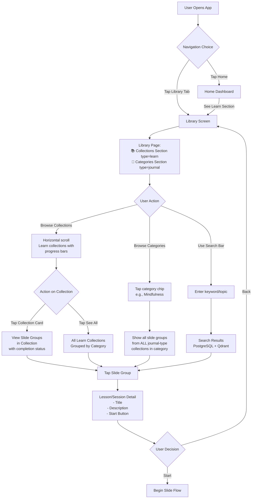
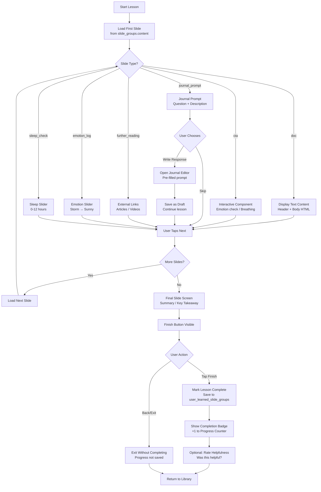
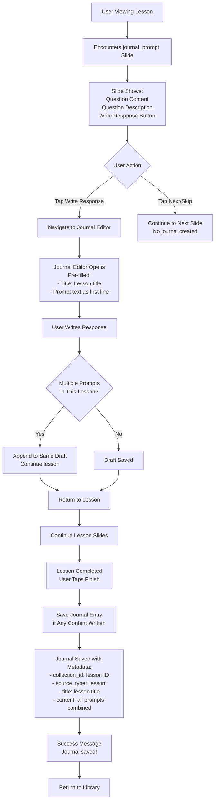
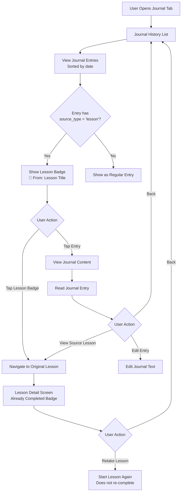
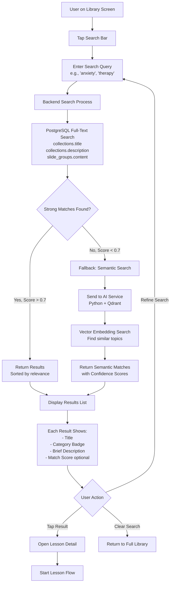
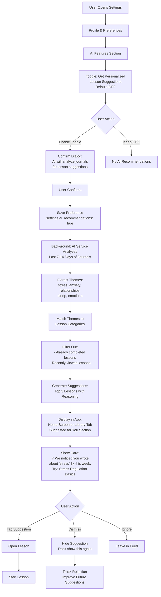
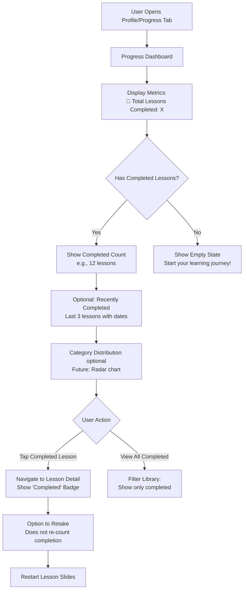
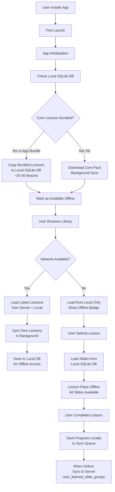
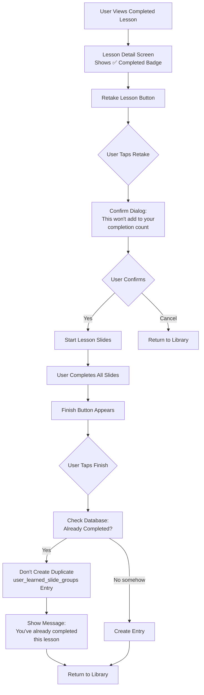

# 🗺️ Micro Learning - User Flows

## Overview

This document outlines all user journeys within the micro-learning feature, from discovering lessons in the library to completing them and tracking progress.

---

## Flow A: Browse & Discover Lessons

**Result**: User enters a lesson/session and begins slide-by-slide content. Learn collections show progress bars; journal categories show slide group listings.

---

## Flow B: Complete a Lesson (Slide Progression)

**Result**: Lesson marked complete only when user taps Finish button. Progress counter increments.

---

## Flow C: Journal Integration from Lesson

**Result**: One journal entry per lesson (even if multiple prompts). Entry links back to source lesson via `collection_id`.

---

## Flow D: View Journal from Lesson History

**Result**: Users can navigate from journal entries back to source lessons and vice versa.

---

## Flow E: Search & Discovery

**Result**: Hybrid search (keyword + semantic) helps users find relevant content even with vague queries.

---

## Flow F: AI Recommendations (Opt-In)

**Result**: Proactive, privacy-respecting recommendations only when user opts in. Clear reasoning shown.

---

## Flow G: View Progress

**Result**: Simple, encouraging progress view. No pressure or gamification (for now).

---

## Flow H: Offline Access

**Result**: Core lessons work 100% offline. New content syncs when available.

---

## Flow I: Lesson Retake (Revisit)

**Result**: Users can revisit lessons for review without inflating progress counter.

---

## Summary: Key User Paths

| Flow | Entry Point | Exit Point | Critical Data |
|------|-------------|------------|---------------|
| **Browse & Discover** | Library Tab | Lesson Detail | `journal_templates` (type='learn') query |
| **Complete Lesson** | Start Button | Finish Button → Save | `user_learned_slide_groups` insert |
| **Journal Integration** | journal_prompt Slide | Journal Editor → Save | `user_journals` with `collection_id` |
| **Search** | Search Bar | Results List → Lesson | PostgreSQL + Qdrant |
| **AI Recommendations** | Settings Toggle → Home | Suggested Lessons | AI analysis of journals |
| **Progress View** | Profile Tab | Progress Dashboard | `user_learned_slide_groups` count |
| **Offline Access** | App Launch | Lesson Playback | Local DB sync |
| **Retake Lesson** | Completed Lesson | Finish (no re-save) | No duplicate entries |

---

**Last Updated**: February 24, 2026
