# ⚙️ Settings - User Flows

This document outlines all user journeys within the Settings feature, showing how users interact with account management, personalization, security, AI features, and data controls.

---

## Flow Index

1. [Access Settings Screen](#1-access-settings-screen)
2. [Edit Username](#2-edit-username)
3. [Change Theme](#3-change-theme)
4. [Enable/Disable Morning Reminder](#4-enabledisable-morning-reminder)
5. [Enable App Lock (PIN)](#5-enable-app-lock-pin)
6. [Enable App Lock (Biometric)](#6-enable-app-lock-biometric)
7. [Change PIN](#7-change-pin)
8. [View AI Memory](#8-view-ai-memory)
9. [Update "Your Story"](#9-update-your-story)
10. [Export Journal Data](#10-export-journal-data)
11. [Import Backup](#11-import-backup)
12. [Delete Account](#12-delete-account)
13. [Toggle AI Personalization](#13-toggle-ai-personalization)
14. [Logout](#14-logout)

---

## 1. Access Settings Screen

**Trigger**: User taps avatar icon on Home screen  
**Goal**: Navigate to Settings

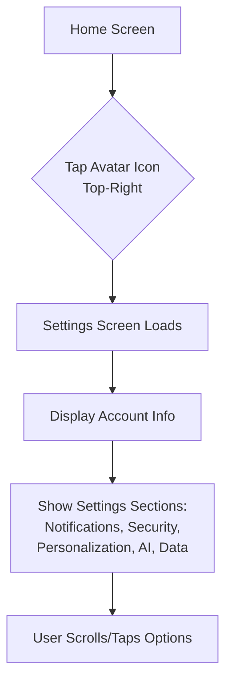

**Success Criteria**:
- Settings screen opens in < 500ms
- Account info displayed (name, email, join date)
- All sections visible and accessible

---

## 2. Edit Username

**Trigger**: User taps on their name in Settings  
**Goal**: Change display name

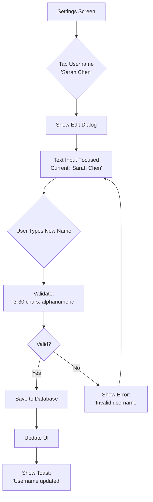

**Edge Cases**:
- Empty input → "Username required"
- Too short (< 3 chars) → "Minimum 3 characters"
- Too long (> 30 chars) → "Maximum 30 characters"
- Special characters → "Only letters, numbers, underscores"

---

## 3. Change Theme

**Trigger**: User taps theme option in Personalization section  
**Goal**: Switch between Light/Dark/Auto themes

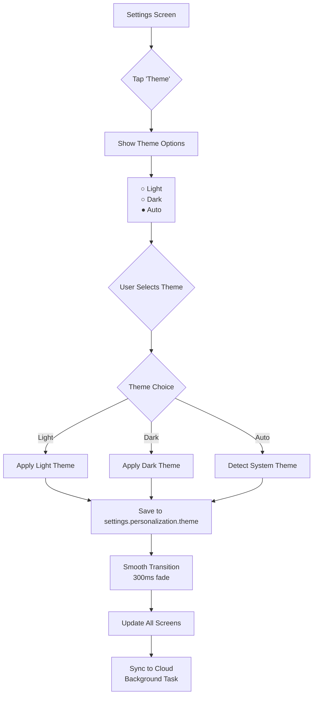

**Success Criteria**:
- Theme change visible immediately
- Smooth transition (no flash)
- Persists after app restart
- Syncs across devices

---

## 4. Enable/Disable Morning Reminder

**Trigger**: User toggles morning reminder switch  
**Goal**: Enable or disable morning journal notification

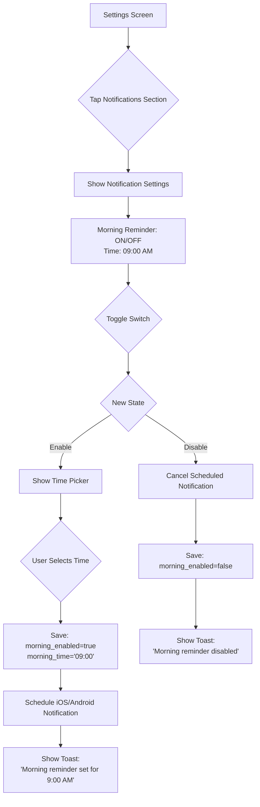

**Platform-Specific**:
- **iOS**: `UNUserNotificationCenter` for local notifications
- **Android**: `WorkManager` for reliable scheduling
- **Web**: Browser notifications (optional, lower priority)

**Edge Cases**:
- Notification permission denied → "Enable notifications in device settings"
- Time picker cancelled → Revert to previous time

---

## 5. Enable App Lock (PIN)

**Trigger**: User enables app lock and chooses PIN  
**Goal**: Secure app with 4-6 digit PIN code

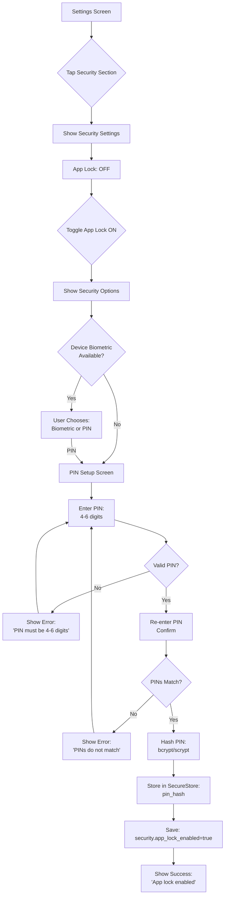

**Security Notes**:
- PIN hashed before storage (bcrypt)
- Stored in device Keychain (iOS) / Keystore (Android)
- Never transmitted to server
- Inherits from registration flow pattern

---

## 6. Enable App Lock (Biometric)

**Trigger**: User enables app lock with Face ID/Touch ID  
**Goal**: Secure app with biometric authentication

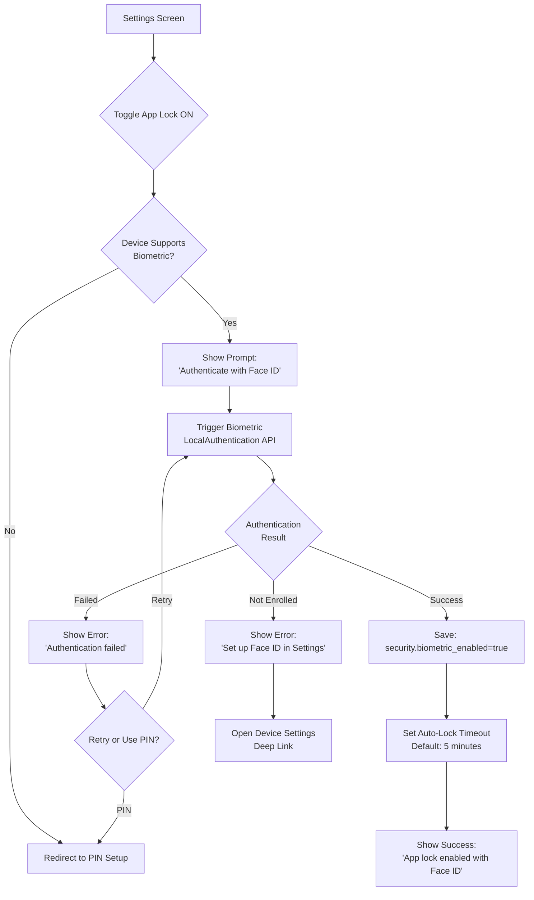

**Platform Differences**:
- **iOS**: Face ID, Touch ID
- **Android**: Fingerprint, Face unlock
- **Fallback**: PIN if biometric fails 3 times

---

## 7. Change PIN

**Trigger**: User taps "Change PIN" in Security settings  
**Goal**: Update existing PIN code

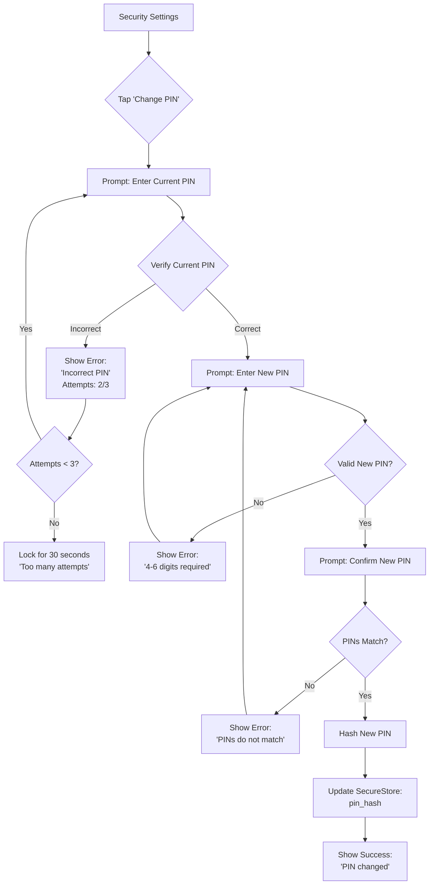

**Security Features**:
- Requires current PIN verification
- 3-attempt limit (locks for 30s after)
- New PIN must be different from old
- No "Forgot PIN" option (requires re-authentication)

---

## 8. View AI Memory

**Trigger**: User taps "View AI Memory" in AI & Privacy section  
**Goal**: See how AI understands user based on journals

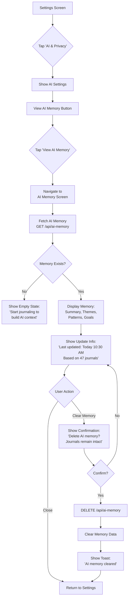

**AI Memory Content**:
- Summary paragraph
- Common themes (work_stress, relationships)
- Emotional patterns (anxiety in mornings)
- Therapy goals
- Last updated timestamp
- Journal count analyzed

**Privacy Notes**:
- Clearing memory does NOT delete journals
- Memory regenerates after next journal entry
- User can disable AI entirely to stop generation

---

## 9. Update "Your Story"

**Trigger**: User taps "Your Story" field in AI & Privacy  
**Goal**: Provide manual context for AI personalization

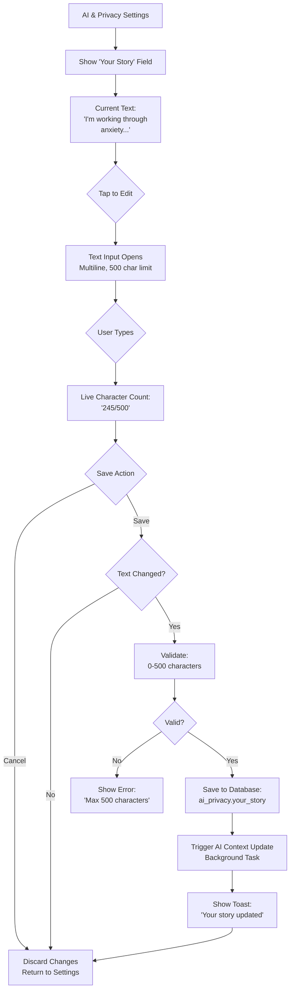

**Use Cases**:
- "I'm preparing for my first therapy session"
- "Dealing with recent job loss and career transition"
- "Managing anxiety from childhood trauma"

**AI Impact**:
- Used as primary context for AI responses
- Overrides or supplements auto-generated memory
- Helps AI tailor suggestions and questions

---

## 10. Export Journal Data

**Trigger**: User taps "Export Data" in Data Management  
**Goal**: Download journal backup as JSON file

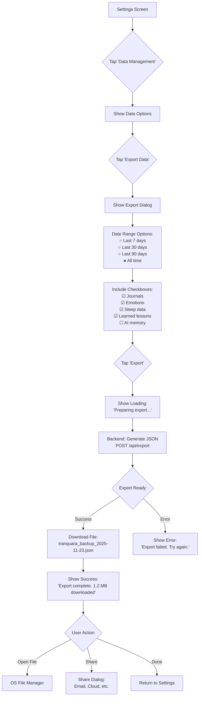

**Export Performance**:
- Small exports (< 100 entries): Immediate download
- Large exports (> 1000 entries): Background job + notification when ready
- Max file size: 50 MB (compress if larger)

**File Format**:
_[JSON code implementation removed - to be added during development]_

---

## 11. Import Backup

**Trigger**: User taps "Import Backup" in Data Management  
**Goal**: Restore journal data from JSON file

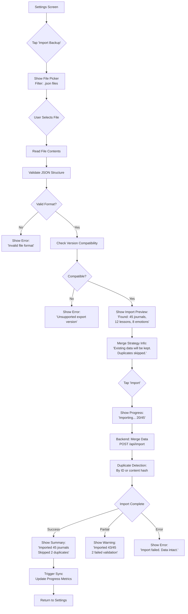

**Validation Checks**:
- Valid JSON syntax
- Required fields present (export_metadata, user, journals)
- Export version compatibility (v1.0, v1.1 supported)
- User ID matches or is remapped

**Merge Logic**:
- Existing journal with same ID → Skip import
- New journal → Add to database
- Conflict resolution: Keep existing data (no overwrite)

---

## 12. Delete Account

**Trigger**: User taps "Delete Account" in Data Management  
**Goal**: Permanently delete account and all data

```mermaid
graph TD
    A[Settings Screen] --> B{Tap 'Delete Account'}
    B --> C[Show Warning Dialog:<br/>'⚠️ This will permanently<br/>delete all your data']
    C --> D{Tap 'Continue'<br/>or Cancel}
    D -->|Cancel| E[Return to Settings]
    D -->|Continue| F[Show Download Prompt:<br/>'Download data first?']
    F --> G{User Choice}
    G -->|Skip| H[Show Grace Period Options]
    G -->|Download| I[Trigger Export Flow]
    I --> J[Wait for Download]
    J --> H
    H --> K[Grace Period Dialog:<br/>○ Delete immediately<br/>● 30-day grace period]
    K --> L{User Selects}
    L --> M[Show Final Confirmation:<br/>'Enter username to confirm']
    M --> N{Type Username}
    N --> O{Username Correct?}
    O -->|No| P[Show Error:<br/>'Username does not match']
    P --> N
    O -->|Yes| Q[Tap 'Delete Account']
    Q --> R{Grace Period?}
    R -->|Immediate| S[DELETE /api/account<br/>immediate=true]
    R -->|30 days| T[POST /api/account/delete<br/>grace_period=30]
    S --> U[Delete All Data:<br/>Journals, Progress,<br/>AI Memory, Settings]
    U --> V[Clear Local Storage]
    V --> W[Show Success:<br/>'Account deleted']
    W --> X[Redirect to<br/>Welcome Screen]
    T --> Y[Mark Account:<br/>deleted_at = NOW()]
    Y --> Z[Lock Account<br/>No Login]
    Z --> AA[Schedule Deletion:<br/>30 days from now]
    AA --> AB[Send Email:<br/>'Recovery link valid<br/>until Dec 23, 2025']
    AB --> AC[Show Success:<br/>'Account will be deleted<br/>on Dec 23, 2025']
    AC --> X
```

**Grace Period Recovery**:
- User receives email with recovery link
- Clicking link → "Recover Account?" dialog
- Confirm → Account reactivated, `deleted_at` cleared
- After 30 days → Automatic permanent deletion cron job

**GDPR Compliance**:
- All data deleted from database
- Backups purged within 90 days
- Deletion confirmation email sent
- No data retention after permanent deletion

---

## 13. Toggle AI Personalization

**Trigger**: User toggles AI Personalization switch in AI & Privacy  
**Goal**: Enable or disable AI-driven features

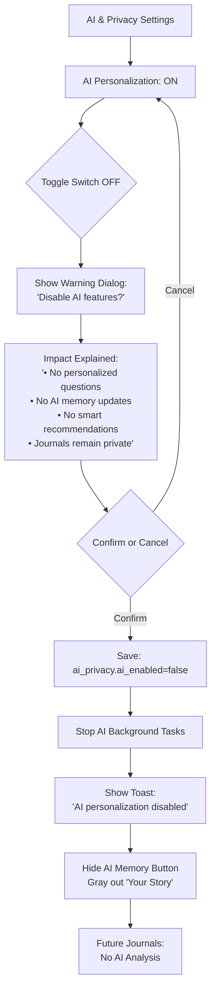

**When AI is Disabled**:
- Journal entries saved normally
- No sentiment analysis
- No AI memory updates
- No personalized prompts
- Search still works (keyword-based, no semantic)

**When Re-enabled**:
- AI analyzes past journals to catch up
- Memory regenerates from existing data
- Personalized features resume

---

## 14. Logout

**Trigger**: User taps "Logout" button at bottom of Settings  
**Goal**: Sign out and return to welcome screen

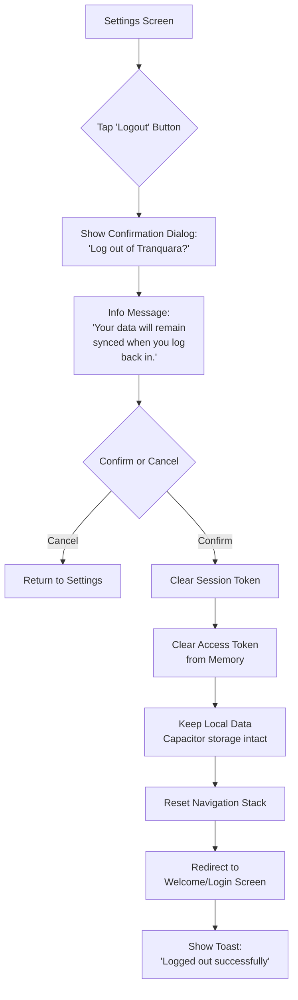

**Logout Behavior**:
- **Session cleared**: Tokens removed, must re-authenticate
- **Local data kept**: Journals, lessons, settings persist offline
- **Sync paused**: No background sync until re-login
- **Biometric/PIN remains**: App lock still active for privacy

**Difference from Delete Account**:
- Logout: Reversible, data intact
- Delete: Permanent, data destroyed

---

## Flow Summary

| Flow | Complexity | User Touches | Success Metric |
|------|-----------|--------------|----------------|
| Access Settings | Low | 1 tap | Screen loads < 500ms |
| Edit Username | Low | 3 taps | Username updates, toast shown |
| Change Theme | Low | 2 taps | Theme applies immediately |
| Enable Reminder | Medium | 3 taps | Notification scheduled |
| Enable PIN Lock | Medium | 5 taps | PIN stored securely |
| Enable Biometric | Medium | 2 taps | Biometric auth works |
| Change PIN | High | 6 taps | New PIN set, old invalidated |
| View AI Memory | Low | 2 taps | Memory screen loads < 1s |
| Update Your Story | Medium | 3 taps | Story saved, AI context updated |
| Export Data | Medium | 4 taps | JSON downloads successfully |
| Import Backup | High | 4 taps | Data merged, duplicates skipped |
| Delete Account | High | 7 taps | Account deleted, email sent |
| Toggle AI | Low | 2 taps | AI features disabled, tasks stopped |
| Logout | Low | 2 taps | Session cleared, redirected |

---

**Last Updated**: November 23, 2025
