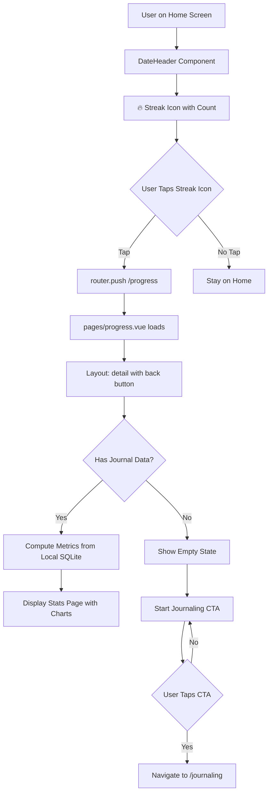
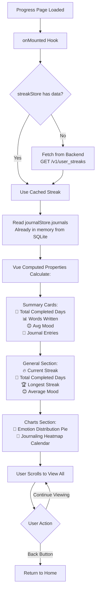
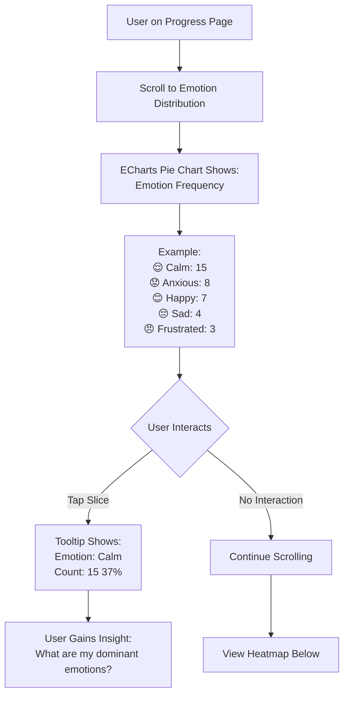
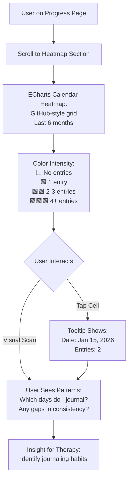
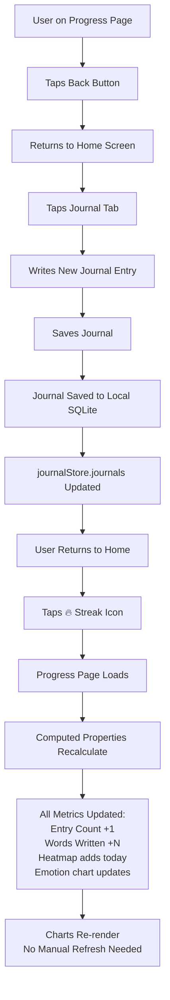
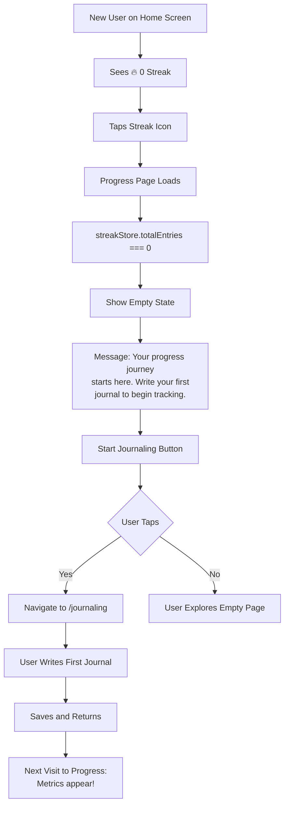

# 🗺️ Progress Tracking - User Flows

## Overview

This document outlines all user journeys within the Progress feature. The Progress page is a **detail page** accessed via the 🔥 streak icon on the Home screen — not a bottom navigation tab.

---

## Flow A: Navigate to Progress Page

**Entry Point**: 🔥 streak icon in `components/HomePage/DateHeader.vue`
**Result**: User lands on Progress page with either real metrics or empty state.

---

## Flow B: View Progress Metrics

**Data Sources**: Local SQLite journals + backend streak API
**Result**: User sees comprehensive stats with charts.

---

## Flow C: View Emotion Distribution Chart

**Chart Library**: ECharts via vue-echarts
**Result**: Users see their emotion patterns at a glance.

---

## Flow D: View Journaling Heatmap

**Result**: Users visualize their journaling consistency over time.

---

## Flow E: Metrics Refresh After Journaling

**Key Point**: No WebSocket or polling — Vue reactivity handles updates when the page re-enters.
**Result**: Metrics update seamlessly when user navigates to Progress after journaling.

---

## Flow F: Empty State (New User)

**Result**: New users understand what will be tracked and have a clear path to start.

---

## Summary: Key User Paths

| Flow | Entry Point | Exit Point | Key Data |
|------|-------------|------------|----------|
| **Navigate to Progress** | 🔥 Streak icon (Home) | Progress detail page | Local SQLite + backend streak |
| **View Metrics** | Progress page | Scrollable stats view | Computed from journals |
| **Emotion Distribution** | Charts section | Pie chart tooltip | Grouped emotion_log data |
| **Journaling Heatmap** | Charts section | Calendar grid tooltip | Journal dates → day counts |
| **Metric Refresh** | After journaling | Updated progress page | Vue reactivity recomputes |
| **Empty State** | New user, 0 entries | Start Journaling CTA | Empty + encouraging message |

---

**Last Updated**: February 28, 2026
