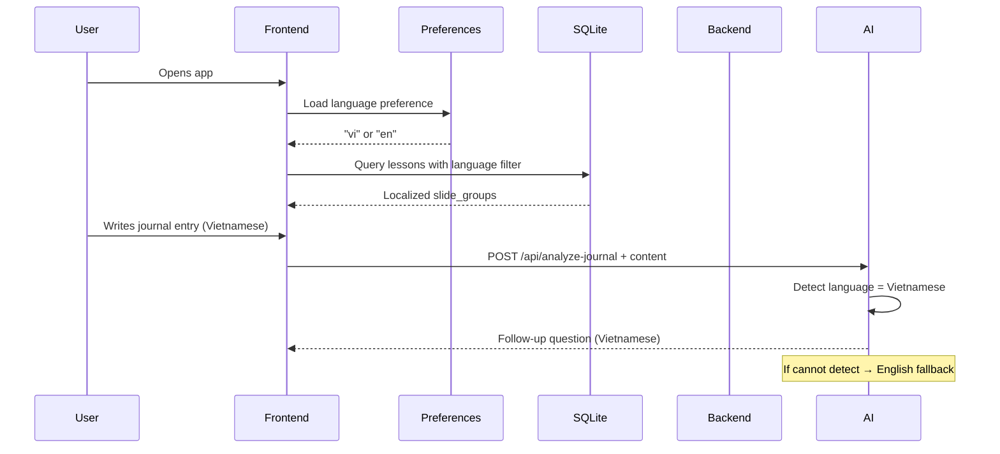

# Multi-Language Support - Overview

> **Status**: 🔄 In Development  
> **Last Updated**: March 8, 2026  
> **Version**: 1.0.0  
> **Priority**: 🟡 HIGH

---

## 📑 Table of Contents

1. [Feature Summary](#feature-summary)
2. [Scope](#scope)
3. [Architecture Overview](#architecture-overview)
4. [Language Support Matrix](#language-support-matrix)
5. [Key Design Decisions](#key-design-decisions)

---

## 🎯 Feature Summary

Implement comprehensive multi-language support across TheraPrep platform to serve international users with localized UI, content, and AI-generated responses.

**Initial Release**: English + Vietnamese  
**Extensible**: Architecture supports adding additional languages in future iterations

**User Story:**
> As a user, I want to use TheraPrep in my preferred language (Vietnamese or English), with AI responses that match the language I'm writing in, so that I can journal and learn comfortably in my native language.

---

## 🌍 Scope

### Phase 1: English + Vietnamese (Current Iteration)

#### ✅ In Scope

**Frontend (`tranquara_frontend/`):**
- ✅ UI text localization (buttons, labels, navigation, error messages)
- ✅ Validation messages
- ✅ Onboarding screens and tooltips
- ✅ Progress charts labels and descriptions
- ✅ User-selectable language preference (stored locally)

**Lesson Content (`slide_groups` in `journal_templates`):**
- ✅ Multi-language support for lesson titles, descriptions
- ✅ Multi-language support for slide questions/prompts
- ✅ Local SQLite storage with language-specific queries
- ✅ Fallback to English if translation missing

**AI Service (`tranquara_ai_service/`):**
- ✅ Automatic language detection from journal content
- ✅ AI-generated follow-up questions in detected language
- ✅ GPT-4o-mini prompt engineering for multi-language responses
- ✅ Fallback to English for undetected languages

#### ❌ Out of Scope (Phase 2+)

- ❌ Email template translations (backend `internal/mailer/`)
- ❌ Dynamic locale switching without app restart
- ❌ Right-to-left (RTL) language support
- ❌ Language-specific date/time formatting beyond basic i18n
- ❌ Voice/audio content localization

---

## 🏗️ Architecture Overview

### High-Level Components

```
┌─────────────────────────────────────────────────────────────┐
│                    USER INTERFACE                            │
│  ┌──────────────────────────────────────────────────────┐   │
│  │  Nuxt Frontend (@nuxtjs/i18n)                        │   │
│  │  • UI Text: locales/en.json, locales/vi.json        │   │
│  │  • Language Preference: Capacitor Preferences        │   │
│  │  • $t() helper for translations                      │   │
│  └──────────────────────────────────────────────────────┘   │
└─────────────────────────────────────────────────────────────┘
                              ↕
┌─────────────────────────────────────────────────────────────┐
│              LESSON CONTENT (slide_groups)                   │
│  ┌──────────────────────────────────────────────────────┐   │
│  │  PostgreSQL: journal_templates.slide_groups (JSONB)  │   │
│  │  • Structure: { question_en, question_vi, ... }      │   │
│  │                                                        │   │
│  │  Local SQLite Cache: journal_templates table         │   │
│  │  • Queries filter by user's language preference      │   │
│  │  • Fallback to _en fields if _vi missing            │   │
│  └──────────────────────────────────────────────────────┘   │
└─────────────────────────────────────────────────────────────┘
                              ↕
┌─────────────────────────────────────────────────────────────┐
│                 AI SERVICE (Python FastAPI)                  │
│  ┌──────────────────────────────────────────────────────┐   │
│  │  GPT-4o-mini Language Detection + Response           │   │
│  │  • System prompt: "Detect language, respond in same" │   │
│  │  • Priority: First non-English language detected     │   │
│  │  • Fallback: English                                 │   │
│  └──────────────────────────────────────────────────────┘   │
└─────────────────────────────────────────────────────────────┘
```

### Data Flow



---

## 🗣️ Language Support Matrix

| Component | English | Vietnamese | Fallback Logic |
|-----------|---------|-----------|----------------|
| **UI Text** | ✅ | ✅ | Always fallback to English |
| **Lesson Titles** | ✅ | ✅ | Show `_en` if `_vi` missing |
| **Lesson Questions** | ✅ | ✅ | Show `_en` if `_vi` missing |
| **AI Follow-up Questions** | ✅ | ✅ | Detect from journal content |
| **Error Messages** | ✅ | ✅ | Client-side translation |
| **Email Templates** | ✅ | ❌ | Phase 2 |

---

## 🎨 Key Design Decisions

### 1. **Separate Language Concerns**
- **UI Language**: User-controlled via Settings → stored in Capacitor Preferences
- **AI Response Language**: Auto-detected per journal entry → NOT stored, dynamically analyzed

**Rationale**: Users may want UI in English but journal in Vietnamese (or vice versa)

---

### 2. **JSONB Multi-Column Approach for Lessons**
Instead of separate `translations` table, embed language fields directly in JSONB:

```json
{
  "id": "morning-mood",
  "type": "emotion_log",
  "question_en": "How are you feeling this morning?",
  "question_vi": "Bạn cảm thấy thế nào sáng nay?",
  "config": { ... }
}
```

**Rationale**:
- ✅ Simpler queries (no JOINs)
- ✅ Atomic updates (all translations in one place)
- ✅ Better offline support (full content cached in SQLite)
- ❌ Larger JSONB payload (acceptable for ~10 languages max)

**Alternative Considered**: Separate `translations` table (rejected due to complex offline sync)

---

### 3. **GPT-4o-mini for Language Detection**
Use AI system prompt instead of separate detection library:

```
System: Detect the language of the user's journal entry. 
        If Vietnamese, respond in Vietnamese.
        If another language (not English), respond in that language.
        Otherwise, respond in English.
```

**Rationale**:
- ✅ No extra library dependency
- ✅ GPT-4 is accurate with language detection
- ✅ Single API call (detection + response generation)
- ❌ Uses ~50 tokens per detection (acceptable cost)

**Alternative Considered**: `langdetect` library (rejected for Phase 1, may revisit if token cost becomes issue)

---

### 4. **Client-Side Error Translation**
Backend returns error keys (e.g., `"error.invalid_credentials"`), frontend translates:

```typescript
const errorMessage = $t(response.error_key);
```

**Rationale**:
- ✅ No backend changes needed
- ✅ Consistent with frontend i18n system
- ✅ Backend stays language-agnostic

---

### 5. **Pre-Bundled Language Packs**
All translations bundled in app (`locales/en.json`, `locales/vi.json`), no on-demand downloads.

**Rationale**:
- ✅ Instant availability (offline-first)
- ✅ Simpler deployment (no CDN/asset management)
- ✅ Small file size (~50KB per language for UI text)

---

## 📊 Performance Considerations

| Concern | Impact | Mitigation |
|---------|--------|-----------|
| **JSONB payload size** | ~10KB per template (2 languages) | Acceptable, pre-cached in SQLite |
| **AI token cost** | ~50 tokens per detection | Batch detection if multiple entries |
| **SQLite query complexity** | Nested JSON field access | Index on `category`, pre-filter before JSON parsing |
| **App bundle size** | +100KB for i18n module + locales | Minification, tree-shaking |

---

## 🔗 Related Documentation

- [Technical Specification](./02-TECHNICAL-SPEC.md) - Implementation details
- [Data Models](./03-DATA-MODELS.md) - Schema changes
- [Migration Guide](./04-MIGRATION-GUIDE.md) - How to add new languages
- [Database Schema](../00-DATABASE/SCHEMA_OVERVIEW.md) - Current schema
- [Micro Learning Feature](../03.%20Micro%20learning/) - Lesson system architecture

---

## 📝 Notes

- **No sync needed**: Language preference is local-only (Capacitor Preferences)
- **Backend compatibility**: API endpoints remain unchanged, backward compatible
- **Extensibility**: Adding new languages requires only JSON files + JSONB field additions
