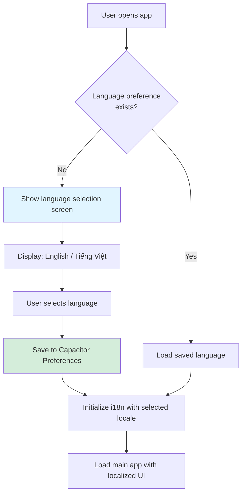
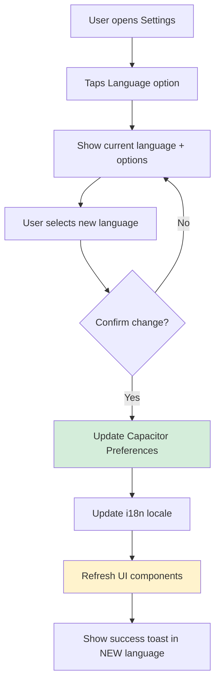
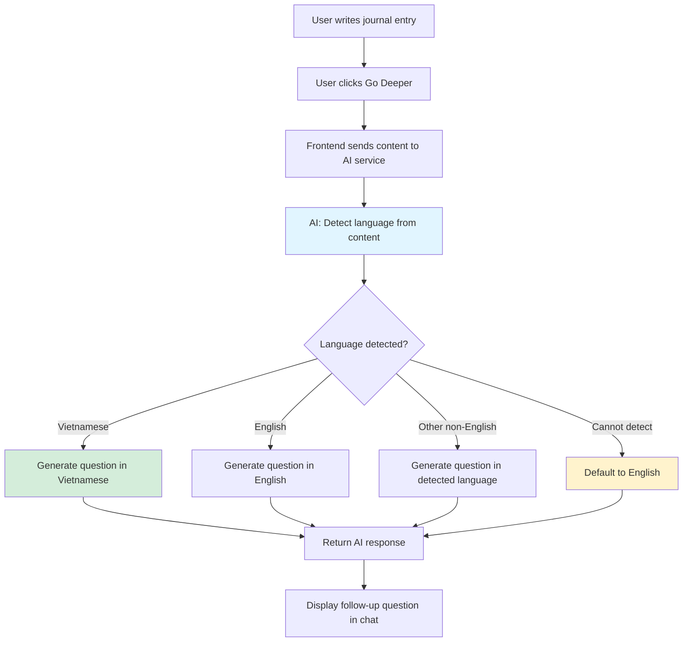
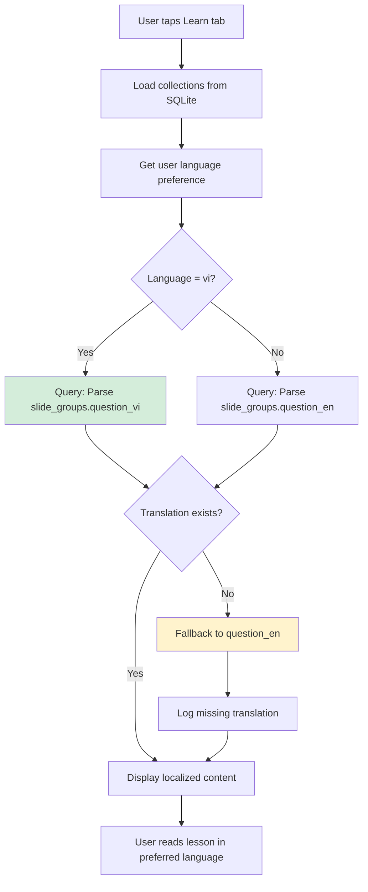

# Multi-Language Support - User Flows

> **Status**: 🔄 In Development  
> **Last Updated**: March 8, 2026  
> **Version**: 1.0.0

---

## 📑 Table of Contents

1. [Flow 1: Initial Language Selection](#flow-1-initial-language-selection)
2. [Flow 2: Changing Language in Settings](#flow-2-changing-language-in-settings)
3. [Flow 3: AI Language Detection During Journaling](#flow-3-ai-language-detection-during-journaling)
4. [Flow 4: Viewing Localized Lesson Content](#flow-4-viewing-localized-lesson-content)
5. [Edge Cases](#edge-cases)

---

## Flow 1: Initial Language Selection

### Trigger
- User opens app for the first time (onboarding)

### Steps



**User Actions:**
1. Opens TheraPrep for the first time
2. Sees language selection screen with options:
   - **English** 🇺🇸
   - **Tiếng Việt** 🇻🇳
3. Taps preferred language
4. Sees app UI immediately switch to selected language

**System Actions:**
1. Check Capacitor Preferences for `user_language` key
2. If not found, display language picker
3. On selection, store value (`"en"` or `"vi"`) in Preferences
4. Configure Nuxt i18n with selected locale
5. Fetch lesson content with language filter from SQLite

**Success State:**
- All UI elements displayed in selected language
- Language preference persisted for future sessions

---

## Flow 2: Changing Language in Settings

### Trigger
- User navigates to Settings → Language

### Steps



**User Actions:**
1. Opens Settings page
2. Taps **"Language" / "Ngôn ngữ"** row
3. Sees modal/sheet with:
   - ✓ **English** (if currently selected)
   - **Tiếng Việt**
4. Selects new language
5. Sees confirmation dialog (optional): "Change language to Vietnamese?"
6. Confirms

**System Actions:**
1. Update `user_language` in Capacitor Preferences
2. Update Nuxt i18n `$i18n.locale` reactively
3. All Vue components automatically re-render with new translations via `$t()`
4. SQLite queries now filter for `_vi` fields instead of `_en`
5. Show success toast: "Language changed to Vietnamese" / "Đã chuyển sang tiếng Việt"

**Success State:**
- Entire UI switched to new language
- Lesson content loads in new language
- Future app launches use new language

**Note**: No app restart required (fully reactive)

---

## Flow 3: AI Language Detection During Journaling

### Trigger
- User writes journal entry and clicks **"Go Deeper"** button

### Steps



**User Actions:**
1. Opens journal from collection (e.g., "Daily Reflection")
2. Writes entry in Vietnamese:
   ```
   Hôm nay tôi cảm thấy rất mệt mỏi vì công việc. 
   Tôi cần nghỉ ngơi nhiều hơn.
   ```
3. Clicks **"Go Deeper"** button
4. Sees AI-generated follow-up question in Vietnamese:
   ```
   Công việc cụ thể nào khiến bạn mệt mỏi nhất? 
   Bạn đã thử cách nào để giảm căng thẳng chưa?
   ```

**System Actions (AI Service):**
1. Receive journal content via `POST /api/analyze-journal`
2. Pass to GPT-4o-mini with enhanced system prompt:
   ```
   Detect the language of the user's journal entry.
   - If Vietnamese, respond entirely in Vietnamese
   - If another language (not English), respond in that language
   - If English or cannot detect, respond in English
   
   Generate a thoughtful follow-up question in the detected language.
   ```
3. GPT-4o-mini analyzes content → detects Vietnamese
4. Generates response in Vietnamese
5. Return to frontend

**Success State:**
- AI question matches user's writing language
- Conversation feels natural and culturally appropriate

**Edge Cases:** See [Edge Cases](#edge-cases) section below

---

## Flow 4: Viewing Localized Lesson Content

### Trigger
- User opens a lesson (slide_group) from Learn tab

### Steps



**User Actions:**
1. Opens **Learn** tab
2. Sees collection cards with localized titles:
   - English: "Daily Reflection"
   - Vietnamese: "Suy Ngẫm Hằng Ngày"
3. Taps a collection
4. Sees slide groups with localized questions:
   - English: "How are you feeling this morning?"
   - Vietnamese: "Bạn cảm thấy thế nào sáng nay?"
5. Progresses through slides, all in selected language

**System Actions:**
1. SQLite query filters `journal_templates` by `is_active = 1`
2. For each `slide_group` in JSONB `slide_groups` array:
   - If `user_language = "vi"`, extract `question_vi`
   - If `question_vi` is null/missing, fallback to `question_en`
3. Render slides with localized questions
4. If fallback used, log to console (dev mode) for translation coverage tracking

**Success State:**
- All lesson content displayed in user's preferred language
- Seamless experience with no mixed languages
- Graceful degradation if translation missing

---

## Edge Cases

### Edge Case 1: Mixed Language Journal Entry

**Scenario:** User writes in both English and Vietnamese:
```
Today I went to the office. Tôi cảm thấy khá mệt. 
Had 3 meetings. Nhưng tôi vẫn hoàn thành công việc.
```

**Expected Behavior:**
- AI detects **Vietnamese** (first non-English language)
- Responds in Vietnamese
- Rationale: Bilingual users often code-switch, but prefer native language responses

**Alternative Approach (Future):**
- Count word frequency per language
- Respond in majority language

---

### Edge Case 2: Very Short Entry (Insufficient Context)

**Scenario:** User writes: "Ok"

**Expected Behavior:**
- AI cannot confidently detect language
- Defaults to **English**
- Generates generic follow-up: "Can you tell me more about that?"

---

### Edge Case 3: Missing Translation in Lesson

**Scenario:** New lesson added to backend with only `question_en`, no `question_vi`

**Expected Behavior:**
1. SQLite query attempts to parse `question_vi`
2. Finds `null` or undefined
3. Fallback to `question_en`
4. User sees English question (marked with subtle indicator: 🌐)
5. Log warning: `[i18n] Missing translation: slide_id="morning-mood", lang="vi"`

**User Communication:**
- Optional: Show tooltip: "This lesson is not yet available in Vietnamese"

---

### Edge Case 4: Language Changed Mid-Session

**Scenario:** User changes language from English to Vietnamese while viewing a lesson

**Expected Behavior:**
1. Current slide finishes rendering (no mid-render switch)
2. On next slide navigation, new language loads
3. If user goes back, previous slides re-render in new language

**Technical Implementation:**
- Use Vue `watch()` on `$i18n.locale`
- Trigger component re-mount or re-query SQLite

---

### Edge Case 5: Offline Language Switch

**Scenario:** User is offline, changes language

**Expected Behavior:**
1. UI language changes immediately (JSON files bundled)
2. Lesson content switches immediately (SQLite cached)
3. No network call needed
4. Works seamlessly offline

---

## 🎨 UI/UX Considerations

### Language Selection Screen (Onboarding)

```
┌───────────────────────────────────┐
│                                   │
│        Welcome to TheraPrep       │
│     Chào mừng đến TheraPrep       │
│                                   │
│     Select your language:         │
│     Chọn ngôn ngữ của bạn:        │
│                                   │
│   ┌─────────────────────────┐    │
│   │     English 🇺🇸          │    │
│   └─────────────────────────┘    │
│                                   │
│   ┌─────────────────────────┐    │
│   │   Tiếng Việt 🇻🇳         │    │
│   └─────────────────────────┘    │
│                                   │
└───────────────────────────────────┘
```

### Settings > Language

```
┌───────────────────────────────────┐
│   ← Settings                      │
├───────────────────────────────────┤
│                                   │
│   App Language                    │
│   Ngôn ngữ ứng dụng               │
│                                   │
│   ┌─────────────────────────┐    │
│   │ ✓ English                │    │
│   ├─────────────────────────┤    │
│   │   Tiếng Việt             │    │
│   └─────────────────────────┘    │
│                                   │
│   ℹ️  Language change takes      │
│       effect immediately          │
│                                   │
└───────────────────────────────────┘
```

---

## 📝 Implementation Checklist

- [ ] Create language selection screen component
- [ ] Add language option to Settings page
- [ ] Implement Capacitor Preferences storage
- [ ] Setup Nuxt i18n with locale switching
- [ ] Add language detection to AI system prompt
- [ ] Implement SQLite JSONB field parsing for multi-language
- [ ] Add fallback logic for missing translations
- [ ] Test all edge cases
- [ ] Add language indicator for untranslated content
- [ ] Create translation coverage monitoring

---

## 🔗 Related Documentation

- [Technical Specification](./02-TECHNICAL-SPEC.md)
- [Data Models](./03-DATA-MODELS.md)
- [AI Service Implementation](./05-AI-SERVICE-INTEGRATION.md)
