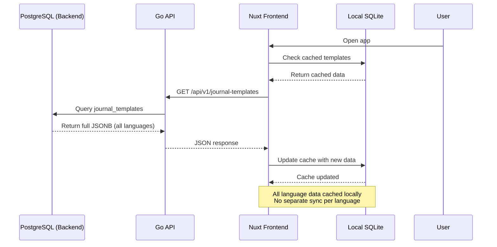

# Multi-Language Support - Data Models

> **Status**: 🔄 In Development  
> **Last Updated**: March 8, 2026  
> **Version**: 1.0.0

---

## 📑 Table of Contents

1. [Schema Changes Overview](#schema-changes-overview)
2. [PostgreSQL Schema](#postgresql-schema)
3. [SQLite Schema (Local)](#sqlite-schema-local)
4. [JSONB Structure](#jsonb-structure)
5. [Data Migration Strategy](#data-migration-strategy)
6. [Example Data](#example-data)

---

## 📊 Schema Changes Overview

### Changes Summary

| Database | Table/Entity | Change Type | Description |
|----------|-------------|-------------|-------------|
| **PostgreSQL** | `journal_templates` | Documentation | Update JSONB comment to reflect multi-lang structure |
| **PostgreSQL** | `journal_templates.slide_groups` | Schema Evolution | Add `question_vi` fields to existing JSONB |
| **SQLite** | `journal_templates` | Column Addition | Add `title_vi`, `description_vi` columns |
| **Capacitor Preferences** | New Key | New | `user_language` key for language preference |

**Migration Impact:**
- ✅ **Non-breaking**: All changes are additive
- ✅ **Backward compatible**: Existing data continues to work
- ✅ **Fallback logic**: Missing translations default to English

---

## 🐘 PostgreSQL Schema

### Table: `journal_templates` (Updated)

**No structural changes to table**, only JSONB content evolution:

```sql
CREATE TABLE journal_templates (
    id UUID DEFAULT gen_random_uuid(),
    title VARCHAR(255) NOT NULL,
    description TEXT,
    category VARCHAR(100),
    slide_groups JSONB NOT NULL,        -- ← Multi-language fields inside
    is_active BOOLEAN DEFAULT true,
    created_at TIMESTAMP DEFAULT CURRENT_TIMESTAMP,
    updated_at TIMESTAMP DEFAULT CURRENT_TIMESTAMP,
    PRIMARY KEY (id)
);

-- Indexes (unchanged)
CREATE INDEX idx_journal_templates_category ON journal_templates(category);
CREATE INDEX idx_journal_templates_active ON journal_templates(is_active);
CREATE INDEX idx_journal_templates_slide_groups ON journal_templates USING GIN (slide_groups);
```

**Column Documentation Update:**

```sql
COMMENT ON COLUMN journal_templates.slide_groups IS 
'JSONB array of slide group objects with multi-language support.

Structure:
[
  {
    "id": "slide-group-id",
    "title": "Slide group title (English)",
    "title_vi": "Tiêu đề nhóm slide (Vietnamese)",
    "description": "Description (English)",
    "description_vi": "Mô tả (Vietnamese)",
    "position": 1,
    "slides": [
      {
        "id": "slide-id",
        "type": "journal_prompt|emotion_log|sleep_check",
        "question_en": "English question text",
        "question_vi": "Vietnamese question text (optional)",
        "config": { ... }
      }
    ]
  }
]

Language Fallback Rules:
- If question_vi is null/missing → use question_en
- If title_vi is null/missing → use title
- Default language: English (en)

Supported Languages: en, vi
Extensible: Add more languages by adding question_<lang> fields
';
```

**Key Points:**
- No table schema migration needed
- JSONB structure evolves within existing column
- Backward compatible: existing `question` field still works, but deprecated
- Future-proof: Can add `question_es`, `question_fr`, etc.

---

## 📱 SQLite Schema (Local)

### Table: `journal_templates` (Updated)

**Added columns for top-level translation caching:**

```sql
CREATE TABLE IF NOT EXISTS journal_templates (
  id TEXT PRIMARY KEY,
  
  -- English (default)
  title TEXT NOT NULL,
  description TEXT,
  
  -- Vietnamese translations (NEW)
  title_vi TEXT,
  description_vi TEXT,
  
  -- Other fields (unchanged)
  category TEXT,
  type TEXT NOT NULL DEFAULT 'journal',
  slide_groups TEXT NOT NULL,  -- JSON string with multi-lang fields
  is_active INTEGER DEFAULT 1,
  created_at TEXT,
  updated_at TEXT,
  cached_at TEXT NOT NULL
);

-- Indexes (unchanged)
CREATE INDEX IF NOT EXISTS idx_templates_category ON journal_templates(category);
CREATE INDEX IF NOT EXISTS idx_templates_active ON journal_templates(is_active);
CREATE INDEX IF NOT EXISTS idx_templates_type ON journal_templates(type);
```

**Why separate columns for `title_vi` / `description_vi`?**
- ✅ Faster queries (no JSON parsing for list views)
- ✅ SQLite indexes work better on columns vs JSON fields
- ❌ More columns (acceptable for 2-3 languages)

**`slide_groups` field:**
- Remains TEXT (JSON string)
- Contains nested multi-language fields (parsed at runtime)

---

### Table: `user_journals` (No Changes)

```sql
-- No changes needed - journals store raw user content
-- Language detection happens at AI service level
CREATE TABLE IF NOT EXISTS user_journals (
  id TEXT PRIMARY KEY,
  server_id TEXT,
  user_id TEXT NOT NULL,
  collection_id TEXT,
  title TEXT,
  content TEXT NOT NULL,        -- Raw user content (any language)
  content_html TEXT,
  mood_score INTEGER CHECK (mood_score >= 0 AND mood_score <= 10),
  mood_label TEXT,
  created_at TEXT NOT NULL,
  updated_at TEXT NOT NULL,
  needs_sync INTEGER DEFAULT 1,
  synced_at TEXT,
  is_deleted INTEGER DEFAULT 0
);
```

---

### Capacitor Preferences (Key-Value Store)

**New Key:**

```typescript
{
  key: "user_language",
  value: "en" | "vi"
}
```

**Storage Location:**
- **iOS**: `UserDefaults`
- **Android**: `SharedPreferences`
- **Web**: `localStorage`

**API Usage:**

```typescript
import { Preferences } from '@capacitor/preferences';

// Save language
await Preferences.set({ key: 'user_language', value: 'vi' });

// Load language
const { value } = await Preferences.get({ key: 'user_language' });
// value = 'vi' or null
```

---

## 📦 JSONB Structure

### PostgreSQL: `slide_groups` JSONB Format

#### Full Structure with Multi-Language

```json
[
  {
    "id": "morning-prep",
    "title": "Morning",
    "title_vi": "Buổi sáng",
    "description": "Start your day with mindful journaling and positive focus.",
    "description_vi": "Bắt đầu ngày mới với nhật ký chánh niệm và tâm thế tích cực.",
    "position": 1,
    "slides": [
      {
        "id": "morning-mood",
        "type": "emotion_log",
        "question_en": "How are you feeling this morning?",
        "question_vi": "Bạn cảm thấy thế nào sáng nay?",
        "config": {
          "scale": "1-10",
          "labels": [
            "Storm", "Heavy Rain", "Rain", "Cloudy", "Partly Cloudy",
            "Mostly Sunny", "Sunny", "Bright", "Radiant", "Blissful"
          ]
        }
      },
      {
        "id": "morning-sleep",
        "type": "sleep_check",
        "question_en": "How many hours did you sleep last night?",
        "question_vi": "Bạn đã ngủ bao nhiêu giờ đêm qua?",
        "config": {
          "min": 0,
          "max": 12
        }
      },
      {
        "id": "morning-mind",
        "type": "journal_prompt",
        "question_en": "What is on my mind this morning?",
        "question_vi": "Điều gì đang ở trong đầu tôi sáng nay?",
        "config": {
          "allowAI": true,
          "minLength": 20
        }
      }
    ]
  }
]
```

#### Field Naming Convention

| Field Pattern | Description | Example |
|--------------|-------------|---------|
| `<field>` | Default (English) | `title`, `question` |
| `<field>_vi` | Vietnamese | `title_vi`, `question_vi` |
| `<field>_es` | Spanish (future) | `question_es` |
| `<field>_<ISO639-1>` | Any language | Follow ISO 639-1 codes |

**Reference:** [ISO 639-1 Language Codes](https://en.wikipedia.org/wiki/List_of_ISO_639-1_codes)

---

### SQLite: `slide_groups` JSON String

**Storage Format:**

Identical to PostgreSQL JSONB, but stored as TEXT:

```typescript
// TypeScript representation
interface SlideGroup {
  id: string;
  title: string;
  title_vi?: string;
  description?: string;
  description_vi?: string;
  position: number;
  slides: Slide[];
}

interface Slide {
  id: string;
  type: 'journal_prompt' | 'emotion_log' | 'sleep_check';
  question_en: string;
  question_vi?: string;
  config: Record<string, any>;
}
```

**Parsing Example:**

```typescript
// services/sqlite/templates_repository.ts

function parseSlideForLanguage(slide: any, lang: 'en' | 'vi'): Slide {
  const questionKey = `question_${lang}`;
  const fallbackKey = 'question_en';
  
  return {
    ...slide,
    question: slide[questionKey] || slide[fallbackKey] || '',
    _language: slide[questionKey] ? lang : 'en', // Metadata
    _hasTranslation: !!slide[questionKey]
  };
}
```

---

## 🔄 Data Migration Strategy

### Migration 1: Add Multi-Language Documentation

**File:** `000023_add_multilang_to_journal_templates.up.sql`

```sql
-- Update column comment with multi-language structure documentation
COMMENT ON COLUMN journal_templates.slide_groups IS 
'JSONB array of slide group objects with multi-language support.
... (see PostgreSQL Schema section for full comment)';
```

**Impact:** Documentation only, no data changes.

---

### Migration 2: Update Existing Templates

**File:** `000024_update_templates_multilang.up.sql`

```sql
-- Strategy: Update slide_groups JSONB by adding Vietnamese translations
-- This is a DATA migration, not a schema migration

-- Example: Update "Daily Reflection" template
UPDATE journal_templates
SET 
  slide_groups = jsonb_set(
    slide_groups,
    '{0,title_vi}',
    '"Buổi sáng"'::jsonb
  ),
  updated_at = CURRENT_TIMESTAMP
WHERE id = '55555555-5555-5555-5555-555555555555'::uuid;

-- Update individual slides within the slide group
UPDATE journal_templates
SET 
  slide_groups = jsonb_set(
    slide_groups,
    '{0,slides,0,question_vi}',
    '"Bạn cảm thấy thế nào sáng nay?"'::jsonb
  ),
  updated_at = CURRENT_TIMESTAMP
WHERE id = '55555555-5555-5555-5555-555555555555'::uuid;

-- Repeat for all slides in all templates...
-- (Can be scripted or done manually for initial content)
```

**Alternative Approach (More Efficient):**

Use a script to generate full JSONB replacement:

```sql
-- Replace entire slide_groups with multi-language version
UPDATE journal_templates
SET slide_groups = '... (full JSONB with all translations) ...'::jsonb
WHERE id = '55555555-5555-5555-5555-555555555555'::uuid;
```

---

### Migration 3: SQLite Schema Update

**File:** `tranquara_frontend/services/sqlite/schema.ts`

```typescript
// Add migration function
export async function migrateToV3(db: SQLiteDBConnection): Promise<void> {
  // Add new columns
  await db.execute(`
    ALTER TABLE journal_templates 
    ADD COLUMN title_vi TEXT;
  `);
  
  await db.execute(`
    ALTER TABLE journal_templates 
    ADD COLUMN description_vi TEXT;
  `);
  
  console.log('Migrated SQLite to v3: Added multi-language columns');
}

// Update DB_VERSION
export const DB_VERSION = 3; // was 2
```

**Trigger in `services/sqlite/sqlite_service.ts`:**

```typescript
async initDatabase() {
  const currentVersion = await this.getDatabaseVersion();
  
  if (currentVersion < 3) {
    await migrateToV3(this.db);
    await this.setDatabaseVersion(3);
  }
}
```

---

## 📝 Example Data

### Example 1: Daily Reflection Template (Multi-Language)

**PostgreSQL `journal_templates` Row:**

```json
{
  "id": "55555555-5555-5555-5555-555555555555",
  "title": "Daily Reflection",
  "description": "Simple daily prompts to help you reflect on your mornings and evenings with intention.",
  "category": "self_care",
  "slide_groups": [
    {
      "id": "morning-prep",
      "title": "Morning",
      "title_vi": "Buổi sáng",
      "description": "Start your day with mindful journaling and positive focus.",
      "description_vi": "Bắt đầu ngày mới với nhật ký chánh niệm và tâm thế tích cực.",
      "position": 1,
      "slides": [
        {
          "id": "morning-mood",
          "type": "emotion_log",
          "question_en": "How are you feeling this morning?",
          "question_vi": "Bạn cảm thấy thế nào sáng nay?",
          "config": {
            "scale": "1-10",
            "labels": ["Storm", "Heavy Rain", "Rain", "Cloudy", "Partly Cloudy", "Mostly Sunny", "Sunny", "Bright", "Radiant", "Blissful"]
          }
        },
        {
          "id": "morning-sleep",
          "type": "sleep_check",
          "question_en": "How many hours did you sleep last night?",
          "question_vi": "Bạn đã ngủ bao nhiêu giờ đêm qua?",
          "config": {
            "min": 0,
            "max": 12
          }
        },
        {
          "id": "morning-mind",
          "type": "journal_prompt",
          "question_en": "What is on my mind this morning?",
          "question_vi": "Điều gì đang ở trong đầu tôi sáng nay?",
          "config": {
            "allowAI": true,
            "minLength": 20
          }
        }
      ]
    },
    {
      "id": "evening-reflection",
      "title": "Evening",
      "title_vi": "Buổi tối",
      "description": "Close your day with reflection and self-kindness.",
      "description_vi": "Kết thúc ngày với suy ngẫm và tự yêu thương bản thân.",
      "position": 2,
      "slides": [
        {
          "id": "evening-mood",
          "type": "emotion_log",
          "question_en": "How are you feeling this evening?",
          "question_vi": "Bạn cảm thấy thế nào tối nay?",
          "config": {
            "scale": "1-10",
            "labels": ["Storm", "Heavy Rain", "Rain", "Cloudy", "Partly Cloudy", "Mostly Sunny", "Sunny", "Bright", "Radiant", "Blissful"]
          }
        },
        {
          "id": "evening-memorable",
          "type": "journal_prompt",
          "question_en": "What happened today worth remembering?",
          "question_vi": "Điều gì đáng nhớ đã xảy ra hôm nay?",
          "config": {
            "allowAI": true
          }
        }
      ]
    }
  ],
  "is_active": true,
  "created_at": "2026-03-01T00:00:00Z",
  "updated_at": "2026-03-08T00:00:00Z"
}
```

---

### Example 2: SQLite Cached Template (Parsed for Vietnamese)

**After parsing with `parseSlideGroupsForLanguage(slideGroups, 'vi')`:**

```typescript
{
  id: "55555555-5555-5555-5555-555555555555",
  title_vi: null, // Would need to be added in migration
  title: "Daily Reflection",
  description: "Simple daily prompts...",
  category: "self_care",
  slide_groups: [
    {
      id: "morning-prep",
      title: "Buổi sáng",  // ← Extracted from title_vi
      description: "Bắt đầu ngày mới...", // ← Extracted from description_vi
      position: 1,
      slides: [
        {
          id: "morning-mood",
          type: "emotion_log",
          question: "Bạn cảm thấy thế nào sáng nay?", // ← From question_vi
          _hasTranslation: true,
          config: { ... }
        },
        {
          id: "morning-sleep",
          type: "sleep_check",
          question: "Bạn đã ngủ bao nhiêu giờ đêm qua?",
          _hasTranslation: true,
          config: { ... }
        }
      ]
    }
  ]
}
```

---

### Example 3: Fallback Scenario (Missing Translation)

**Scenario:** New template added with only English:

```json
{
  "id": "new-template-id",
  "slide_groups": [
    {
      "id": "new-slide-group",
      "title": "New Feature",
      "title_vi": null,  // ← Missing Vietnamese
      "slides": [
        {
          "id": "new-slide",
          "type": "journal_prompt",
          "question_en": "How do you feel about this new feature?",
          "question_vi": null  // ← Missing Vietnamese
        }
      ]
    }
  ]
}
```

**After parsing with language='vi':**

```typescript
{
  slide_groups: [
    {
      id: "new-slide-group",
      title: "New Feature",  // ← Fallback to English
      slides: [
        {
          id: "new-slide",
          question: "How do you feel about this new feature?", // ← Fallback
          _hasTranslation: false,  // ← Indicator for UI
        }
      ]
    }
  ]
}
```

**UI Indicator (Optional):**
```vue
<template>
  <div>
    <p>{{ slide.question }}</p>
    <UBadge v-if="!slide._hasTranslation" color="gray">
      🌐 English only
    </UBadge>
  </div>
</template>
```

---

## 🔄 Sync Strategy (PostgreSQL ↔ SQLite)

### Sync Flow for Multi-Language Templates



**Key Points:**
- API returns **full JSONB** with all language fields
- Frontend caches entire payload in SQLite
- Language filtering happens at **query time** (client-side)
- No need for language-specific sync

---

## 📊 Database Comparison

| Aspect | PostgreSQL | SQLite |
|--------|-----------|--------|
| **Language Storage** | JSONB (nested) | TEXT (JSON string) + columns |
| **Query Performance** | GIN index on JSONB | JSON parsing at runtime |
| **Top-level Translations** | In JSONB | Separate columns (`title_vi`) |
| **Fallback Logic** | Client-side | Client-side |
| **Migration Complexity** | Data update (JSONB) | Schema change (columns) |
| **Extensibility** | Add JSONB fields | Add columns per language |

---

## 🔗 Related Documentation

- [PostgreSQL JSONB Documentation](https://www.postgresql.org/docs/current/datatype-json.html)
- [SQLite JSON Functions](https://www.sqlite.org/json1.html)
- [Capacitor Preferences API](https://capacitorjs.com/docs/apis/preferences)
- [Technical Specification](./02-TECHNICAL-SPEC.md)
- [Database Schema Overview](../00-DATABASE/SCHEMA_OVERVIEW.md)

---

## 📝 Notes

- **Storage Efficiency**: Multi-column approach (SQLite) vs nested JSONB (PostgreSQL) tradeoff
- **Query Performance**: SQLite columns are faster for list views, JSONB is flexible
- **Backward Compatibility**: Existing `question` field deprecated but still works
- **Future Languages**: Add `question_es`, `question_fr` as needed (no schema changes)
- **Translation Coverage**: Track missing translations via `_hasTranslation` metadata
