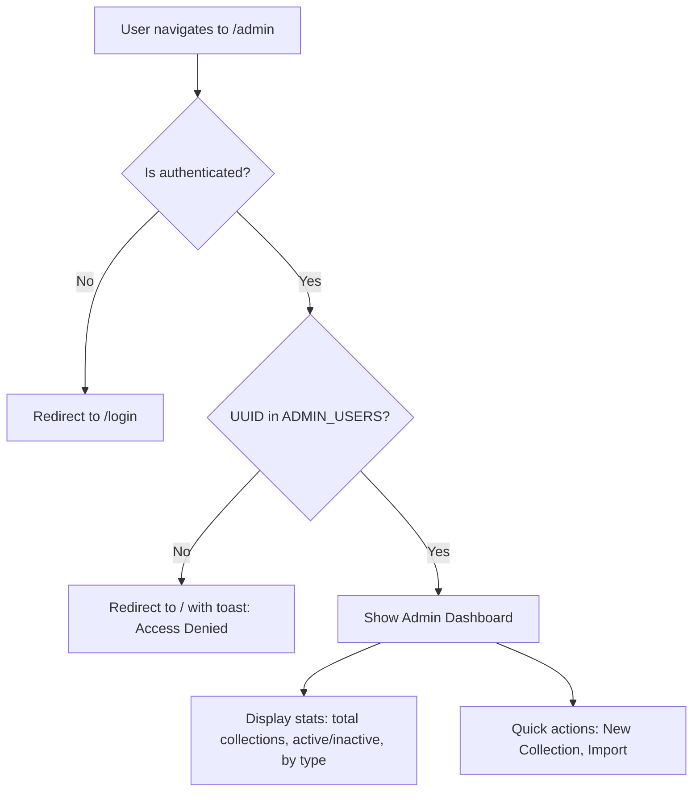
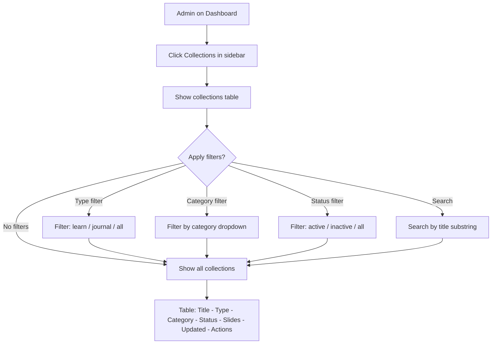
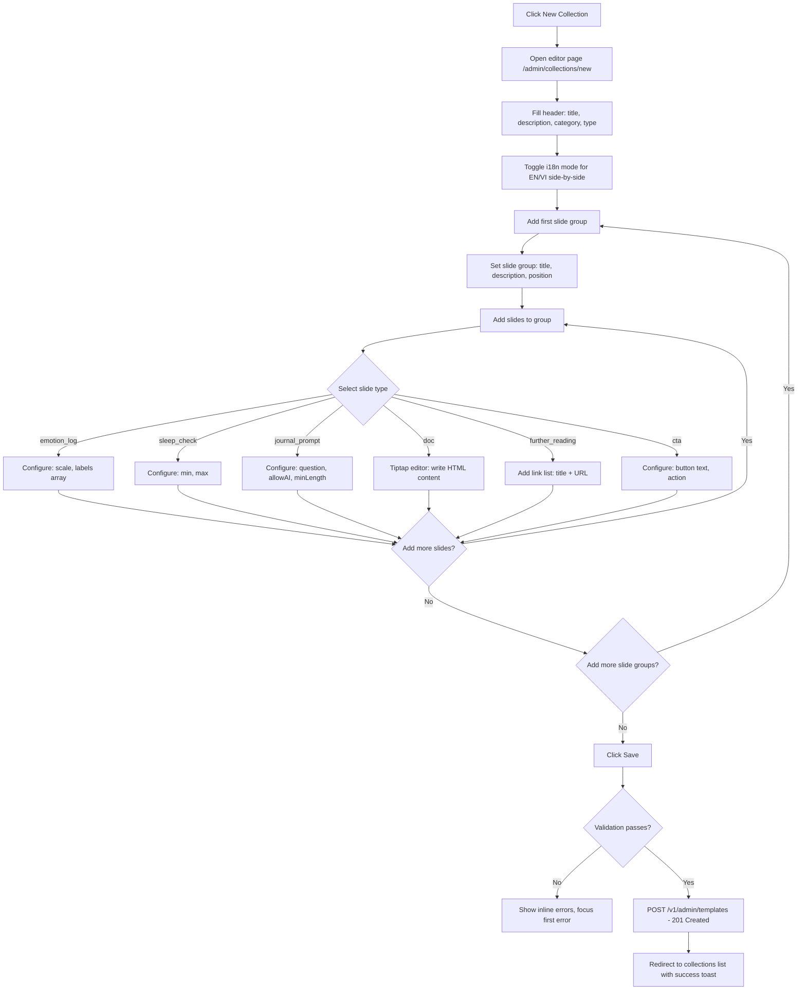
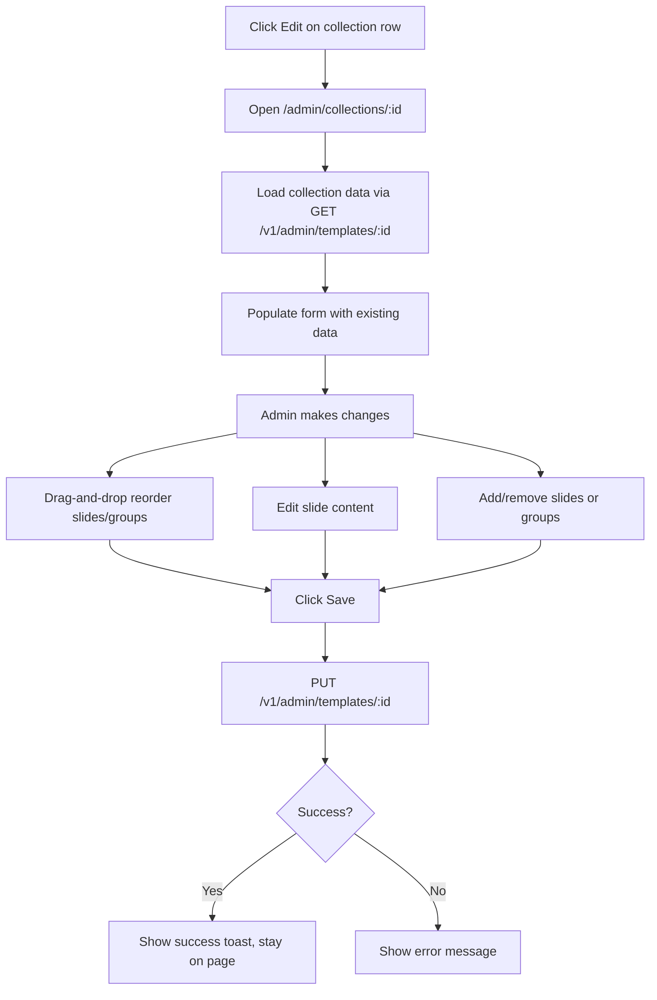
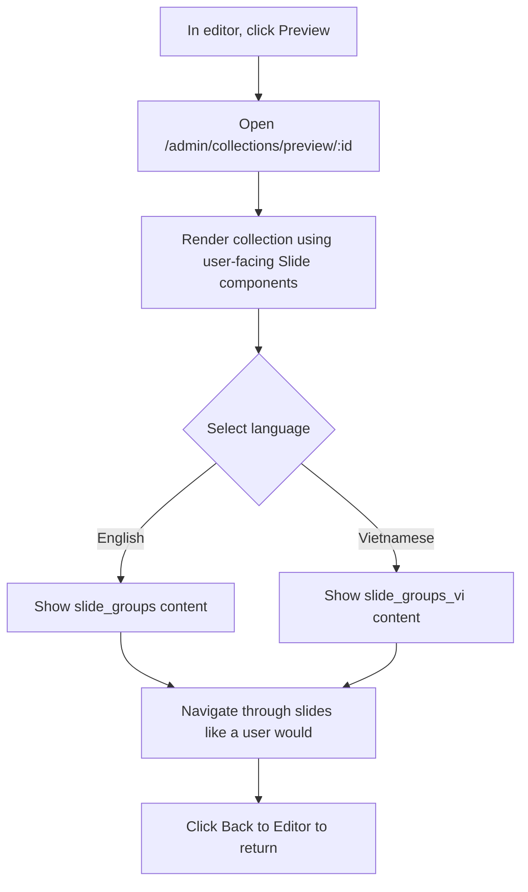
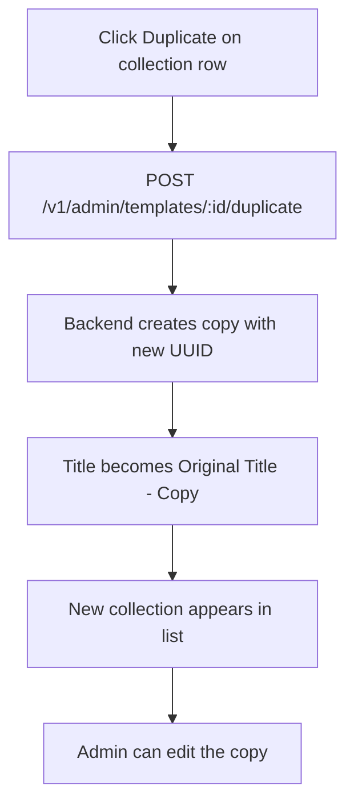
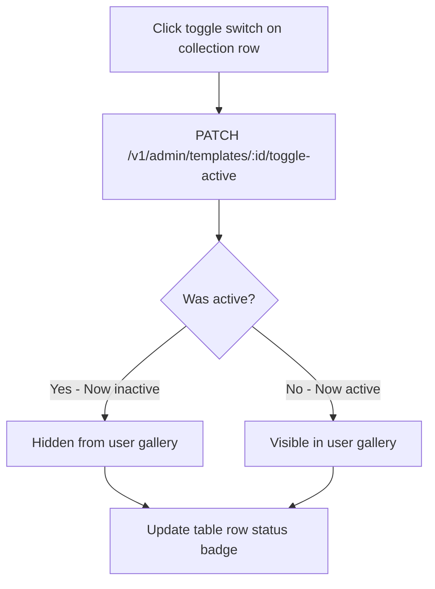
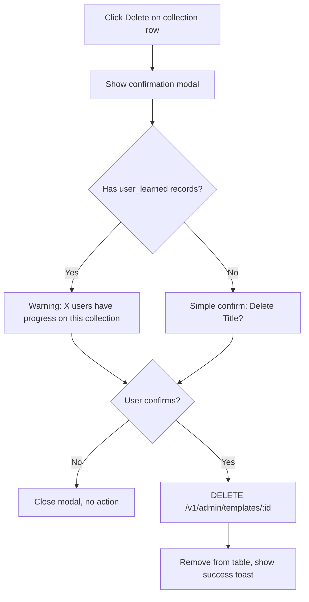
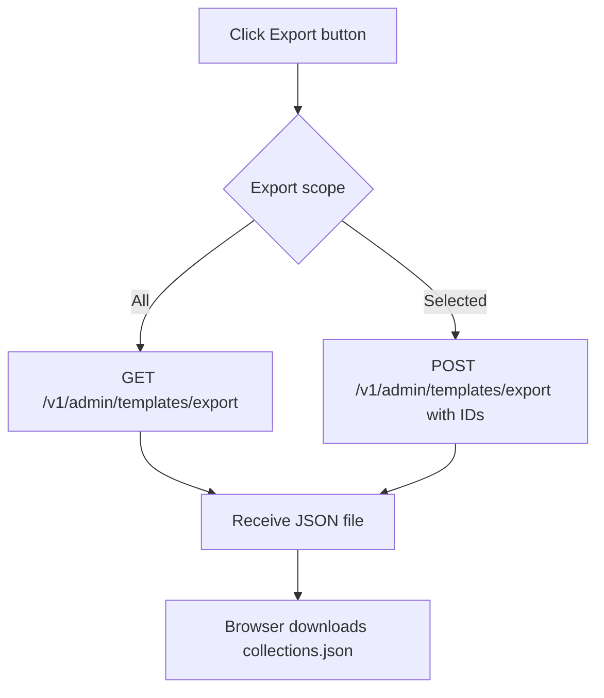
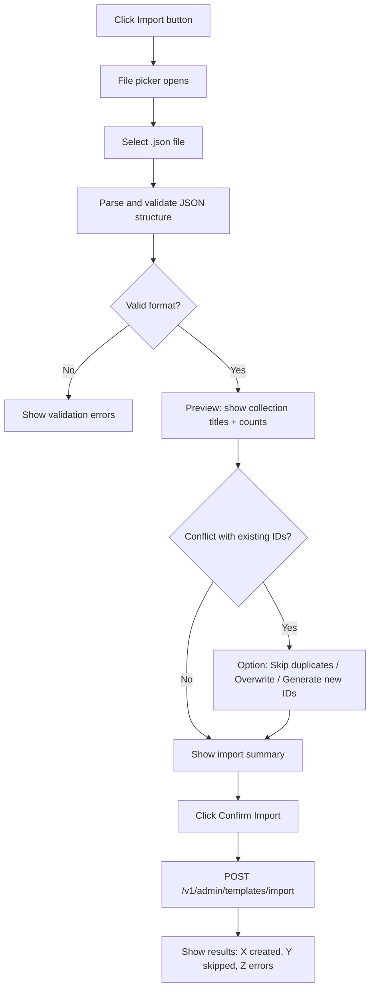

# 🔄 Admin Panel - User Flows

## Overview

All admin flows are available only to authenticated users whose UUID matches the `ADMIN_USERS` environment variable. Regular users are redirected away.

---

## Flow A: Access Admin Panel

**Result**: Admin sees dashboard with content overview and quick actions.

---

## Flow B: Browse & Search Collections

**Result**: Admin sees filtered list of all collections with action buttons per row.

---

## Flow C: Create New Collection

**Result**: New collection created and immediately available in user library (if active).

---

## Flow D: Edit Existing Collection

**Result**: Collection updated. Changes reflected immediately for users.

---

## Flow E: Preview Collection

**Result**: Admin sees exactly how content appears to users.

---

## Flow F: Duplicate Collection

**Result**: New copy of collection ready for customization.

---

## Flow G: Toggle Active/Inactive

**Result**: Collection visibility changed instantly.

---

## Flow H: Delete Collection

**Result**: Collection permanently deleted (with warning about user impact).

---

## Flow I: Export Collections

**Result**: JSON file downloaded containing all collection data.

---

## Flow J: Import Collections

**Result**: Collections imported from JSON file into database.

---

## Flow Summary

| Flow | Trigger | Endpoint | Result |
|------|---------|----------|--------|
| A. Access | Navigate to /admin | — | Dashboard or redirect |
| B. Browse | Click Collections | GET /v1/admin/templates | Filtered table |
| C. Create | Click New | POST /v1/admin/templates | New collection |
| D. Edit | Click Edit row | PUT /v1/admin/templates/:id | Updated collection |
| E. Preview | Click Preview | GET /v1/admin/templates/:id | Visual preview |
| F. Duplicate | Click Duplicate | POST /v1/admin/templates/:id/duplicate | Cloned collection |
| G. Toggle | Click toggle | PATCH /v1/admin/templates/:id/toggle-active | Visibility changed |
| H. Delete | Click Delete | DELETE /v1/admin/templates/:id | Permanently removed |
| I. Export | Click Export | GET /v1/admin/templates/export | JSON file download |
| J. Import | Click Import | POST /v1/admin/templates/import | Bulk creation |

---

**Last Updated**: May 6, 2026
