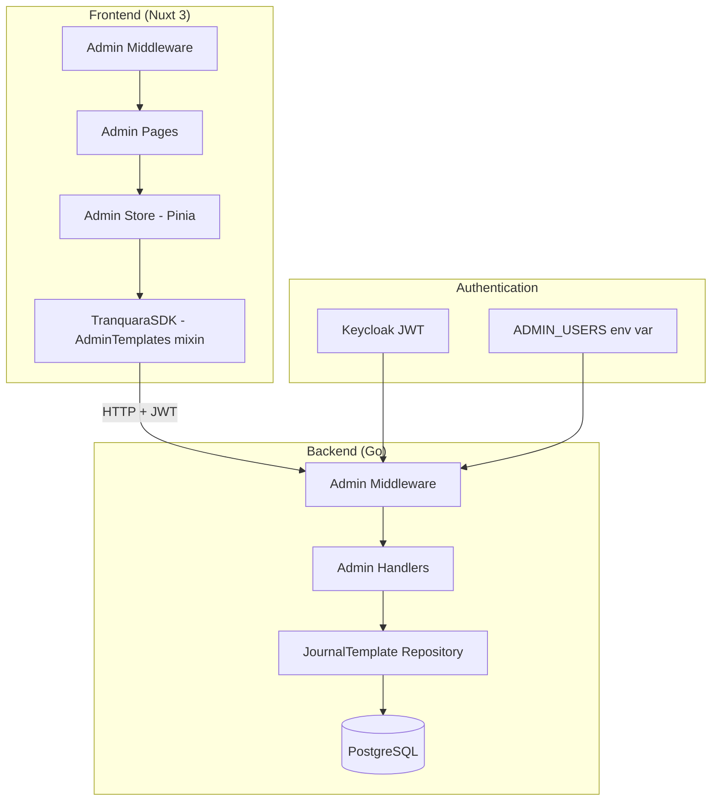

# ⚙️ Admin Panel - Technical Specification

## Overview

This document details the technical implementation of the admin panel for managing library collections. The feature spans both backend (new admin API endpoints + middleware) and frontend (new pages, components, and stores).

## 🏗️ System Architecture



## 🔐 Admin Authentication

### Strategy: Hardcoded UUID Check

**Why not Keycloak roles?**
- Single admin user — RBAC infrastructure is unnecessary overhead
- No Keycloak admin console changes needed
- Simple env var is easy to update

### Backend Implementation

```
┌─────────────────────────────────────────┐
│ Request with Bearer token               │
├─────────────────────────────────────────┤
│ 1. authMiddleWare validates JWT         │
│    - Checks signature with public key   │
│    - Extracts claims to context         │
├─────────────────────────────────────────┤
│ 2. adminMiddleware checks UUID          │
│    - Gets "sub" claim from context      │
│    - Compares against ADMIN_USERS env   │
│    - Returns 403 if not in list         │
├─────────────────────────────────────────┤
│ 3. Handler executes                     │
└─────────────────────────────────────────┘
```

**Environment Variable:**
```bash
# .env or docker-compose
ADMIN_USERS=550e8400-e29b-41d4-a716-446655440000
```

### Frontend Implementation

```
┌─────────────────────────────────────────┐
│ Navigate to /admin/*                    │
├─────────────────────────────────────────┤
│ 1. auth.global.ts checks isAuthenticated│
│    - Redirects to /login if not         │
├─────────────────────────────────────────┤
│ 2. admin.ts middleware runs             │
│    - Gets user UUID from auth store     │
│    - Checks against runtimeConfig list  │
│    - Redirects to / if not admin        │
├─────────────────────────────────────────┤
│ 3. Admin page renders                   │
└─────────────────────────────────────────┘
```

**Runtime Config:**
```typescript
// nuxt.config.ts
runtimeConfig: {
  public: {
    adminUsers: "", // comma-separated UUIDs from NUXT_PUBLIC_ADMIN_USERS env
  }
}
```

---

## 🌐 API Design

### Base Path: `/v1/admin/templates`

All endpoints require: `Authorization: Bearer <token>` where token's `sub` claim is in `ADMIN_USERS`.

| Method | Path | Purpose | Request | Response |
|--------|------|---------|---------|----------|
| GET | `/v1/admin/templates` | List all (incl. inactive) | Query: `?type=&category=&search=` | `{ templates: [...] }` |
| GET | `/v1/admin/templates/:id` | Get single | — | `{ template: {...} }` |
| POST | `/v1/admin/templates` | Create | Body: template object | `{ template: {...} }` 201 |
| PUT | `/v1/admin/templates/:id` | Update | Body: template object | `{ template: {...} }` |
| DELETE | `/v1/admin/templates/:id` | Hard delete | — | 204 No Content |
| POST | `/v1/admin/templates/:id/duplicate` | Clone | — | `{ template: {...} }` 201 |
| PATCH | `/v1/admin/templates/:id/toggle-active` | Flip is_active | — | `{ template: {...} }` |
| GET | `/v1/admin/templates/export` | Export all as JSON | — | `{ templates: [...] }` |
| POST | `/v1/admin/templates/import` | Bulk import | Body: `{ templates: [...], strategy }` | `{ created, skipped, errors }` |

### Request/Response Schemas

**Create/Update Request Body:**
```json
{
  "title": "Daily Reflection",
  "title_vi": "Suy ngẫm hàng ngày",
  "description": "Simple daily prompts...",
  "description_vi": "Các câu hỏi hàng ngày...",
  "category": "self_care",
  "type": "journal",
  "slide_groups": [],
  "slide_groups_vi": [],
  "is_active": true
}
```

**Error Response (validation):**
```json
{
  "error": "validation_failed",
  "details": {
    "title": "required",
    "type": "must be 'learn' or 'journal'",
    "slide_groups": "must have at least one slide group"
  }
}
```

---

## 📁 Frontend File Structure

```
tranquara_frontend/
├── middleware/
│   └── admin.ts                          # Route guard (UUID check)
├── layouts/
│   └── admin.vue                         # Sidebar + header layout
├── pages/admin/
│   ├── index.vue                         # Dashboard with stats
│   ├── collections/
│   │   ├── index.vue                     # Collections table
│   │   ├── [id].vue                      # Editor (create + edit)
│   │   └── preview/
│   │       └── [id].vue                  # Preview renderer
│   └── import-export.vue                 # Import/Export page
├── components/admin/
│   ├── AdminSidebar.vue                  # Sidebar navigation
│   ├── AdminHeader.vue                   # Header bar
│   ├── CollectionForm.vue                # Main form wrapper
│   ├── SlideGroupEditor.vue              # Single slide group editor
│   ├── SlideEditor.vue                   # Single slide editor (type switcher)
│   └── slides/
│       ├── AdminSlideEmotionLog.vue      # Emotion log config form
│       ├── AdminSlideSleepCheck.vue      # Sleep check config form
│       ├── AdminSlideJournalPrompt.vue   # Journal prompt config form
│       ├── AdminSlideDoc.vue             # Rich text (Tiptap) editor
│       ├── AdminSlideFurtherReading.vue  # Links list editor
│       └── AdminSlideCta.vue             # CTA config form
├── stores/
│   ├── admin_templates/
│   │   └── index.ts                      # SDK mixin for admin API
│   └── stores/
│       └── admin_store.ts                # Pinia store for admin state
```

---

## 🧩 Component Architecture

### Page - Component Hierarchy

```
pages/admin/collections/[id].vue
├── CollectionForm.vue
│   ├── Header Section (title, desc, category, type inputs)
│   │   ├── EN fields (left column)
│   │   └── VI fields (right column, togglable)
│   ├── SlideGroupEditor.vue (x N, draggable list)
│   │   ├── Group header (title, description, position)
│   │   └── SlideEditor.vue (x M, draggable list)
│   │       └── [Type-specific component based on slide.type]
│   │           ├── AdminSlideEmotionLog.vue
│   │           ├── AdminSlideSleepCheck.vue
│   │           ├── AdminSlideJournalPrompt.vue
│   │           ├── AdminSlideDoc.vue
│   │           ├── AdminSlideFurtherReading.vue
│   │           └── AdminSlideCta.vue
│   └── Action buttons (Save, Preview, Cancel)
```

### Key Interactions

| Action | Component | Event | Handler |
|--------|-----------|-------|---------|
| Reorder groups | SlideGroupEditor list | @end (drag) | Update positions in store |
| Reorder slides | SlideEditor list | @end (drag) | Update array order in store |
| Add slide | SlideGroupEditor | Click Add Slide | Show type picker then insert |
| Remove slide | SlideEditor | Click x | Confirm then splice from array |
| Switch type | SlideEditor | Change type dropdown | Reset config, swap component |
| Toggle i18n | CollectionForm | Toggle switch | Show/hide VI columns |

---

## 📦 Dependencies

### New (to add)
- `sortablejs` (^1.15.7) — Direct usage for drag-and-drop (already installed)

### Existing (reused)
- `@tiptap/vue-3` + extensions — Rich text editing for `doc` slides
- `@nuxt/ui` (v3) — UTable, UButton, UInput, USelect, UModal, UToast
- `pinia` — State management
- `@vueuse/core` — Composables (useClipboard for JSON export)

---

## 🔒 Security Considerations

- **Double auth**: Both frontend middleware (UX) AND backend middleware (real security) validate admin status
- **JWT validation**: Backend verifies Keycloak RSA signature before checking admin UUID
- **No elevation path**: Admin endpoints are completely separate route group — regular auth token alone is insufficient
- **Import validation**: Server validates JSON schema before inserting (prevents injection via malformed JSONB)
- **CSRF**: Not applicable (Bearer token auth, no cookies)

---

## ⚡ Performance

- **Collections list**: Paginate if > 50 collections (unlikely short-term)
- **Slide builder**: All editing is in-memory (Pinia state) — single PUT on save
- **No real-time sync**: Admin is single-user — no need for WebSocket or optimistic locking
- **Preview**: Lazy-loaded page — only renders on navigation

---

## 🔗 Quick Reference & Validation Links

### Core Specifications & Standards

| Topic | Reference |
|-------|-----------|
| JWT Validation | [RFC 7519 - JSON Web Token](https://datatracker.ietf.org/doc/html/rfc7519) |
| REST API Design | [RFC 7231 - HTTP Semantics](https://datatracker.ietf.org/doc/html/rfc7231) |
| UUID Format | [RFC 4122 - UUID URN Namespace](https://datatracker.ietf.org/doc/html/rfc4122) |

### Framework/Library Documentation

| Technology | Documentation |
|------------|---------------|
| Nuxt 3 Middleware | [Nuxt Route Middleware](https://nuxt.com/docs/guide/directory-structure/middleware) |
| Nuxt UI 3 Components | [Nuxt UI Documentation](https://ui.nuxt.com/) |
| Pinia Stores | [Pinia Documentation](https://pinia.vuejs.org/) |
| Tiptap Editor | [Tiptap Documentation](https://tiptap.dev/docs/editor/introduction) |
| sortablejs | [SortableJS](https://github.com/SortableJS/Sortable) |
| httprouter (Go) | [httprouter GitHub](https://github.com/julienschmidt/httprouter) |

### Security & Best Practices

| Topic | Reference |
|-------|-----------|
| Authorization | [OWASP Authorization Cheat Sheet](https://cheatsheetseries.owasp.org/cheatsheets/Authorization_Cheat_Sheet.html) |
| Input Validation | [OWASP Input Validation](https://cheatsheetseries.owasp.org/cheatsheets/Input_Validation_Cheat_Sheet.html) |
| REST Security | [OWASP REST Security](https://cheatsheetseries.owasp.org/cheatsheets/REST_Security_Cheat_Sheet.html) |

---

**Last Updated**: May 6, 2026
