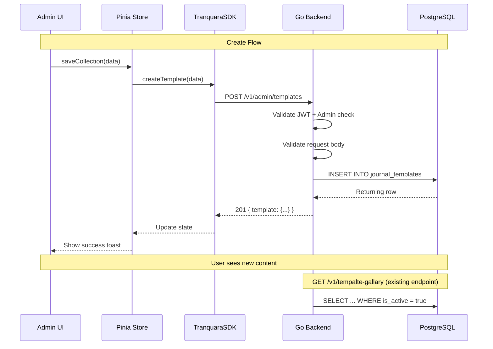

# 📊 Admin Panel - Data Models

## Overview

The admin panel manages the existing `journal_templates` table — **no new database tables are needed**. This document details the API request/response schemas, validation rules, and the TypeScript types used in the frontend.

> **⚠️ Important**: The admin panel operates on the same `journal_templates` table used by the
> user-facing library. See [Micro Learning Data Models](../03.%20Micro%20learning/03-DATA-MODELS.md)
> for the canonical schema definition.

## 🗄️ Existing Database Schema (No Changes)

### `journal_templates` Table

```sql
CREATE TABLE journal_templates (
    id              UUID PRIMARY KEY DEFAULT gen_random_uuid(),
    title           VARCHAR(255) NOT NULL,
    title_vi        VARCHAR(255),
    description     TEXT,
    description_vi  TEXT,
    category        VARCHAR(100) NOT NULL,
    type            VARCHAR(50) NOT NULL,       -- 'learn' or 'journal'
    slide_groups    JSONB NOT NULL,
    slide_groups_vi JSONB,
    is_active       BOOLEAN DEFAULT true,
    created_at      TIMESTAMP DEFAULT CURRENT_TIMESTAMP,
    updated_at      TIMESTAMP DEFAULT CURRENT_TIMESTAMP
);
```

### Valid `category` Values

| For type='learn' | For type='journal' |
|------------------|--------------------|
| anxiety | self_care |
| emotions | mental_health |
| gratitude | therapy_prep |
| mental_health | gratitude |
| mindfulness | relationships |
| relationships | |
| self_care | |
| sleep | |
| therapy_prep | |
| stress_management | |
| communication | |
| self_compassion | |

---

## 📋 API Schemas

### SlideGroup Structure (JSONB)

```typescript
interface SlideGroup {
  id: string;           // Unique within collection (kebab-case)
  title: string;
  description?: string;
  position: number;     // Display order (1-based)
  slides: Slide[];
}
```

### Slide Types & Config Schemas

```typescript
type Slide = EmotionLogSlide | SleepCheckSlide | JournalPromptSlide 
           | DocSlide | FurtherReadingSlide | CtaSlide;

interface EmotionLogSlide {
  id: string;
  type: 'emotion_log';
  question: string;
  config: {
    scale: '1-10';
    labels: string[];   // Exactly 10 items
  };
}

interface SleepCheckSlide {
  id: string;
  type: 'sleep_check';
  question: string;
  config: {
    min: number;        // Default: 0
    max: number;        // Default: 12
  };
}

interface JournalPromptSlide {
  id: string;
  type: 'journal_prompt';
  question: string;
  config: {
    allowAI?: boolean;  // Default: true
    minLength?: number; // Minimum text length
  };
}

interface DocSlide {
  id: string;
  type: 'doc';
  title?: string;
  content: string;      // HTML content
}

interface FurtherReadingSlide {
  id: string;
  type: 'further_reading';
  links: Array<{
    title: string;
    url: string;
    description?: string;
  }>;
}

interface CtaSlide {
  id: string;
  type: 'cta';
  title?: string;
  description?: string;
  config: {
    action: string;     // e.g., 'breathing_exercise', 'emotion_check'
    buttonText?: string;
  };
}
```

### Admin API Request/Response Models

**List Response:**
```typescript
interface AdminListTemplatesResponse {
  templates: JournalTemplate[];
}
```

**Single Template Response:**
```typescript
interface AdminTemplateResponse {
  template: JournalTemplate;
}

interface JournalTemplate {
  id: string;               // UUID
  title: string;
  title_vi?: string;
  description?: string;
  description_vi?: string;
  category: string;
  type: 'learn' | 'journal';
  slide_groups: SlideGroup[];
  slide_groups_vi?: SlideGroup[];
  is_active: boolean;
  created_at: string;       // ISO 8601
  updated_at: string;       // ISO 8601
}
```

**Create/Update Request:**
```typescript
interface CreateUpdateTemplateRequest {
  title: string;            // Required, max 255
  title_vi?: string;
  description?: string;
  description_vi?: string;
  category: string;         // Required, from valid list
  type: 'learn' | 'journal'; // Required
  slide_groups: SlideGroup[]; // Required, min 1 group
  slide_groups_vi?: SlideGroup[];
  is_active?: boolean;      // Default: true on create
}
```

**Import Request:**
```typescript
interface ImportTemplatesRequest {
  templates: CreateUpdateTemplateRequest[];
  strategy: 'skip' | 'overwrite' | 'new_ids';
}

interface ImportTemplatesResponse {
  created: number;
  skipped: number;
  overwritten: number;
  errors: Array<{
    index: number;
    title: string;
    error: string;
  }>;
}
```

---

## ✅ Validation Rules

### Collection-Level

| Field | Rule |
|-------|------|
| title | Required, 1-255 chars |
| type | Required, must be 'learn' or 'journal' |
| category | Required, must be from valid list |
| slide_groups | Required, at least 1 group |

### SlideGroup-Level

| Field | Rule |
|-------|------|
| id | Required, unique within collection, kebab-case |
| title | Required, 1-255 chars |
| position | Required, positive integer |
| slides | Required, at least 1 slide |

### Slide-Level (by type)

| Type | Required Fields | Config Rules |
|------|----------------|--------------|
| emotion_log | question | labels must have exactly 10 items |
| sleep_check | question | min < max, both >= 0 |
| journal_prompt | question | minLength >= 0 if provided |
| doc | content | Must be non-empty HTML string |
| further_reading | links | At least 1 link with title + valid URL |
| cta | config.action | Action must be non-empty string |

---

## 🔄 Data Flow



---

## 📊 Shared Queries (Admin-Specific)

**Get all templates (admin — no active filter):**
```sql
SELECT id, title, title_vi, description, description_vi, category, type,
       slide_groups, slide_groups_vi, is_active, created_at, updated_at
FROM journal_templates
ORDER BY updated_at DESC;
```

**Get single template by ID:**
```sql
SELECT id, title, title_vi, description, description_vi, category, type,
       slide_groups, slide_groups_vi, is_active, created_at, updated_at
FROM journal_templates
WHERE id = $1;
```

**Duplicate template:**
```sql
INSERT INTO journal_templates (title, title_vi, description, description_vi, category, type, slide_groups, slide_groups_vi, is_active)
SELECT title || ' (Copy)', title_vi, description, description_vi, category, type, slide_groups, slide_groups_vi, false
FROM journal_templates
WHERE id = $1
RETURNING *;
```

**Toggle active:**
```sql
UPDATE journal_templates
SET is_active = NOT is_active, updated_at = NOW()
WHERE id = $1
RETURNING *;
```

**Check user impact before delete:**
```sql
SELECT COUNT(*) FROM user_learned_slide_groups WHERE collection_id = $1;
```

---

**Last Updated**: May 6, 2026
