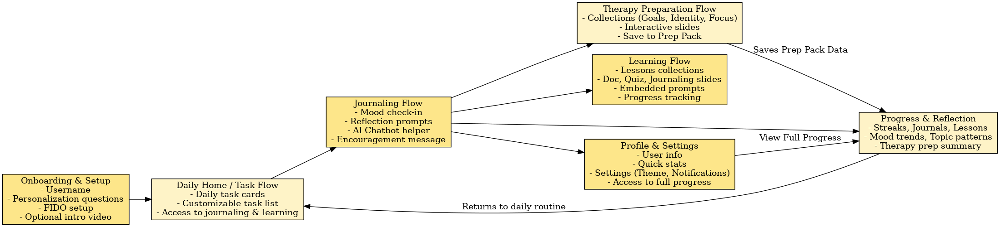

# 🧠 TheraPrep - Feature Design Documentation

> **AI-assisted emotion journaling and therapy preparation platform**

This documentation hub provides comprehensive design specifications for all TheraPrep features, including user flows, technical architecture, and data models.

---

## 📋 Table of Contents

- [Project Overview](#project-overview)
- [Quick Navigation](#quick-navigation)
- [Reading Guide](#reading-guide)
- [Architecture](#architecture)
- [Glossary](#glossary)

---

## 🎯 Project Overview

**TheraPrep** is a mental wellness application that combines:
- AI-assisted emotion journaling
- Guided therapy preparation lessons
- Personalized mental health insights
- Progress tracking and habit building

### Key Objectives
1. Lower barriers to mental health awareness
2. Help users prepare for therapy sessions
3. Build sustainable journaling habits
4. Provide data-driven emotional insights

---

## 🗂️ Quick Navigation

### Core Features

| Feature | Status | Priority | Documentation |
|---------|--------|----------|---------------|
| **User Registration & Auth** | ✅ Done | High | [📁 01. User register](./01.%20User%20register/) |
| **Emotion Journaling** | ✅ Done | High | [📁 02. Jounral Feature](./02.%20Jounral%20Feature/) |
| **Micro Learning** | ✅ Done | High | [📁 03. Micro learning](./03.%20Micro%20learning/) |
| **User Profile & Settings** | 🔄 In Progress | High | [📁 06. User profile and Settings](./06.%20User%20profile%20and%20Settings/) |
| **Progress Tracking** | 🔄 In Progress | Medium | [📁 07. Progress](./07.%20Progress/) |
| **Multi-Language Support** | 🧠 Planned | High | [📁 08. Multi-Language](./08.%20Multi-Language/) |
| **Therapy Toolkit** | 🧠 Planned | High | [📁 09. Therapy Toolkit](./09.%20Therapy%20Toolkit/) |

### Supporting Documentation

- **[Database Design](./database/)** - Complete schema and data models
- **[Feature Backlog](./Feature%20backlog/)** - Future features and ideas
- **[Project Documentation](./Project%20documentation.md)** - High-level overview and architecture

---

## 📖 Reading Guide

### For New Team Members
Start here to understand the system:

1. **[Project Documentation.md](./Project%20documentation.md)** - Overall architecture and feature list
2. **[Database Design](./database/Database%20design%20(formated).md)** - Data structure foundation
3. **[User Registration](./01.%20User%20register/onboarding%20flow.md)** - First user touchpoint
4. **[Journaling Feature](./02.%20Emotion%20Jounral%20Feature/)** - Core functionality

### For Feature Implementation
Follow this sequence when building a feature:

1. Read the **feature overview** document
2. Study **user flows** and interaction patterns
3. Review **data models** and database requirements
4. Check **dependencies** with other features
5. Review **technical specifications**

### For AI/LLM Context
When providing context to AI assistants:

1. Start with **[Project Documentation.md](./Project%20documentation.md)** for overall context
2. Include relevant **feature folder** contents
3. Reference **[Database Design](./database/)** for schema understanding
4. Include **user flow diagrams** when discussing UX

---

## 🏗️ Architecture

### Technology Stack

**Frontend**:
- **Framework**: Nuxt 3 (Vue 3) + Capacitor
- **Mobile**: iOS & Android via Capacitor
- **Web**: SPA with Nuxt 3 (SSR disabled for Capacitor compatibility)
- **Styling**: TailwindCSS + Nuxt UI 3
- **State**: Pinia
- **Storage**: SQLite (heavy data) + Capacitor Preferences (settings) + SecureStorage (tokens)

**Backend**:
- **Core Service**: Golang (tranquara_core_service)
- **AI Service**: Python (FastAPI) + OpenAI (GPT-4o-mini) + LangChain

**Database**: 
- PostgreSQL (user data, journals, streaks, lessons)
- Qdrant vector store (semantic search for journals via RAG)

**Infrastructure**:
- **Queue**: RabbitMQ (async AI processing + data sync)
- **Authentication**: Keycloak (Direct Grant Flow for mobile)
  - Email/password via Resource Owner Password Credentials

### System Architecture

```
┌─────────────┐      ┌──────────────┐      ┌─────────────┐
│   Mobile    │◄────►│   Backend    │◄────►│     AI      │
│ (Nuxt+Cap)  │      │     (Go)     │      │  (FastAPI)  │
└─────────────┘      └──────────────┘      └─────────────┘
       │                    │                      │
       │                    ▼                      ▼
       │             ┌─────────────┐        ┌──────────┐
       │             │ PostgreSQL  │        │  Qdrant  │
       │             └─────────────┘        └──────────┘
       │                    │
       │                    ▼
       │             ┌─────────────┐
       └────────────►│  Keycloak   │
                     │   (Auth)    │
                     └─────────────┘
```

### User Journey Flow



*Inspired by Alan Mind app*

---

## 📚 Glossary

### Status Indicators

| Status | Meaning |
|--------|---------|
| ✅ Done | Feature is fully implemented and tested |
| 🔄 In Progress | Currently being developed or integrated |
| 🧠 Planned | Planned feature, not yet started |
| 🧪 Testing | Feature developed, currently in testing |
| 🛠️ Maintenance | Existing feature undergoing updates or bug fixes |
| ⏸️ On Hold | Development paused due to dependencies |
| ⚠️ Blocked | Cannot proceed due to technical blocker |
| ❌ Backlog | Feature idea acknowledged, not scheduled |

### Key Terms

- **KYC** - Know Your Customer (onboarding questions)
- **Slide Group** - Collection of lesson slides in therapy prep
- **Collection** - Group of related lessons or journaling prompts
- **Streak** - Consecutive days of user activity
- **AI Guider** - Chat assistant during journaling sessions
- **FIDO** - Fast Identity Online (passwordless authentication)

### Feature Categories

- **Learn Type** - Educational micro-lessons about psychology
- **Prepare Type** - Therapy preparation lessons and prompts
- **Journal Template** - Guided prompts for specific journaling topics
- **Free Journal** - Unstructured, open-ended journaling

---

## 🔗 Cross-Feature Dependencies

### Journaling Dependencies
- Requires: User Authentication
- Feeds into: Therapy Preparation, Metrics, Profile Summarizing
- Used by: AI Service for pattern recognition

### Therapy Preparation Dependencies
- Requires: User Profile, Journaling data
- Feeds into: Profile Summarizing
- Used by: Progress tracking

### Data Sync Dependencies
- Requires: All feature data models
- Critical for: Cross-device experience

---

## 📝 Documentation Standards

### File Naming
- Use descriptive names with proper capitalization
- Separate words with spaces or hyphens
- Include file type suffix when applicable (e.g., "flow", "schema", "spec")

### Markdown Formatting
- Use heading hierarchy properly (H1 for titles, H2 for sections)
- Include tables for structured data
- Add diagrams/images in feature folders
- Use code blocks for technical examples

### Diagram Conventions
- `.drawio.png` - Editable diagrams (use draw.io)
- `.png` - Static diagrams/screenshots
- Store diagrams in feature folders, not separate assets folder

---

## 🚀 Getting Started

1. **Clone the repository**
2. **Review this README** for overall context
3. **Read [Project Documentation.md](./Project%20documentation.md)**
4. **Explore feature folders** based on your focus area
5. **Check [Feature Backlog](./Feature%20backlog/)** for upcoming work

---

## 📞 Questions?

If documentation is unclear or missing:
1. Check if the feature has multiple related documents
2. Review the database schema for data structure clarity
3. Look for visual diagrams in feature folders
4. Create an issue or discussion for documentation improvements

---

**Last Updated**: March 8, 2026
